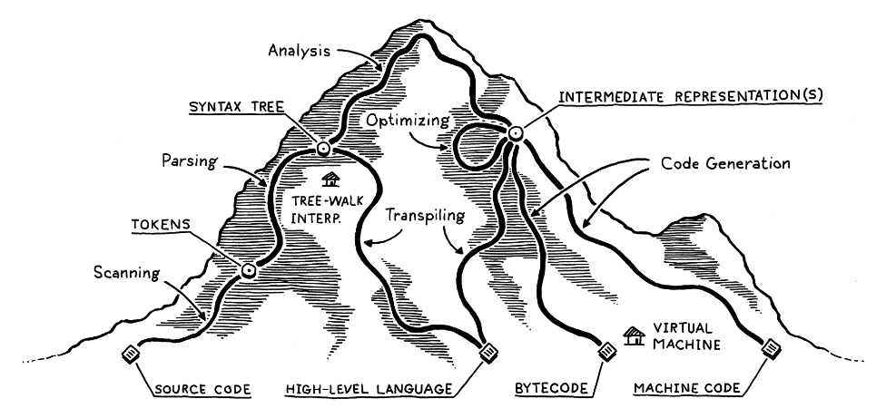
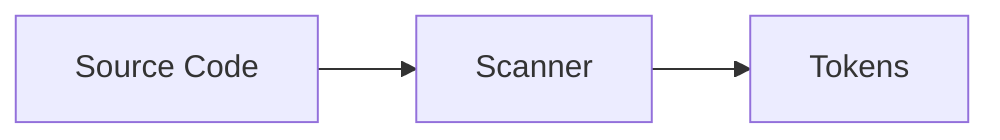
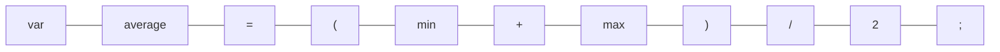
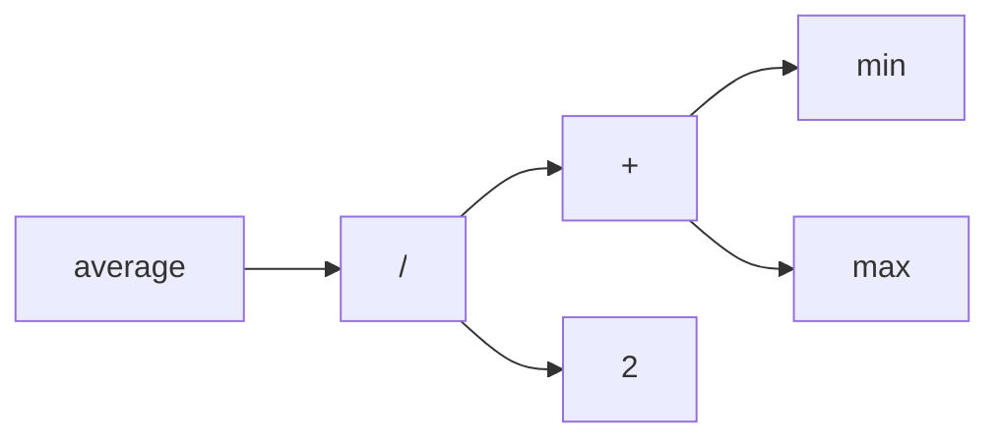
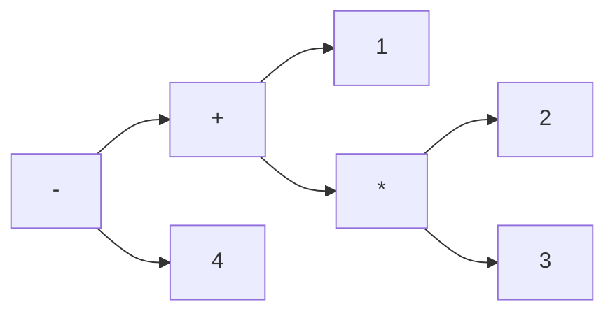
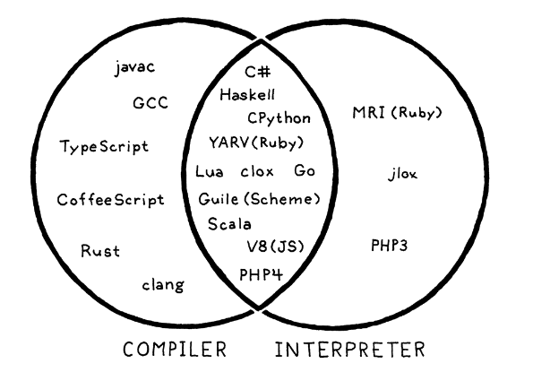

# Parts of a Programming Language

---

# Introduction



Almost every single programming language is the same at its core with the same basic parts. Built in the same basic order.

We'll be following the book `Crafting Interpreters` by Bob Nystrom as a guide for this course. It's available for free online at [craftinginterpreters.com/contents.html](https://craftinginterpreters.com/contents.html).

---
layout: center
---

# Why

Before starting though, 

Why should we study the creation of programming languages

---

## Why

1. To become better programmers
    - a stronger understanding of the tools you're using
    - the skills developed during the creation of the tool
2. To create new programming languages
    - for specific tasks
    - for learning purposes
    - or as a basis for larger general purpose languages
3. It's interesting

---
layout: two-cols
---

## Exercise 1

15 minutes

in NEO, there is an exercise

select one of the programming languages provided and write about:

1. (3 pts) It's origin
2. (3 pts) It's main use case
3. (3 pts) An example of its syntax
4. (1 pt) 1 interesting fact about it

No more than _ students can select the same language

::right::

### Example
Python was created in February 1991 by Guido Van Rossum, while ...

It's a general purpose programming language with an emphasis on readability and simplicity, and ...

An example of it's syntax is `test = 'two' * 2`, which declares a ...

And the name python comes from the comedy Monty Pyhon's Flying Circus, not the snake


---
layout: center
---

# A General Overview

---

## Scanning

The first step, also usually known as **lexing** or *lexical analysis*. This step is primarily focused on breaking up source code into **tokens**.

this means



Source Code
```js
var average = (min + max) / 2;
```

Tokens


> Is there anything in the source code that wasn't converted into a token?

---

## Tokens

Tokens are the smallest unit of meaning in a programming language. 

- Sometimes they're characters `(` or `,`,
- Other times they're keywords like `var` or `if`, or identifiers like variable names `average` or `min`,
- Number literals like `2` or `3.14`, string literals like `"hello"` or `'world'`, 
- Or operators like `+` or `/` are also tokens.


---

## Parsing

If scanning turns source code into "*words*", parsing gives those words *grammar*, turning it into a sentence with **meaning**.

```
The tearcher and the student both wanted a break
先生も生徒も休憩を望んでいた
```

A parser transforms tokens into a data structure usually called an **Abstract syntax tree** or AST. 

This tree has *meaning* because the way it's organized says something about the relationships between the tokens, and it makes the next step **interpreting** or **compiling** consistent.

---

## Parsing

With our current tokens and code
```js
var average = (min + max) / 2;
```


Parsing this would produce an AST like this:



---

## Syntax Tree

The syntax tree shows the relationships between the tokens, another example of a syntax tree would be

```
1 + 2 * 3 - 4
```


---

## Exercise 2

10 minutes

In NEO, there is another exercise

On a piece of paper, draw the syntax tree for the following expression:

```
(5 + 3) * (2 - 1 * 2) / 4 / 5
```

> Assuming standard operator precedence

There are multiple ways to draw the correct tree

Submit through either a picture of your drawing or a digital drawing

---

## Static Analysis

The steps before this exist in almost every single language. Static analysis and many of the steps after this are less universal, but still very common.

At this point we know some facts about the code, for example

```python
a + b
```

Means ____

But what are the names `a` and `b` referring to? Local? Global?, from a module?

This step is called **resolution** or **binding** where we take each *identifier* and figure out what it's referring to.

If a language is statically typed, this is also where we figure out the types of each variable and expression and generate **type error**s.

---

## Intermediate Representation

Think of each step in the process as a way to make the step after it easier and easier to work with.

An intermediate representation is a way to make the next step easier, while also giving the opportunity to do **optimizations**.

If the **frontend** of a programming language is everything up to this point, and the **backend** is the language actually running code, 

An *IR* allows for a way to support multiple architectures significantly easier.

---

## Intermediate Representation

Imagine a compiler that supports multiple languages, say `C, Pascal, and Fortran` that wants to support `x86, ARM, x86_64, and RISC-V`

Without an IR, the language would need to have a **separate** code generation step for each architecture

With an IR, the language only needs to have one code generation step that converts the **IR** into machine code for each architecture

Mechanically speaking, the IR acts as a common but **equivalent** representation of the source code that can be easily translated into different target architectures

---

## Optimizing

Even if you don't need to support multiple architectures, an IR gives the opportunity to do optimizations on the code before it's run

Optimization is one of the most explored areas of programming languages and improvements are constantly being made to make programs run faster and use less memory.

Because you generated code that's equivalent to the source code, you can make changes to the IR that make it run faster or use less memory 

A simple example of optimization would be **constant folding**

```python
area = 3.14 * (0.75 / 2) * (0.75 / 2);
```

When generating the IR, we could simply replace all those constants with their computed value

```python
area = 0.4411875;
```

This moves the computation from runtime to compile time, making the program run faster in exchange for a slightly longer compile time which in almost every case is worth it

---
layout: two-cols
---

## Report 1

Groupings of _


We won't be doing much optimizations in our language, and so I'd like you to

> Choose between any of these optimizations, research them, and present a report next meeting

1. constant propagation
2. global value numbering
3. strength reduction
4. scalar replacement of aggregates
5. dead code elimination
6. loop unrolling
7. loop invariant code motion

::right::

### Notes
- keep the report short
- no presentations
- you are allowed notes
- per person scoring

### Rubrics are
- 5 pts: completeness of the information
- 5 pts: clarity of the report
- 5 pts: effective use of examples

### An example structure would be
1. what is the name of the optimization
2. what does it do (it removes dead code...)
3. what is its goal (increase speed but also increase size...)
4. Example of before and after

---

## Code Generation

What's considered the backend of the programming language pipeline

Note that **code** here generally means *machine code* but it could also be *bytecode* for a virtual machine, or even other *high level language code*

Assuming *machine code*, something can actually be run by a computer, we have a choice to make here.

We either
1. Generate instructions for a specific architecture (x86, ARM, etc)
2. Generate code for a virtual machine (JVM, CLR, etc)

In the first case, we generate native code which is significantly faster but significantly harder to do, especially if we want to support multiple architectures

In the second case, we generate *bytecode* for a virtual machine which is significantly easier to do, especially if we want to support multiple architectures, but is significantly slower

---

## Virtual Machine

Assuming you picked *machine code* in the previous slide, your work is done and you have a fully functioning programming language.

But if you picked a *virtual machine*, you now need to create the virtual machine that will run the bytecode you generated.

Since no computer runs bytecode, we need to create another translator. A virtual machine emulates a hypothetical computer that runs your bytecode "natively".

It's slower than running native code, but it's simpler and more portable.

---

## Runtime

After the program is actually running, there's still some work required to be done. This comes in the form of something called a **runtime**

Things like a garbage collector, type tests, language functions, error handling, and more are all usually part of the runtime

In compiled languages, the runtime is usually a library that is *included* in the binary

While in interpreted languages, the runtime is usually part of the *interpreter* or virtual machine

---
layout: two-cols
---

## A hypothetical run through

say we have

```python
houseSize = 100 * 100 * 100
price = houseSize * 3000

if houseSize < 50000:
    price = price * 0.9
```

::right::

1. scanning
2. parsing
3. static analysis
4. intermediate representation
5. optimization
6. code generation
7. virtual machine
8. runtime

---
layout: center
---

5 minute break time

---
layout: center
---

# Other types of compilers

---

## Single pass compilers

When writing `c` code, you need to *declare* functions before you use them

**Single pass compilers** do analysis, code generation, and all the other steps **directly** in the parser

It requires all the information to be available at parse time

This means that it's more memory efficient.

---

## Tree walk interpreters

Another way to make a programming language is to **skip** generating any intermediate representation or code generation

Common for little languages, but pretty slow

We'll be making one of these

---

## Transpiler

A complete backend is difficult

Another option is to take your code, and instead of generating machine code, you generate code in another language and then compile that

This is called **source-to-source compiling** or **transpiling**

---

## just in time compilation

Native machine code is the fastest way for your code to run. But interpretation, and the usage of virtual machines allow you to access certain parts of the code easier.

In exchange for performance, you get portability, dynamic typing, easier debugging, and more.

JVM, CLR, and most modern JavaScript engines use **just in time compilation** or JIT

It compiles the code **at runtime**

Fancier JIT compilers will profile and recompile code

---
layout: center
---

# The difference between compiled and interpreted languages

---

## Compiled vs Interpreted

Compiled and interpreted are not mutually exclusive categories

Mechanically there are distinct differences, but in use, these terms usually mean



- compiled: transforms to machine code you can run
- interpreted: runs immediately without a separate compilation step
