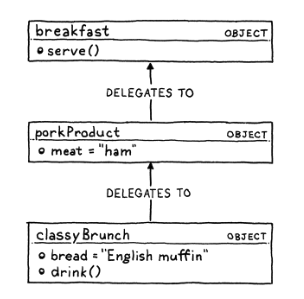

# Introduction to the Lox Language

---

## Online interpreter

[lox.nanmu.me/en/](https://lox.nanmu.me/en/)

```
// This is a comment
print "Hello, world!";
```

C style syntax for familiarity.

---

## A high-level language

Lox, while very small, is a high-level language.

Most similar to *JavaScript* and *Lua*

And shares some **features** with them:
- dynamic typing
- automatic memory management

---

## Dynamic Typing

Variables can store values of any type, and can change type at runtime.

Static typing requires more work to learn and implement

---

## Automatic Memory Management

Memory management teds to be error-prone and tedious.

Lox uses a garbage collector to automatically reclaim memory that is no longer in use.

Using such as **reference counting** or **tracing garbage collection**.

<!--
Why do languages without garbage collection exist?
-->

---

## Data types

- Booleans
```
true;
false;
```

- numbers (all numbers are double-precision floating point)
```
1234;
12.34;
```

- strings
```
"This is a string.";
```

- nil
```
nil;
```

<!--
boolean from george boole, died in 1864
give me other data types that other languages have
-->

---
layout: center
---

# Expressions

---

## arithmetic

```
add + me;
subtract - me;
multiply * me;
divide / me;
```

- **operands**: the things on the left and right
- **binary**: because there are two operands
- **infix**: because the operator is in between
- one arithmetic operator can be both **infix** and **prefix**

---

## comparison and equality

```
less < than;
lessThan <= orEqual;
greater > than;
greaterThan >= orEqual;
```

<!--
1 2
cat dog
314 pi
123 "123"
-->

---

## logical

```
!true;
!false;
```

Works like control flow
```
true and false
true or false
```

- if both true > return right side
- if not both true > return left side

Vice versa for `or`

<!--
how do you do and in C
-->

---

## precedence

Same precedence as C

```
var average = (min + max) / 2;
```

---
layout: center
---

# Statements

---

## Statements

An expression produces a **value**, a statement produces an **effect**.

```
print "hello, world!";
```
<!--print is a part of the language, not a core library-->

```
"An expression";
```

<!--expression statement-->

```
{
    print "This is a block.";
    print "It contains multiple statements.";
}
```

---
layout: center
---

# Variables

---

## Variables

```
var imAVariable = "value";
var iAmNil;
```

```
var breakfast = "bagels";
print breakfast;
```

---
layout: center
---

# Control Flow

---

## Control Flow

```
if (condition) {
    print "yes";
} else {
    print "no";
}
```

```
var i = 1;
while (i < 10) {
    print i;
    a = a + 1;
}
```

```
for (var i = 0; i < 10; i = i + 1) {
    print i;
}
```

---
layout: center
---

# Functions

---

## Functions

```
makeBreakfast(rice, egg, soySauce);
makeRice();
```

```
fun printSum(a, b) {
    print a + b;
}
```

- argument: an actual value
- parameter: the variable in the function definition

---

## Closures

functions are *first-class* values

```
func addPair(a, b) {
    return a + b;
}

fun identity(a) {
    return a;
}

print identity(addPair)(1, 2);
```

---

## Closures

Scoping also works as expected
```
fun outerFunction(a) {
    fun innerFunction(b) {
        return "local";
    }
    return innerFunction;
}
```

---

## Closures

```
fun returnFunction() {
    var outside = "outside";

    fun inner() {
        print outside;
    }
    return inner;
}

var fn = returnFunction();
fn();
```

---
layout: center
---


# Classes

---
layout: center
---


## Why object oriented

1. People still use object-oriented programming for many tasks.
2. It **works***

---

## Why is lox object oriented

Lox already has scope and closures, so it's basically a functional language.

> You'll end up using OOP at some point

Knowing how to make one is useful

---

## Classes or prototypes

There are two main approaches to making objects
1. Classes
2. Prototypes

---

## Classes

In class based languages, the main concepts are

1. instances, which store the **state** of an object
2. classes, which contains the **methods and inheritance** chain

To call a method on an instance, you go inside the instance, find the class, then find the method.


---

## Prototypes

In prototype based languages, there are only objects and no classes



And objects can directly "inherit" from other objects (*delegate*)

Simpler to implement, but people are more familiar with classes

---

## In lox

```
class Breakfast {
    cook() {
        print "Cooking breakfast!";
    }

    serve(who) {
        print "Here is your breakfast, " + who + "!";
    }
}

var someVariable = Breakfast; // creates a class object
someFunction(Breakfast);

var breakfast = Breakfast(); // creates an instance
breakfast.cook();
```

---

## Initialization

The idea of object oriented programming is to **bundle** data and behavior together

Like some other dynamically typed languages, Lox let's you *freely* add properties to objects
```
breakfast.meat = "ham";
breakfast.bread = "white bread"

class Breakfast {
    serve(who) {
        print "Here is your " + meat + " on " + bread + ", " + who;
    }
```

---

## Initialization

`init()` is called when an instance is created
```
class Breakfast {
    init(meat, bread) {
        this.meat = meat;
        this.bread = bread;
    }

    serve(who) {
        print "Here is your " + this.meat + " on " + this.bread + ", " + who;
    }
}
```

---

## Inheritance

Inheritance is how object oriented languages work

```
class Brunch < Breakfast {
    drink() {
        print "Here is your beer";
    }
}
```

Where `Brunch` is a derived class or *subclass*, and `Breakfast` is a base class or *superclass*.

---

## Inheritance

Every method defined in `Breakfast` is also available in `Brunch`.

```
var benedict = Brunch("bacon", "english muffin");
benedict.serve("student");
```

Even the `init()` method is inherited, but you can access the superclass's version with `super`
```
class Brunch < Breakfast {
    init(meat, bread, drink) {
        super.init(meat, bread);
        this.drink = drink;
    }
}
```
