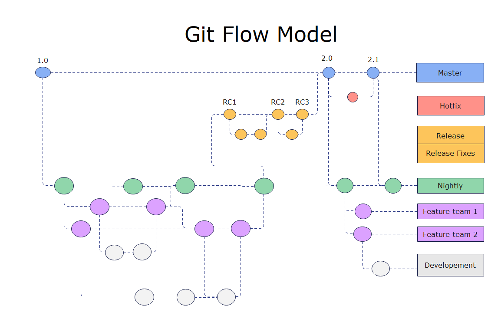

# Running Java

---

## Install Java Development Kit (JDK)

[oracle.com/asean/java/technologies/downloads/#java25](https://www.oracle.com/asean/java/technologies/downloads/#java25).

In lab, this *should* already be installed.

check by opening a terminal and running:

```
java --version
```

---

## Make a Java file

Inside a folder anywhere, create a file named `HelloWorld.java` with the following content:

```java
class HelloWorld {
    public static void main(String[] args) {
        System.out.println("Hello, World!");
    }
}
```

---

## In the terminal

Navigate to the folder where you created `HelloWorld.java`.

```
javac HelloWorld.java
```

This **c**ompiles the java file into java bytecode, and you should have a file named `HelloWorld.class` now.

then to run

```
java HelloWorld
```

---

## Java syntax overview

[learnxinyminutes.com/java/](https://learnxinyminutes.com/java/)


---

## A note on IDEs

You can use any text editor or IDE to write Java code.

I will be using notepad and the terminal for demonstration purposes.

---
layout: center
---

# Git and GitHub

---
layout: center
---

# What is Version Control

---

## Version Control

Version control is a way of **recording** files over time with the *main goal* being 

## the ability to **recall** previous versions.

For example, if you are a student writing code for a project, you might want to **save** your code in case of data loss or *functionality* loss.

So what are the ways you would do that?

---
layout: center
---

## How do you back up your files?

---

## Local

The simplest method is to simply **copy** the file into another directory or with a different name, maybe even with dates and titles if you were feeling neat.

````md magic-move
```
project/
    main.py
    main_backup_2025-09-01.py
    main_backup_2025-09-02.py
```
```
project/
    main.py
    main_final.py
    main_final2.py
    main_final_final.py
```
````

But this method is incredibly **error prone**, and *inconvenient* to create and manage.
- what if you write to the backup
- what if you *forget* to backup your files
- you accidentally delete the backup copy

---

## Local

Because of it's simplicity, this method has been automated by various developers *early on* in computing history and is the origin of the term **VCS or Version Control System**.


Where it's essentially the same as the manual backup method, but automated.

---

## Centralized

The next major issue is *collaboration*.

Most, if not all, large scale project require **multiple developers** to work on the **same codebase**. 

And all those developers need to:
1. have access to a version controlled codebase
2. be able to share their changes with each other

---

## Centralized

This led to the development of **Centralized Version Control Systems** where a single server would host the codebase and developers would connect to it to get the latest version and upload their changes.


Examples of applications that use this model are *Subversion*, *CV*, and *Perforce*.

This makes it easy to share code, and also let administrators have fine control over access permissions.

But it's also a **single point of failure**

---
layout: two-cols-header
---

## Distributed

To solve the single point of failure problem, **Distributed Version Control Systems** were created. Example applications include *Git*, *Mercurial*, and *Bazaar*.

Where instead of connecting to a single central server, each client has a **full copy** of the version controlled codebase, and changes can be shared between any two clients. 

::left::


::right::
Thus, if any one computer goes down, the codebase is still *safe* and accessible from other computers.

The downsides of this approach is that it can be more **difficult to manage** access permissions, and sharing changes can be more complex. 

---

# What is Git

## History

Git was created in 2005 by Linus Torvalds, the creator of Linux, to help manage the development of the Linux kernel.

Its main goals were
- speed
- simplicity
- strong support for non-linear development (thousands of parallel branches)
- fully distributed
- able to handle large projects efficiently

---
layout: center
---

# How does Git work

---

## Snapshots

Fundamentally, git stores data as a series of **snapshots** of the entire codebase, like a mini filesystem/folder.

Every time you *commit* or save your project, Git takes a picture of **all** of the files and stores them. 

<small>Though if Git sees that files have not changed, it doesn't store the file again, just a shortcut to the previous identical file it has already stored.</small>


This gives Git some major advantages

---

## Local

Because every developer has a full copy of the codebase, most operations are local, and don't require network access. 

This makes Git **very fast** because it's running on your hardware and don't have to run through a network. 

And it also means it's possible to work with a fully functional version control system **even when offline**.

---

## Integrity

Everything in Git is checksummed* before it's stored and is then referred to by that checksum

<small>*A checksum is an ID generated from the contents of a file or data. Even a small change in the data will produce a completely different ID.</small>

This means it's **impossible** to change the contents of any file or directory without Git knowing about it. This ensures the integrity of your codebase.

---

## Only* adds

*Almost* **all** actions in Git **only add** data to the database. 

This means it's very hard to lose data, and you can always go back to previous versions of your codebase. Which is the main reason version control exists in the first place.

<small>*There are some commands that can remove data, but they are not commonly used and require explicit action.</small>

---

## Three States

There are three main states that your files can be in Git which are important to understand

1. **modified**
2. **staged** 
3. **committed**

**Modified** means that you have *changed* the file, but it's not being tracked by the Git database yet

**Staged** means that you marked a modified file, *in it's current version*, to go into the next commit

**Committed** means that the data is safely stored in your local database

---

## Checkout


In here, **the working directory** is a single *checkout* (meaning one of the versions) of the project. 

Git takes data from its database, then places it in your disk as normal files that you can edit.

---

## Modify


Once you change the file in some way, it becomes **modified**. But at this point, Git doesn't track that version of the file yet.

Meaning that data is something you *could lose*.

---

## Stage


Then, you tell git to include that file, which puts it into the *staged* state. Mechanically, the **staged** state is just a file in Gits database which holds what content should be put into the next commit

---

## Commit


Finally, when you **commit**, Git takes all the changes in the *staged* state and puts them into the database so you can always go back to it.

This creates a new **snapshot** of the entire project, which is now safely stored in Git's database.

---

## Command line

A note on command line use

There are many ways to use Git. Some of them with GUIs (like GitHub Desktop, SourceTree, GitKraken, etc) or IDE integrations (like in VSCode, PyCharm, etc).

But the most *universal* way to use Git is through the command line interface (CLI) since it's available on all platforms and is the most powerful way to use Git.

---

## Installation and Setup

On windows, the easiest way to install command line Git is through [Git for Windows](https://gitforwindows.org/) 

To configure git, you can use the `git config` command.

```bash
git config --global user.name "Your Name"
git config --global user.email "yourName@example.com"
```

In particular, setting your email and name is important since it's used to identify your commits. So each commit will have your name and email attached to it.

```bash
git config --global init.defaultBranch main
```

Is also an important command to set the default branch name to `main` instead of `master` which is the historical default but is being phased out in most systems.

---

## Getting help

To get help with git commands, you can use the `git help` command followed by the command you need help with.

```bash
git help [verb]
git [verb] --help
man git-[verb]
```

Or simply google the answers, considering how old and well established git is. It's likely you'll never find a problem that someone else hasn't solved yet

---

# Working with Git

## Getting a Git Repository

There are two main ways to get a Git repository

1. **init** - use a command to create a new empty repository `git init`
2. **clone** - copy an existing repository from somewhere else, usually online but not necessarily `git clone`

In either case, you'll end up with a Git repository on your local machine that you can work with.

This comes in the form of a hidden `.git` folder that contains all the data for the repository. 

The `.git` folder is what makes the folder a Git repository.

---

## Init

Using the command git init will create a new Git repository in the current directory.

```bash
git init
```

To start version controlling, you can create new files and add them to the repository.

```bash
git add <file>
```

Which adds the file to the staging area.

Then, you can commit the changes to the repository.

```bash
git commit -m "Initial commit"
```

Which saves the changes to the repository with a message describing the changes.

---

## Clone

To copy an existing repository, you can use the git clone command followed by the URL of the repository.

```bash
git clone <repository-url>
```

for example
```bash
git clone https://github.com/sininen-blue/github-tutorial.git
```

This will create a new folder with the name of the repository and copy all the files and history from the remote repository to your local machine.

---

## Recording Changes

Once you have a Git repository, *and* a checkout or *working directory*, you can start tracking changes to a file.

At a higher level, there are two states a file can be
1. **tracked**
2. **untracked**

---

## Recording Changes

Tracked files are files that were in the last snapshot or commit, while untracked files are files that were not in the last snapshot.

And only tracked files can be modified, staged, and committed.


---

## Status

The main tool to figure out which files are in which state is the `git status` command.

And you should see something like this

```bash
$ git status
On branch main
Your branch is up to date with 'origin/main'.
nothing to commit, working tree clean
```

This means you have a **clean** *working directory*; in other words, no changes have been made since the last commit or version. 

Git looked at your current folder, then it looked at the latest commit in the database, compared the two, and found **no differences**.

Then it tells you which *branch* you are on, and if your branch is up to date with the *remote branch*.

---

## Adding

Make a new file in your repository or folder, name it anything, and then run the `git status` command again.

You should see something like this
```bash
$ git status
On branch main
Your branch is up to date with 'origin/main'.
Untracked files:
  (use "git add <file>..." to include in what will be committed)
        newfile.txt
nothing added to commit but untracked files present (use "git add" to track)
```

This means that Git has detected a new file that is untracked and is giving you a hint on what to do next.

Git won't start tracking this file until you **tell it to do so**. And so any changes to this file will **not be recorded** until you track it.

---

## Tracking New Files

To begin tracking that new file, use `git add`

```bash
git add newfile.txt
```

Then run `git status` again
```bash
on branch main
Your branch is up to date with 'origin/main'.
Changes to be committed:
  (use "git restore --staged <file>..." to unstage)
        new file:   newfile.txt
```

Which means that the file is now **staged** and ready to be committed.

---

## Staging Modified Files

If you change a previously tracked file called `requirements.txt`, and then run `git status`, you should see something like this

```bash
On branch master
Your branch is up-to-date with 'origin/main'.
Changes to be committed:
  (use "git reset HEAD <file>..." to unstage)
    new file:   newfile.txt

Changes not staged for commit:
  (use "git add <file>..." to update what will be committed)
  (use "git checkout -- <file>..." to discard changes in working directory)
    modified:   requirements.txt
```

So while the `requirements.txt` file is modified, it's not yet staged for commit. We can simply stage it by using `git add` again.

---

## Staging Modified Files

Then running `git status` again should show both files as staged for commit.
```bash
On branch master
Your branch is up-to-date with 'origin/main'.
Changes to be committed:
  (use "git reset HEAD <file>..." to unstage)

    new file:   newfile.txt
    modified:   requirements.txt
```

Which means both files are now staged and ready to be committed.

---

## But wait

What if we forgot something in our changes to `requirements.txt` and want to modify it again? 

If we open and edit it and run the `git status` command again, we'll see something different

```bash
On branch master
Your branch is up-to-date with 'origin/main'.
Changes to be committed:
  (use "git reset HEAD <file>..." to unstage)
        new file:   newfile.txt
        modified:   requirements.txt

Changes not staged for commit:
  (use "git add <file>..." to update what will be committed)
  (use "git checkout -- <file>..." to discard changes in working directory)
        modified:   requirements.txt
```

---

## But wait

```bash
Changes not staged for commit:
  (use "git add <file>..." to update what will be committed)
  (use "git checkout -- <file>..." to discard changes in working directory)
        modified:   requirements.txt
```

Now `requirements.txt` is listed in both the **staged** and **modified** sections.

This is because Git stages files **exactly** as they are when you run the `git add` command. If we commit the `requirements.txt` file now, it will only include the changes that were staged, not the new changes we just made.

So if we modify a file after running `git add`, we need to run `git add` again to stage the new changes.

---

## Git Status Trick

Git status can be quite verbose, so it's often useful to use the `-s` or `--short` flag to get a more concise output.

```bash
git status -s
```

This will show a summary of the changes in a more compact format.

---

## Ignoring

In many projects, there are files that you don't want Git to track, like temporary files, build files, or **sensitive information**.

To tell Git to ignore these files, you can create a `.gitignore` file in the **root** of your repository. (root is where your `.git` folder is)

In this file, you can list the *files* or *patterns* that you want Git to ignore.

For example, to ignore all `.log` files and the `temp/` directory, you can add the following lines 

```
# in .gitignore
*.log
temp/
main2.py
```

---

## Viewing Staged and Unstaged Changes

To see the differences between the staged and unstaged changes, you can use the `git diff` command.

`git diff` primarily answers two questions
1. what have you **changed but not staged** yet
2. what you **staged** that you are **about to commit**

`git status` answers these questions but very generally

while `git diff` shows you the exact lines that were added, removed, or modified.

---

## Viewing Staged and Unstaged Changes

To see the unstaged changes, simply run

```bash
git diff
```

which will show the differences between the working directory and the staging area.

for example

```bash
diff --git a/requirements.txt b/requirements.txt
index e69de29..b6fc4c6 100644
--- a/requirements.txt
+++ b/requirements.txt
@@ -0,0 +1 @@
-numpy==1.20.0
+numpy==1.21.0
 pandas==1.3.0
```

---

## Committing

Once you have staged your changes, you can commit them to the repository using the `git commit` command.

```bash
git commit -m "Update requirements.txt and add newfile.txt"
```

It's good practice to write meaningful commit messages via `-m` that describe the changes you made.

At this point, the changes are safely stored in your local Git repository and can be recalled later if needed.

---

## Skips

While staging and committing allow for fine-grained control over what changes to include, sometimes you just want to **quickly commit all** your changes without staging them first.

you can use the `-a` or `--all` flag with the `git commit` command to automatically stage all modified and deleted files before committing.

```bash
git commit -a -m "Quick commit of all changes"
```

Which is especially useful for small changes or when you want to quickly save your work.

---

## Removing and Moving

To remove a tracked file from the repository and the working directory, you can use the `git rm` command. And then run `git commit` to record the change.

This means that the file itself will be deleted from your folder, but its previous versions will still be available in the Git history.

```bash
git rm <file>
```

---

## History

One of the core commands that you'll be using in git is `git log`, which shows the **commit history** of the repository.

by default `git log` shows a list of commits in reverse chronological order, with the most recent commit at the top.

there are a huge number of options to the `git log` command, but some common ones include

```
git log --patch -2
```

`--patch` or `-p` shows the changes made in each commit, while `-2` limits the output to the last two commits

---

## Other git log options


```git log --stat``` shows a summary of changes made in each commit, including the number of files changed, insertions, and deletions.

```git log --pretty=oneline``` shows each commit on a single line, making it easier to scan through the history.

in particular `--pretty` is a command that allows you to customize the output format of the log or use predefined formats like 
- `oneline`, 
- `short`, 
- `medium`, 
- `full`, and 
- `fuller`.

---
layout: center
---

# Undoing
The thing you want to be able to do

---

## Undoing Changes

One core feature of version control systems is the ability to undo changes. Git provides several commands to help you do this.

Let's explore some of the most common ways to undo changes in Git, with examples

---

## Amend

1. You commit something and realized that you wanted to **include something else** in that commit

say that you modified `requirements.txt` to add a few new packages, and then you committed it.

But you forgot one extra package and you don't want to make a new commit just for that because it will make the **history less clear**. 

> Like organizing your room, having a clear and organized history makes it easier to find things later.

To fix this, you can use the `--amend` flag with the `git commit` command to modify the most recent commit.

```
modify the file > git add * > git commit --amend
```

This will open your default text editor *(probably nano or vim)* with the commit message of the most recent commit. You can modify the message if needed, and then save and close the editor.

---

## Unstage

2. another common situation is that you staged a file, but then realized that you **don't want to include it** in the next commit.

To unstage a file, you can use the `git restore --staged` command followed by the file name.

```bash
git restore --staged <file>
```

This will remove the file from the staging area, but keep the changes in your working directory.

*Mechanically*, this just calls the command `git reset HEAD <file>` which resets the file to the last committed state in the staging area.

But `reset` is a more powerful command that can do many things, `git restore --staged` is a more user-friendly way to unstage files.

---

## Unmodify

3. If you modified a file but then realized that you want to **discard the changes and revert** back to the last committed version, you can use the `git restore` command followed by the file name.

```bash
git restore <file>
```

This will replace the file in your working directory with the version from the last commit, effectively discarding any changes you made. Note that this action is **irreversible**, so use it with caution.

Mechanically, this is equivalent to `git checkout -- <file>` which is the older way of doing the same thing.

---
layout: center
---

# Remotes
Github and Git are different things

---

## Remotes

Remotes are versions of your project that are hosted on the internet or network somewhere. They are the exact same as your local repository, but they are hosted on a server.

you can find what remotes you have configured by using the `git remote` command.

```bash
git remote
```

And adding `-v` will show you the URLs of the remotes

```bash
git remote -v
```

---

## Remotes

You can add a new remote using the `git remote add` command followed by the name of the remote and the URL.

```bash
git remote add other <repository-url>
```

and fetch the data from that repository using

```bash
git fetch other
```

Note that this **doesn't change your working directory** or current branch, it just downloads the data from the remote repository.

---

## Remotes

To get the changes from the remote repository and merge them into your current branch, you can use the `git pull` command.

```bash
git pull other main
```

Read as, *pull* the changes from the `main` branch of the `other` remote and **merge** them into the current branch.

And finally, you can push your changes to the remote repository using the `git push` command.

```bash
git push origin main
```

---
layout: center
---

# Branches

This is gits killer feature, and one that you'll be expected to use in almost every project.

---
layout: two-cols
---

## Branches



::right::

Primarily, branches useful for **isolating work** on different features or bug fixes **without affecting the main codebase**, or going back to previous versions of the codebase by going to a previous commit and branching off from there.

Nearly every other VCS system supports some form of branching, but Git's implementation is **lightweight** and **fast**, making it easy to create, switch, and merge branches.

---

## How does git store data

Before we can talk about branches, we need to understand how Git **stores data**.

Git stores a series of **snapshots**, and when you make a `commit`, git stores a `commit object`

This `commit object` contains
- a **pointer to the snapshot** of the content you staged
- **metadata** about the commit (author, date, message)
- and pointers to the commit or commits that **directly came before** this one (its parent commits)
    - usually one parent, but can be more in the case of merges

---

## Branches

Let's assume you have a directory containing three files, and you stage them all and commit

- Staging the files computes a checksum for each one
- stores that version of the file in the Git repository
- adds that checksum to the staging area

```
git add README test.rb LICENSE
git commit -m "Initial commit"
```

When you create the commit, Git *checksums* each subdirectory and stores them as a *tree object* in the repository

---

## Branches


Your project now holds five objects
- three **blobs** which is the contents of each file
- one **tree** that lists the contents of the directory and each blob is inside that directory + metadata
- one **commit** that is a pointer to that root tree

---

## Branches


If you make some changes and commit again, the next commit stores a pointer to the commit that came **before it**

A branch in Git is simply a **pointer** to a specific commit.

The default branch name is `master`. And as you start making commits, you are given the `master` branch that points to the last commit you made

---

## Branches


---

## Creating a new branch

When we create a new branch, all it does is it creates a **new pointer** for us to move around.

Let's say we want to create a new branch called `testing`

We can do that with the `git branch testing` command


---

## The HEAD pointer

For git to know the branch that you're currently on, it keeps a special pointer called `HEAD`

It's a pointer to the local branch you are **currently** on


Note that it's still on master, even though we created the `testing` branch. Creating a branch **doesn't switch to it**.

---

## Switching branches

To switch to the new branch, we use the `git checkout` command followed by the branch name.

```bash
git checkout testing
```

Which moves the `HEAD` pointer to point to the `testing` branch.


So what does this actually do?

---

## Let's make a new commit

If you make, edit, and commit a new file called `test.py`


Notice that the `testing` branch pointer has moved to point to the new commit, while the `master` branch pointer is still on the previous commit.

So let's go back to the `master` branch

```bash
git ____ master
```

---

## Let's go back to master


This command does two things
- it moved the `HEAD` pointer back to point to the `master` branch
- it **reverted** the files in your working directory to match the snapshot of the commit that `master` is pointing to.

Now let's make a new commit on `master`. Make a new file, edit it, and then commit 

---

## Branches


Our project has now **diverged** into two different branches, each with its own commit history.

And each change is **isolated**

And finally, if you need both changes in the same branch, you can use the `git merge` command to combine them.

---
layout: center
---

# Merging
And finally, the last piece of the puzzle

---

## Merging

Let's go through a simple example of that you might see in the real world


In this example, we are in our master branch, and on our 3rd commit, then we realized that we needed to on a bug, 

For demonstration, assume that bug was tagged #04 on their issue tracker.

---

## Merging

To fix this bug without losing any data, you decided to branch off from commit 3

```
$ git checkout -b bug04
Switched to a new branch "bug04"
```

Note that the `-b` command simply creates the branch and switches to it in one command.


What are the two commands you can do to achieve this without the `-b` flag?

---
layout: two-cols
---

## Merging

Then you work on the bug a bit, test it, do some commits. After all of that, the `bug04` branch is now ahead by a bit


But! You get a call about an **emergency fix** that needs to be done **right now**.

With Git, you don't need to push your changes that may or may not be finished in the `bug04` branch. 

::right::
You can just 
1. switch back to `master`, 
2. make a new branch to make sure the fix is isolated `git checkout -b hotfix`
3. work on the fix, and
4. commit it


---
layout: two-cols
---

## Merging

After that we can finally do our first **merge**. Assuming you've run your tests and everything is working, we merge our `hotfix` branch back into `master`.

```
$ git checkout master
$ git merge hotfix
```

You'll notice the phrase "*fast-forward*" in the output, that's because the commit in `hotfix` is directly ahead of `master`. 

So Git simply moves the `master` pointer forward to point to the same commit as `hotfix`

::right::
Now master has all the changes from `hotfix`


And finally, just delete the `hotfix` branch

```
git branch -d hotfix
```

Since it's no longer needed

---

## Back to bug04

Since we finished fixing that bug, we can now **go back** and continue editing the `bug04` branch. Finishing the bugfix there.

```
git checkout bug04
```


It's worth noting that the things we worked on in the `hotfix` branch are **not** in the `bug04` branch yet. 

---

## Decision

We have 2 choices
1. we can merge `master` into `bug04` to get the changes, this is usually called **pulling in** the changes, or
2. we can wait until `bug04` is finished, then **merge** it into `master` which does have the changes from `hotfix`

Let's say you have finished the bug fix at `bug04` and now we want to merge it into `master`

```
$ git checkout master
$ git merge bug04
```

You'll notice that this time we don't have the "fast-forward" message, because the `bug04` branch has diverged from `master`.

---

## Merging from diverged branches

The way git manages this, is that it does a **three-way merge** between the two branch tips and their *common ancestor*.


---

## Merging from diverged branches

So instead of moving the branch pointer forward, git makes a **new** snapshot that combines all 3


This is called a **merge commit** since it merges the histories of both branches together.

Now your work in `bug04` is safely in `master`, along with the emergency fix from `hotfix`.

So we can close the issue, and delete the `bug04` branch

---

## Conflicts

But that's the ideal case, when each branch **modified different** parts of the codebase and never touched each other.

But what if, when you were working on `bug04` you touched a function, and in `hotfix` you also touched that **same function** but with different changes?

When you try to merge `bug04` into `master`, Git will detect that and will be **unable to automatically merge them**.

```
$ git merge bug04
Auto-merging main.py
CONFLICT (content): Merge conflict in main.py
Automatic merge failed; fix conflicts and then commit the result.
```

Git **pauses** the merge process while waiting for you to resolve the conflict.

---

## Conflicts

Merge conflicts are often where people get stuck when using Git for the first time. But at it's core, it's a very simple concept

Your main decision here is simply, do you want to
1. keep the changes from `bug04`
2. keep the changes from `hotfix`
3. or make a new change that combines both

Most of the time, you'll just be picking one of the two changes and discarding the other.

---

## Conflicts

If you type the `git status` command, you'll see something like this

```
$ git status
On branch master
You have unmerged paths.
  (fix conflicts and run "git commit")

Unmerged paths:
  (use "git add <file>..." to mark resolution)
    both modified:   main.py

no changes added to commit (use "git add" and/or "git commit -a")
```

So all the files that have **merge conflicts** are listed under "Unmerged paths".

---

## Conflicts

Opening the file with conflicts, you'll see something like this

```python
def important_function():
    <<<<<<< HEAD
    print("This is the hotfix change")
    =======
    print("This is the bug04 change")
    >>>>>>> bug04
```

This is the standard Git conflict marker format.

On the top of the `===`, you'll see that it's from `HEAD` 

Which is the current branch, in this case `master` which has the `hotfix` changes.

Below you'll see the changes from the branch being merged in `bug04`.

---

## Conflicts

All you have to do is erase the parts you don't want, and the conflict markers 

```python
def important_function():
    print("This is the hotfix change")
```

In this case, we decided to keep the `hotfix` changes and discard the `bug04` changes.

But we could also make a custom change like so

```python
def important_function():
    print("This a fix that solves all problems")
```

---
layout: center
---

# Conflicts

Notice that all you did was edit the file like normal. 

Which means the next step, after **modifying** a file, is _________

---

## Conflicts

using the git status command you'll see

```
$ git status
On branch master
All conflicts fixed but you are still merging.
  (use "git commit" to conclude merge)

Changes to be committed:
  modified:   main.py
```

And after committing, the merge is complete!

To be helpful to your future self and other developers, make sure to write a **meaningful** commit message that **describes how you resolved the conflict**. (which decision you decided to take)

---
layout: center
---

# That was all you needed to know to use git
The three stages, branches, merges, and remotes

---
layout: center
---

# Branch Management
How to actually use Git in real projects

---
layout: two-cols
---

## Organization is important

Again, in a clean room, it's easy to find things

One simple way to organize branches is the **long running branches** workflow

Simply have 2 branches for the main codebase, and a bunch of other branches for features and bug fixes


::right::

- `Master` is where the code is always stable and ready for production, 

- `Develop` is where the latest development changes are, and

- `Topic` is where you add new features or bug fixes

This means that
1. there's always something stable to go back to
2. a branch where we things that *should* be in the next release is
3. and isolated branches for new features and bug fixes

---
layout: two-cols
---

## Topic branches

For simple, solo projects, you might not need that level of organization. Something like the topic branch approach is good enough. 


::right::

simply just make branches every time you want to add a new feature or fix a bug. 

Then, once it's done and tested, merge it back into `main` or `master`.

Then add a branch to branches if you get another idea or bug.

This means that it's really easy to **isolate** work, and if something goes wrong, you can simply **delete the branch and start over** without affecting the main codebase.

---
layout: center
---

# It's finally over
