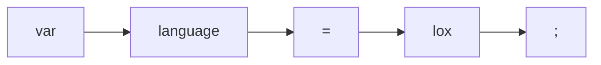

# Components and Implementation of a Scanner

---

## A tree walk interpreter

We'll be writing around 2000 lines of java code to implement a tree-walk interpreter for Lox.

Everyone will end up with the same end result with the same code, and so the majority of your grade will come from your ability to explain and demonstrate your code.

Create an empty folder named

```
lastname_cs370
```

and put it on github

---

## Framework

```
lox/Lox.java
create a new file
```
```java
package com.craftinginterpreters.lox;

import java.io.BufferedReader;
import java.io.IOException;
import java.io.InputStreamReader;
import java.nio.charset.Charset;
import java.io.file.Files;
import java.nio.file.Paths;
import java.util.List;
```

---

## Framework
```
lox/Lox.java
after imports
```
```java
public class Lox {
    public static void main(String[] args) throws IOException {
        if (args.length > 1) {
            System.out.println("Usage: jlox [script]");
            System.exit(64);
        } else if (args.length == 1) {
            runFile(args[0]);
        } else {
            runPrompt();
        }
    }
}

```

---

## Framework

```
lox/Lox.java
add after main()
```
```java
private static void runFile(String path) throws IOException {
    byte[] bytes = Files.readAllBytes(Paths.get(path));
    run(new String(bytes, Charset.defaultCharset()));
}
```

---

## Framework

```
lox/Lox.java
add after runFile()
```
```java
private static void runPrompt() throws IOException {
    InputStreamReader input = new InputStreamReader(System.in);
    BufferedReader reader = new BufferedReader(input);

    for (;;) {
        System.out.print("> ");
        String line = reader.readLine();
        if (line == null) break;
        run(line);
    }
}
```

---

## Framework

```
lox/Lox.java
add after runPrompt()
```
```java
private static void run(String source) {
    Scanner scanner = new Scanner(source);
    List<Token> tokens = scanner.scanTokens();

    for (Token token : tokens) {
        System.out.println(token);
    }
}
```

---

## Error handling

A requirement for actually usable languages

```
lox/Lox.java
add after run()
```
```java
static void error(int line, String message) {
    report(line, "", message);
}

private static void report(int line, String where, String message) {
    System.err.println("[line " + line + "] Error" + where + ": " + message);
    hadError = true;
}
```

It's good practice to separate creating an error and reporting an error

---

## Error handling

```
lox/Lox.java
in class Lox
```
```java
public class Lox {
    static boolean hadError = false;
```

---

## Error handling

```
lox/Lox.java
in runFile()
```
```java
    // run(new String(bytes, Charset.defaultCharset()));

    if (hadError) System.exit(65);
}
```

and
```
lox/Lox.java
in runPrompt()
```
```java
    // run(line);
    hadError = false;
}
```

---
layout: center
---

# Checkpoint
We can't run the program yet

---
layout: center
---

# Lexemes and Tokens

---

## Lexemes

This is a line of Lox code
```
var language = "lox";
```

where:
- `var` means to declare a variable

But if you try to make it smaller, like `va` it no longer means anything

`var` is a **lexeme** in Lox, the smallest unit of meaning

In the example, all the lexemes are



But note that a lexeme is **just a string**

---

## Tokens

If we take a lexeme and bundle it together with other data, it becomes a **token**

Most parsers run with a logic like

```
if the next token is WHILE then do ...
```

But that means that the parser needs to know more information about the token than just its lexeme. It wants to know if the lexme is a reserved keyword, which keyword it is, what value it has

We *could* do that by matching strings, but that's slow, error-prone, and clunky.

---

## Lexemes and Tokens

Instead we can make a different type for each keyword, operator, and other language constructs

```
lox/TokenType.java
```
```java
package com.craftinginterpreters.lox;

enum TokenType {
    LEFT_PAREN, RIGHT_PAREN, LEFT_BRACE, RIGHT_BRACE,
    COMMA, DOT, MINU, PLUS, SEMICOLON, SLASH, STAR, //
    BANG, BANG_EQUAL,
    EQUAL, EQUAL_EQUAL,
    GREATER, GREATER_EQUAL,
    LESS, LESS_EQUAL, //
    IDENTIFIER, STRING, NUMBER, //
    AND, CLASS, ELSE, FALSE, FUN, FOR, IF, NIL, OR,
    PRINT, RETURN, SUPER, THIS, TRUE, VAR, WHILE, //
    EOF
}
```

---
layout: center
---

## Literal Value and Location

Give me an example of a literal value in `python`

A statement, line, that evaluates to just a value

---

## Literal Value and Location

Some lexemes have values associated with them, like numbers and strings
- `123` has the value `123`
- `"hello"` has the value `hello`
- `var` has no value

And we also want to track where in the source code the token appeared for error reporting

---

## Literal Value and Location

```
lox/Token.java
create new file
```
```java
package com.craftinginterpretrs.lox;

class Token {
    final TokenType type; // const
    final String lexeme;
    final Object literal;
    final int line;

```

---

## Literal Value and Location

```
lox/Token.java
after declarations
```
```java
    Token(TokenType type, String lexeme, Object literal, int line) {
        this.type = type;
        this.lexeme = lexeme;
        this.literal = literal;
        this.line = line;
    }

    public String toString() {
        return type + " " + lexeme + " " + literal;
    }
}
```

---
layout: center
---

# Regular Languages and Expressions

---

## Regular languages


We want to *produce* **tokens** from a stream of characters, the process to doing that is fairly mechanical
1. starting with the first character,
2. the *scanner* reads characters until it has a complete lexeme
3. it figures out what lexeme that character is
4. it creates a token for that lexeme
5. it consumes that lexeme's characters from the input
6. it repeats until the end of the input

---

## Regular expressions

The figuring out (matching) step *can* be done with **regular expressions**, for example

```
[a-zA-Z_][a-zA-Z_0-9]*
```

Which matches identifiers and keywords in Lox

And the rules that determines how to group characters into lexemes is called **lexical grammar**. And most languages have simple enough rules that it can be classified as a **regular language**.

And we *can* use regular expressions to describe the entire lexical grammar of Lox

---

## The Scanner Class

```
lox/Scanner.java
create new file
```
```java
package com.craftinginterpreters.lox;

import java.util.ArrayList;
import java.util.HashMap;
import java.util.List;
import java.util.Map;
import static com.craftinginterpreters.lox.TokenType.*; // belongs to the class

class Scanner {
    private final String source;
    private final List<Token> tokens = new ArrayList<>();

    Scanner(String source) {
        this.source = source;
    }
}
```

---

## The Scanner Class
```
lox/Scanner.java
add after Scanner()
```
```java
    List<Token> scanTokens() {
        while (!isAtEnd()) {
            scanToken();
        }

        tokens.add(new Token(EOF, "", null, line));
        return tokens;
    }
```

So it goes through the source code, and keeps adding tokens until it hits the end

Then it adds an end of file token, and returns it

---

## The Scanner Class
Some data we need to keep track of
```
lox/Scanner.java
in class Scanner
```
```java
    // private final List<Token> tokens = new ArrayList<>();
    private int start = 0;
    private int current = 0;
    private int line = 1;
```

and our first of many helper functions

```
lox/Scanner.java
add after scanTokens()
```
```java
    private boolean isAtEnd() {
        return current >= source.length();
    }
```

---
layout: center
---

# Recognizing Lexemes

---

## Recognizing Lexemes

In each loop, we'll scan for a single token, this is the actual **scanner** part of the code

```
lox/Scanner.java
add after scanTokens()
```
```java
private void scanToken() {
    char c = advance();
}
```

---
layout: two-cols
---

## Exercise 1

A switch statement is defined in java as
```
lox/Scanner.java
under char c
```
```java
switch (c) {
    case VALUE_1:
        // code block
        break;
    case VALUE_2:
        // code block
        break;
}
```

Make a switch statement inside `scanToken()` that recognizes single character lexemes, one example is

```java
case '(': addToken(LEFT_PAREN); break;
```

::right::
specifically, make it recognize these lexemes:
- `)`
- `{`
- `}`
- `,`
- `.`
- `-`
- `+`
- `;`
- `*`

<style>
.grid-cols-2 {
  grid-template-columns: minmax(0,1.2fr) minmax(0,0.4fr);
}
</style>

---

## Recognizing Lexemes

Define the functions used in the switch statement

```
lox/Scanner.java
add after isAtEnd()
```
```java
private char advance() {
    return source.charAt(current++); // java post-increment
}

private void addToken(TokenType type) {
    addToken(type, null);
}

private void addToken(TokenType type, Object literal) {
    String text = source.substring(start, current);
    tokens.add(new Token(type, text, literal, line));
}
```

---
layout: center
---

## Run through

assume that the source is

```
((*+)-)
```

---
layout: center
---

break

---

## Lexical Errors

What if the input was
```
@##^()
```

to handle that we add
```
lox/Scanner.java
in scanToken()
```
```java
    default:
        Lox.error(line, "Unexpected character.");
        break;
```

Note that we **keep** scanning, we don't throw an exception or halt the program. This is because we want to report as many errors as possible in one run

---

## Operators

What if the input was
```
!=
```

What token should this result in?

---

## Operators

We need to be able to look ahead one character **without** consuming it

```java
    case '!':
        // if the next character is a '='
```

<!--
// return a bang equal, and consume BOTH characters
// if not, return a bang, and only consume one character
-->

---

## Operators

```
lox/Scanner.java
in scanToken()
```
```java
    case '!':
        addToken(match('=') ? BANG_EQUAL : BANG);
        break;
```

repeat for 
- equals and equals equals
- less and less equal
- greater and greater equal

---

## Operators

```
lox/Scanner.java
add after scanToken()
```
```java
    private boolean match(char expected) {
        if (isAtEnd()) return false;
        if (source.charAt(current) != expected) return false;

        current++;
        return true;
    }
```

---
layout: center
---

## Longer Lexemes

The only operator left is the slash `/`

Why is it different than the single and double character operators?

What lexemes or tokens start with a `/`

---

## Longer lexemes

```
lox/Scanner.java
in scanToken()
```
```java
    case '/':
        if (match('/')) {
            while (peek() != '\n' && !isAtEnd()) advance();
        } else {
            addToken(SLASH);
        }
        break;

    // default:
```

What is a `//` in lox

---

## Longer lexemes

The same as other two character operators, but if we see another `/` we skip until the end of the line

```java
    private char peek() {
        if (isAtEnd()) return '\0';
        return source.charAt(current);
    }
```

let's run through this with
```
// cmnt
line
```
and 

```
// cmnt
```

---

## Skipping some characters

Some characters we just want to skip over entirely, like whitespace

```
lox/Scanner.java
in scasnToken()
```
```java
    case ' ':
    case '\r':
    case '\t':
        // ignore whitespace
        break;

    case '\n':
        line++;
        break;
    // default:
```

---
layout: center
---

## Run through 2

```
// comment
(( )){} //group
!*+-/ =<> <= ==
```

---
layout: center
---

# Break time

---

## Strings

Strings are longer lexemes, but don't end at the `\n` character
```
lox/Scanner.java
in scanToken()
```
```java
    case '"':
        string();
        break;
    // default:
```

---

## Strings

A string needs to 
1. start with a `"`
2. end with the next `"`
3. be multiline, because why not

---

## Strings

```
lox/Scanner.java
add after scanToken()
```
```java
private void string() {
    while (peek() != '_' && ___) { // when do we end a string
        if (peek() == '\n') line++;
        advance();
    }

    if (isAtEnd()) {
        Lox.error(line, "Unterminated string.");
        return;
    }

    advance();
    String value = source.substring(start + 1, current - 1);
    addToken(STRING, value);
}
```

---

## Numbers

in lox all numbers are technically just floating point numbers in runtime, but both integer and decimal literals are allowed

```
1234
12.34
```

but we don't allow
```
.1234
1234.
```

---

## Numbers
```
lox/Scanner.java
in scanToken()
replace 1 line
```
```java
    default:
        if (isDigit(c)) {
            number();
        } else {
            Lox.error(line, "Unexpected character.");
        }
        break;
```

Guess why this is in default instead of a case

how would you support `113`, `213` and `321`

---

## Numbers
```
lox/Scanner.java
add after peek()
```
```java
private boolean isDigit(char c) {
    return c >= '0' && c <= '9';
}
```

---

## Numbers
```
lox/Scanner.java
add after scanToken()
```
```java
private void number() {
    while (isDigit(peek())) advance();

    if (peek() == '.' && isDigit(peekNext())) {
        advance();

        while (isDigit(peek())) advance();
    }

    String numberString = source.substring(start, current);
    addToken(NUMBER, Double.parseDouble(numberString));
}
```

---

## Numbers
```
lox/Scanner.java
add after peek()
```
```java
private char peekNext() {
    if (current + 1 >= source.length()) return '\0';
    return source.charAt(current + 1);
}
```

---
layout: center
---

Let's run through
```
4123 "21
44
"
```

---

break

---

## Identifiers and Keywords

The last piece of the puzzle is identifiers and keywords

We *could* handle each keyword like so

```java
    case 'o':
        if (match('r')) {
            addToken(OR);
        }
        break;
```

but what happens when the source code has a variable named `orchid`

---
layout: two-cols-header
---

## Maximal munch

A principle in lexical analysis is called **maximal munch**, which means that when there are multiple valid ways to group characters into lexemes, we should always choose the longest possible lexeme

::left::
```
---a;
```

could be valid depending on if it's read as

```
- --a;
```

or 

```
-- -a;
```

::right::

And so

```
orchid
```

will always be read as an `identifier` because it's longer than the keyword `or`

---

## Identifiers and Keywords

So to handle keywords, we first assume that any lexeme starting with a letter or underscore is an **identifier**

```
lox/Scanner.java
in scanToken()
```
```java
    default:
        // if (isDigit(c)) {
        //     number();
        } else if (isAlpha(c)) {
            identifier();
        // } else {
        //     Lox.error(line, "Unexpected character.");
        // }
        // break;
```

---

## Identifiers and Keywords
```
lox/Scanner.java
add after scanToken()
```
```java
private void identifier() {
    while (isAlphaNumeric(peek())) advance();

    addToken(IDENTIFIER);
}
```

---

## Identifiers and Keywords
```
lox/Scanner.java
add after peekNext()
```

```java
private boolean isAlpha(char c) {
    return (c >= 'a' && c <= 'z') ||
           (c >= 'A' && c <= 'Z') ||
            c == '_';
}

private boolean isAlphaNumeric(char c) {
    return isAlpha(c) || isDigit(c);
}
```

---

## Identifiers and Keywords

So now that we can detect identifiers, we can check if the identifier is a keyword

The easiest way of doing so being in a dictionary

---
layout: two-cols
---

## Identifiers and keywords

```
lox/Scanner.java
in class Scanner
```
```java
private static final Map<String, TokenType> keywords;

static {
    keywords = new HashMap<>();
    keywords.put("and", AND);
    keywords.put("class", CLASS);
    keywords.put("else", ELSE);
    keywords.put("false", FALSE);
    keywords.put("for", FOR);
    keywords.put("fun", FUN);
    keywords.put("if", IF);
```
::right::
```java
    keywords.put("nil", NIL);
    keywords.put("or", OR);
    keywords.put("print", PRINT);
    keywords.put("return", RETURN);
    keywords.put("super", SUPER);
    keywords.put("this", THIS);
    keywords.put("true", TRUE);
    keywords.put("var", VAR);
    keywords.put("while", WHILE);
}
```

<style>
.slidev-code {
    font-size: 12px !important;
}

.grid-cols-2 {
  grid-template-columns: minmax(0,1.2fr) minmax(0,1fr);
}
</style>

---

## Identifiers and Keywords

```
lox/Scanner.java
in identifier()
replace 1 line
```
```java
while (isAlphaNumeric(peek())) advance();

String text = source.substring(start, current);
TokenType type = keywords.get(text);
if (type == null) type = IDENTIFIER;
addToken(type);
```

---

# Done
compile and run `Lox` on some source code in REPL mode

---
layout: center
---

# Run through

```
var x = 10.5 + _abc123;
print "value = " + x;
```
