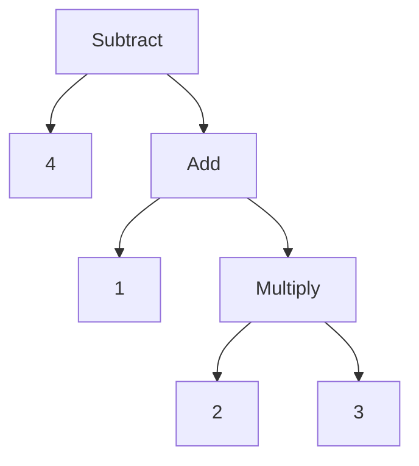

# Representing Code

---

## Introduction

At this point we have source code

which turn into

tokens

next is to use those tokens to make something the parser likes more

---

## Representing code

our representation should be easy for the **parser** to produce and easy for the **interpreter** to consume

we can figure out what a good representation is by looking at how a *human* interprets

```
1 + 2 * 3 - 4
```

---

## Representing code

Because of grade school, we know that we do multiplication first

One way to represent this is to use a tree structure



In order to evaluate a node of arithmetic, we need to know the literal values of the leaf nodes, so we evaluate that first

So starting from the leaves, up to the root (post-order traversal)

---

## Exercise

Draw the syntax tree for the following expression:

```
(5 - 2) * (8 + 3)
2 * 4 + 6 / 3
10 - (2 + 3) / 4
```

---

## Context free grammars

Defining our lexical grammar, the rules for how characters get grouped, the grammar for lexemes, was called a **regular grammar**

And that works for scanners which produce a flat sequence of tokens

Because we need to do nesting, we need something more powerful

in the toolbox of formal grammar, this is called a **context free grammar**

---

## Context free grammars

A formal grammar takes a set of atomic pieces which it calls "alphabet", then it defines a set of "strings" that are "in" the grammar, and each string is a sequence of "letters"

In our scanner, 
- the alphabet is characters
- the strings are valid lexemes

in our parser
- the alphabet is tokens
- the strings are valid expressions

---

## Notation

> how do we write down a grammar that contains an infinite number of valid strings?

It's easier to define the garmmar using rules

Starting from the rules you can *generat* strings that are in the grammar, this is called derivations

And so rules are called *productions* because they produce srtings in the grammar

---

## Notation

A context free grammar has a 

- head, which is the name
- a body, which describes what it generates

and a body has a list of symbols of two types

- a terminal, from the grammars alphabet, which are end points
- a non-terminal, which is a reference to another production

And finally, you can have rules with the same name, and when you hit a non terminal with that name, you can pick any of the rules

---

## Notation

To write this down, we have a variety of proper notations, we'll be using a modified Backus-Naur Form (BNF)

but ways to crystalize grammars have been invented as far back as tthe ashtadhyayi (600 BCE)

each rule is a name, followed by an arrow (->), a sequence of symbols, and a semicolon (;)

teriminals are quoted strings, non terminals are lowercase words

---

## Example

```
breakfast -> protein "with" breakfast "on the side";
breakfast -> protein;
breakfast -> bread;

protein -> crispiness "crispy" "bacon";
protein -> "sausage";
protein -> cooked "eggs";

crispiness -> "really";
crispiness -> "really" crispiness;

cooked -> "scrambled";
cooked -> "fried";

bread -> "toast";
bread -> "bagel";
```

---

## Exercise

Using the grammar from the previous slide, generate some sentences

---

## Enhancing the notation

---

## Making a grammar for (a portion of) lox

---

## Implementation of Syntax Trees

---

## Metaprogramming
