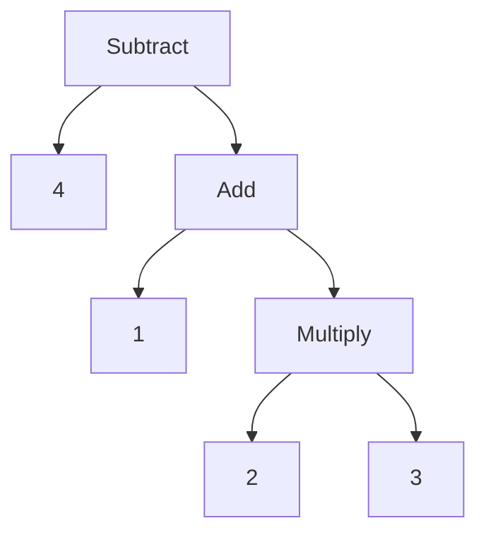
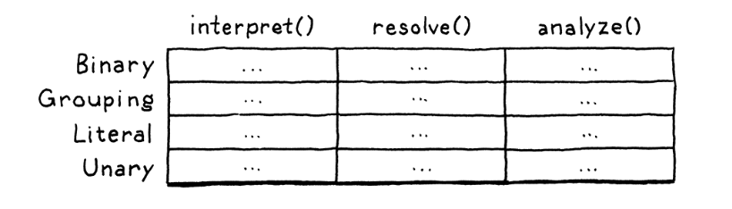
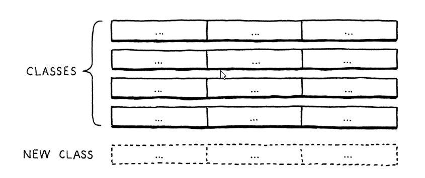
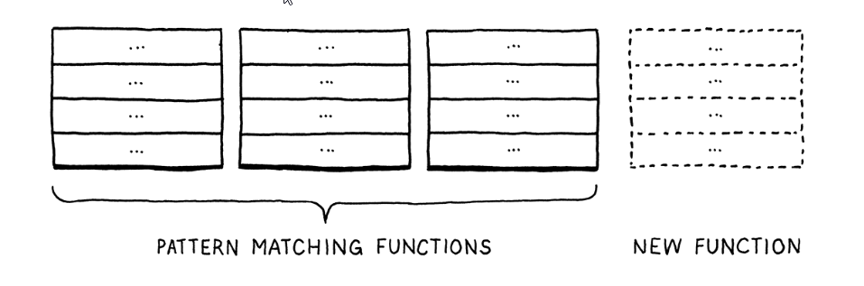
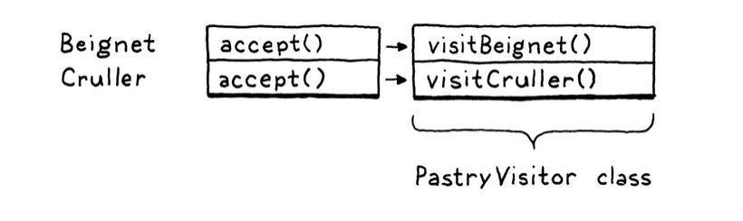

# Representing Code

---

## Introduction

At this point we have source code

which turn into

tokens

next is to use those tokens to make something the parser likes more

---

## Representing code

our representation should be easy for the **parser** to produce and easy for the **interpreter** to consume

we can figure out what a good representation is by looking at how a *human* interprets

```
1 + 2 * 3 - 4
```

---
layout: two-cols
---

## Representing code

Because of grade school, we know that we do multiplication first

One way to represent this is to use a tree structure

In order to evaluate a node of arithmetic, we need to know the literal values of the leaf nodes, so we evaluate that first

So starting from the leaves, up to the root (post-order traversal)

::right::


```mermaid
graph TD
    Subtract
    Subtract --> Add
    Subtract --> 4
    Add --> 1
    Add --> Multiply
    Multiply --> 2
    Multiply --> 3
```

---

## Exercise

Draw the syntax tree for the following expression:

```
(5 - 2) * (8 + 3)
2 * 4 + 6 / 3
10 - (2 + 3) / 4
```

---

## Context free grammars

Defining our lexical grammar, the rules for how characters get grouped, the grammar for lexemes, was called a **regular grammar**

And that works for scanners which produce a flat sequence of tokens

Because we need to do nesting, we need something more powerful

in the toolbox of formal grammar, this is called a **context free grammar**

---

## Context free grammars

A formal grammar takes a set of atomic pieces which it calls "alphabet", then it defines a set of "strings" that are "in" the grammar, and each string is a sequence of "letters"

In our scanner, 
- the alphabet is characters
- the strings are valid lexemes

in our parser
- the alphabet is tokens
- the strings are valid expressions

---

## Notation

> how do we write down a grammar that contains an infinite number of valid strings?

It's easier to define the garmmar using rules

Starting from the rules you can *generat* strings that are in the grammar, this is called derivations

And so rules are called *productions* because they produce srtings in the grammar

---

## Notation

A context free grammar has a 

- head, which is the name
- a body, which describes what it generates

and a body has a list of symbols of two types

- a terminal, from the grammars alphabet, which are end points
- a non-terminal, which is a reference to another production

And finally, you can have rules with the same name, and when you hit a non terminal with that name, you can pick any of the rules

---

## Notation

To write this down, we have a variety of proper notations, we'll be using a modified Backus-Naur Form (BNF)

but ways to crystalize grammars have been invented as far back as tthe ashtadhyayi (600 BCE)

each rule is a name, followed by an arrow (->), a sequence of symbols, and a semicolon (;)

teriminals are quoted strings, non terminals are lowercase words

---

## Example

```
breakfast -> protein "with" breakfast "on the side";
breakfast -> protein;
breakfast -> bread;

protein -> crispiness "crispy" "bacon";
protein -> "sausage";
protein -> cooked "eggs";

crispiness -> "really";
crispiness -> "really" crispiness;

cooked -> "scrambled";
cooked -> "fried";

bread -> "toast";
bread -> "bagel";
```

---

## Exercise

Using the grammar from the previous slide, generate some sentences

Neo

---

## Enhancing the notation

Purely to make it easier to read and write, we can add some enhancements to the notation

- the pipe (|) means "or", so we can combine multiple rules with the same name
- parenthesis () group things together, meaning to select from one of the options inside
- the asterisk (*) means "zero or more" of the preceding item
- the plus (+) means "one or more" of the preceding item
- the question mark (?) means "zero or one" of the preceding item

```
breakfast -> protein ( "with" breakfast "on the side")? | 
            bread;

protein ->  "really"* "crispy" "bacon" | 
            "sausage" | 
            ("scrambled" | "fried") "eggs";

bread ->    "toast" | 
            "bagel";
```

---

## Making a grammar for (a portion of) lox

Some definitions

The syntactic grammar is significantly larger than the lexical grammar, so we'll only show a portion of it here

the main things we want to parse are 

- literals: numbers, strings, booleans, nil
- unarys: prefixes like (!) and (-)
- binarys: infix like (+), (*), etc, and logical operators (==, <=)
- parentheses: a pair of ( ) to group expressions

Which lets us run things like

```
1 - (2 * 3) < 4 == false
```

---

## Class Exercise

Finish the grammar

```
expression -> literal | unary | binary | grouping;

literal -> NUMERAL | STRING |
grouping ->
unary ->
binary ->
operator ->
```

so that 

```
1 - (2 * 3) < 4 == false
```

is a valid expression


---

## Implementation of Syntax Trees

You'll notice that in a grammar, almost all productions refer back to "expression"

This makes a tree structure a natural fit for representing code

> what is a tree for syntax called?

A single expression class with a list of children would also work

We'll mainly implement them as individual classes since we're using java

So for each production under expression, we make a subclass that has fields for the non-terminals specific to that production 

---

## Example

```
abstract class Expr{
    static class Binary extends Expr {
        Binary(Expr left, Token operator, Expr right) {
            this.left = left;
            this.operator = operator;
            this.right = right;
        }
        final Expr left;
        final Token operator;
        final Expr right;
}
```

Where `Expr` is a base class that all expressions inherit from

> all operations in our language will be considered an expression

---
layout: center
---

## Metaprogramming

Since all we're doing is making behavior less classes, 

We can use **metaprogramming** to generate the classes for us

> When given a task that is mostly boilerplate, write code to write that code for you

---

## Metaprogramming

```
tool/GenerateAst.java
create new file
```
```java
package com.craftinginterpreters.lox.tool;

import java.io.IOException;
import java.io.PrintWriter;
import java.util.Arrays;
import java.util.List;

public class GenerateAst {
    public static void main(String[] args) throws IOException {
        if (args.length != 1) {
            System.err.println("Usage: generate_ast <output directory>");
            System.exit(64);
        }
        String outputDir = args[0];
    }
}
```
---

## Defining the AST structure

```
tool/GenerateAst.java
in main()
```
```java
        // String outputDir = args[0];
        defineAst(outputDir, "Expr", Arrays.asList(
            "Binary   : Expr left, Token operator, Expr right",
            "Grouping : Expr expression",
            "Literal  : Object value",
            "Unary    : Token operator, Expr right"
        ));
```

---

## Defining the AST structure

```
tool/GenerateAst.java
add after main
```
```java
private static void defineAst(
    String outputDir, String baseName, List<String> types)
    throws IOException {

    String path = outputDir + "/" + baseName + ".java";
    PrintWriter writer = new PrintWriter(path, "UTF-8");

    writer.println("package com.craftinginterpreters.lox;");
    writer.println();
    writer.println("import java.util.List;");
    writer.println();
    writer.println("abstract class " + baseName + " {");

    writer.println("}")
    writer.close();
}
```

---

## Defining the AST structure

```
tool/GenerateAst.java
in defineAst(), before writer.close()
```
```java
    // writer.println("abstract class " + baseName + " {");
    for (String type : types) {
        String className = type.split(":")[0].trim();
        String fields = type.split(":")[1].trim();
        defineType(writer, baseName, className, fields);
    }
```

---

## Defining type

```
tool/GenerateAst.java
add after defineAst()
```
```java
private static void defineType(
    PrintWriter writer, String baseName,
    String className, String fieldList) {
    writer.println("    static class " + className + " extends " + baseName + " {");

    // Constructor.
    writer.println("        " + className + "(" + fieldList + ") {");

    // Store parameters in fields.
    String[] fields = fieldList.split(", ");
    for (String field : fields) {
        String name = field.split(" ")[1];
        writer.println("            this." + name + " = " + name + ";");
    }
    writer.println("        }");

```

---

## Defining type

```
tool/GenerateAst.java
add after constructor
```
```java
    // Fields.
    for (String field : fields) {
        writer.println("        final " + field + ";");
    }
    writer.println("    }");
}
```

If you compile and run this code, it will generate the Expr.java file for us

---
layout: center
---

# Working with trees

Imagine what the interpreter will do

> The interpreter needs to do different things depending on what kind of expression it is evaluating

Unlike with tokens, where we can just `switch` on the token type

We can't have a "type" for each expression, because each expression is a different class

---

## Technically

We can simply

```
if (expr instanceof Expr.Binary) {
    // handle binary
} else if (expr instanceof Expr.Literal) {
    // handle literal
} ...
```

But this is slow and clunky

Since we have an object-oriented language, we would want to put behavior into each class

Simply having an `intepret()` method on the `Expr` superclass that each subclass overrides

> However, this scales poorly

Both the parser and the interpreter would need to be modified every time we add a new expression type

---
layout: center
---

# The Expression Problem

---

## The expression problem

We have some types (binary, literal, grouping, unary)

and a few operations (intepreter, resolve, analyze)

And for each pair we need an implementation



---

## The nature of Object Oriented Programming


Object oriented programming likes writing new rows 

> the core idea is that the things you do with a type are likely related

So it tries to make it easy to define them together as methods inside a class



So to make a new type, you just make a new class that implements all of its behaviors

---

## The nature of Functional Programming

In functional programming, there exists methods, not classes.

> Types and functions are distinct

To implement an operation for a number of different types, you make **one** function that pattern matches on the type



So to make a new operation, you just make a new function, and implement all of its behaviors depending on the type

---
layout: center
---

## Problem

There's a "*grain*" to each paradigm 

And it's difficult to do one thing in the style of the other

This is called the **expression problem**

---
layout: center
---

# The Visitor Pattern

---

## The visitor pattern

A pattern about *approximating* a functional style within OOP

Its goal is allowing us to make a new set of columns easier

We simply define all the behavior for a new operation in one place

---

## An Example

```java
abstract class Pastry {} 

class Beignet extends Pastry {}

class Cruller extends Pastry {}
```

And we want to define new pastry operations `cooking, eating, decorating, etc`

And we want to do that without having to add a new method to each class every time

---

## An Example

To do that we make an **interface**

> in java, an interface is a class that only has method signatures, no implementations

Like a blueprint for classes, or a class for classes

```java
interface PastryVisitor {
    void visitBeignet(Beignet beignet);
    void visitCruller(Cruller cruller);
}
```

Where each operation that we want to do on pastries is a new class that **implements** the interface

So now we have classes for the **objects** (pastries) and classes for the **operations** (visitors)

---
layout: two-cols-header
---

## An Example

Then we simply route those two using some *polymorphism*

```java
abstract class Pastry {
    abstract void accept(PastryVisitor visitor);
}
```

And each subclass implements

::left::
```java
class Beignet extends Pastry {
    @Override
    void accept(PastryVisitor visitor) {
        visitor.visitBeignet(this);
    }
}
```

::right::
```java
class Cruller extends Pastry {
    @Override
    void accept(PastryVisitor visitor) {
        visitor.visitCruller(this);
    }
}
```

---

## An Example

Then finally, to perform an operation on the pastry,

we simply run the `accept()` method with the visitor just passed in



This means all we need to do to add a new operation is make a new class that implements the visitor interface

Like a `CookingVisitor`, `EatingVisitor,` etc, and then pass that to the pastry's `accept()` method

---

## Visitor Pattern for Expressions

We'll be defining the visitors inside the generate ast class so we don't have to write them by hand

```
tool/GenerateAst.java
in defineAst()
```
```java
    // writer.println("absract class " + baseName + " {");
    defineVisitor(writer, baseName, types);
```

---

## Visitor Pattern for Expressions

```
tool/GenerateAst.java
add after defineAst()
```
```java
private static void defineVisitor(
    PrintWriter writer, String baseName, List<String> types) {

    writer.println("    interface Visitor<R> {");

    for (String type : types) {
        String typeName = type.split(":")[0].trim();
        writer.println("        R visit" + typeName + baseName + "(" +
            typeName + " " + baseName.toLowerCase() + ");");
    }

    writer.println("    }");
}
```

---

## Visitor Pattern for Expressions

```
tool/GenerateAst.java
in defineAst()
```
```java
    // defineType(writer, baseName, className, fields);
    // }

    writer.println();
    writer.println("    abstract <R> R accept(Visitor<R> visitor);");

    // writer.println("}");
```

---

## Visitor Pattern for Expressions

Finally, each subclass should implement the accept function

```
tool/GenerateAst.java
in defineType()
```
```java
    // writer.println("    }");

    // visitor pattern
    writer.println();
    writer.println("        @Override");
    writer.println("        <R> R accept(Visitor<R> visitor) {");
    writer.println("            return visitor.visit" + className + baseName + "(this);");
    writer.println("        }");
    writer.println("    }");

    // fields
```

---

# A printer

---


