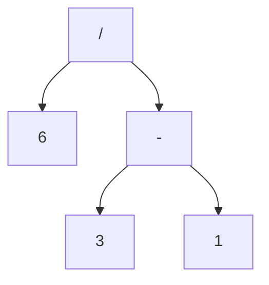
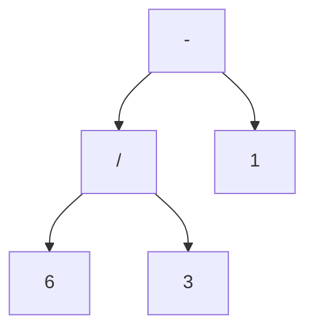

# The parser

---

## Parser

Making an actual parser, with decent *error handling*, coherent internal *structure*, and the ability to go through fairly *sophisticated syntax* can be difficult

But because we *front-loaded* a large amount of the work involved, it's significantly easier

---

## Ambiguity

Last time, we took a set of rules and *produced* a string that was valid

Parsers play that game in reveres, where *given a series of tokens*, it maps those tokens to *terminals*

Then it figures out which *non-terminals*, or *rules* could generate that string

keyword of **could**

---

## Ambiguity

It's *entirely possible* to make a gramma that is **ambiguous**

Whre different choices of productions can lead to the same string

For *generation*, that's not a problem, but in parsing, it could mean that the parser *misunderstands* the code

---

## Recap

```
expression -> literal | unary | binary | grouping;
literal -> NUMBER | STRING | "true" | "false" | "nil";
grouping -> "(" expression ")";
unary -> ("-" | "!") expression;
binary -> expression operator expression;
operator -> "==" | "!=" | "<" | "<=" | ">" | ">=" | "+"
            | "-" | "*" | "/";
```

and a valid string for this grammar is 

```
6 / 3 - 1
```

---
layout: two-cols-header
---

## Ways to generate that string

::left::
1. Starting with `expression`, pick `binary`
2. then for the left `expression`, pick *NUMBER*, and use *6*
3. for the operator, pick *\/*
4. for the right `expression`, pick `binary`
5. in that nested `binary`, pick `3 - 1`

::right::
1. starting at `expression`, pick `binary`
2. for the left `expression`, pick `binary`
3. in that nested `binary` expression pick `6 / 3`
4. In the operator, pick `-`
5. for the right-hand `expression` pick *NUMBER* and use *1*

---
layout: two-cols-header
---

## Ambiguity

Both of those produce the same *strings* but not the same syntax tree

::left::


::right::


---

## Ambiguity

In other words, our *grammar* allows us to see our expression as either

$$
(6 /3) - 1 \text{ or } 6 / (3 - 1)
$$

And the way that *mathematics* has addressed this ambiguity since blackboards was usign **precedence** and **associativity**

---

## Precedence

Determines which operator is evaluated *first* in an expression containing a mixture of different operators

Normal precedence rules tells us to evaluate the `/` before the `-` in the `6 / 3 - 1` example

Because `/` has *higher* precedence than `-`

## Associativity

Determines which operator is evaluated first in a series of the *same* operator

When an operation is **left-associative** (left to right), operators on the left evaluate befor those on the right

```
5 - 3 - 1
```

Evaluates as `(5 - 3) - 1` since `-` is *left associative*

---

## Associativity

We'll be using `C` style associativity, which means

- Equality, == !=, left
- Comparison, > >= < <=, left
- Term, - +, left
- Factor, / *, left
- Unary, ! -, Right

---

## Building associativity and precedence into the grammar

Right now, all our grammar is in a single `expression` type

Where the same rule is used as the non-terminal for operands, 

Which lets the grammar accept any kind of expression as a subexpression, **regardless of the precedence**

We fix that by *stratifying* (arranging in layers) the grammar and defining rules for each *precedence level*

```
expression -> ...
equality -> ...
comparison -> ...
term -> ...
factor -> ...
unary -> ...
primary -> ...
```

Where each rule only matches expressions **at** its precedence level or **higher**

---

## Building associativity and precedence into the grammar

For example,

a `unary` matches a `unary` expression like `!orchid` **or** a `primary` expression like `1234`

And a `term` can match `1 + 2` but also `3 * 4 / 5` (a `factor`)

And the final `primary` rule covers the highest-precedence forms, which is *literals* and *parenthesized* expressions

---

## Filling out the grammar

The top `expression` matches **any** expression at **any** precedence, and since `equality` has the *lowest* precedence, if we match that, it covers everything

```
expression -> equality
```

and at the other end of the precedence table, a `primary` expression contains *all* the literals and grouping expressions

```
primary -> NUMBER | STRING | "true" | "false" | "nil" | "(" expression ")";
```

---

## Filling out the grammar

The unary expression starts with a `unary operator`, followed by the `operand`

If we want unary operators to be able to next

```
!!true
```

How should we structure our unary rule

```
unary -> ("!" | "-") _____;
```

---

## Filling out the grammar

Note that the unary rule never terminates, remember that a rule has to match expressions on the **same** level

Which is handled by a recursive unary operator, **or higher**

In our table, what operation is higher than a `unary`

---

## Filling out the grammar

The remaining rules are all binary operators

so to define `factor`

```
factor -> factor ("/" | "*") unary | unary;
```

This let's us match `1 * 2 / 3` and putting the *recursive* section of the production on the left makes the **left-associative**ness clear

However, some parsing techniques strugle with a *left-recrusive* style grammar, and while **technically** it doesn't matter if multiplication is left or right associative

In the real word it causes some issuse

```
0.1 * (0.2 * 0.3);
(0.1 * 0.2) * 0.3;
```

---

## New syntax

We'll define left-associative rules with

```
factor -> unary ( ("/" | "*") unary )*;
```

Meaning, *a factor is a unary* (higher precedence), *and zero or more multi and divisions* (same precedence) 

So it's a *flat sequence* of multiplications and divisions

---

## The full precedence grammar

```
expression -> equality;
equality -> comparison (("!=" | "==") comparison)*;
comparison -> term ((">" | ">=" | "<" | "<=") term)*;
equality -> factor (("-" | "+") factor)*;
equality -> unary (("/" | "*") unary)*;
unary -> ("!" | "-") unary | primary;
primary -> NUMBER | STRING | "true" | "false" | "nil" | "(" expression ")";
```

Exercise
```
!!true == (5 > 2 == !false)
10 + 5 * 2 / (6 - 4) == 15
-(5 * 2) == ((nil == false) == !"string")
```

---

## Recursive Descent Parsing

There is a whole pack of parsing techniques whose names are mostly combinations of "L" and "R"

```
LL(k), LR(1), LALR, etc
```

For our interpreter, we're using **recursive descent** parsing. One of the simplest way to build a parser, and doesn't require using acomplex parser generator tools like *Yacc* or *Bison*

It's fast, robust, and can support sophisticated error handling

An example of recursive descent in use is GCC, V8, Roslyn, and many more

It's a **top-down parser** because it starts from the top or outermost grammar rule, and works its way down.

