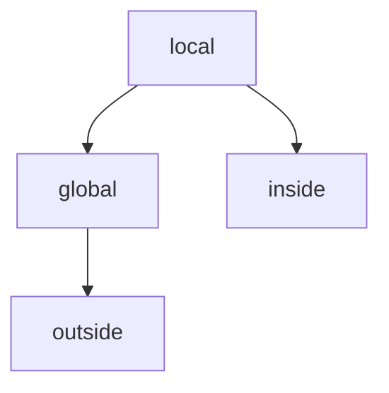

## Scope

Defines a *region* where a *name* **maps** to a certain *entitiy*

Multiple scopes enable the *same name* to refer to different things in *different contexts*

Given the name "Neil", which usually refers to *me*

But in a different *context*, it could refer to *Neil Armstrong* or *Neil deGrasse Tyson*

> Same *name*, different *entities*

---

## Lexical scope

Sometimes also called *static scope* is a specific style of scoping where the **text** of the program shows where the scope begins and ends

```js
{
    var a = "first";
    print a;
}
{
    var = "second";
    print a;
}
```

We have two *blocks* with a variable in *each* block

---

## Dynamic scope

Lexical scope is in contrast to *dynamic scope* where we don't know what a name refers to until we *run* the program

```
class Saxophone {
    play() {
        print "toot";
    }
}

class GolfClub {
    play() {
        print "fore";
    }
}

fun playIt(thing) {
    thing.play();
}
```

In this example, we don't know what `thing` is until we *run* the program and pass in an argument. It could be a `Saxophone` or a `GolfClub` and the output would be different in each case.

---

## Scopes and Environments

Scopes and environments are closely related, where scope is the *theory* while environment is the *implementation* of that theory

Since our program is in the `C` style family, we define our scopes using *blocks* of code, which are denoted by `{` and `}`

```
{
    var a = "in block";
}
print a; // Error, no a
```

Where any variable defined inside a block *disappears* once we exit that block

---

## Nesting and Shadowing

One way of implementing scope is to 

1. *visit* each statement and keep track of variables
2. *delete* variables when we exit the block

But that presents a problem

```
var volume = 11;

volume = 0;

{
    var volume = 3 * 4 * 5;
    print volume;
}
```

---

## Shadowing

When a local variable has the *same name* as a variable in an *enclosing scope*, the local variable *shadows* the outer one

Meaning that the inner variable casts a *shadow* that *hides* the outer variable, but crucially, it's **still** there

When we enter a new block scope, we need to *preserve* variables from outer scope, and the way we do that is by simply *defining a new environment* that *encloses* the previous one

And when we exit that block, we *discard* that inner environment,

```
volume = 0;
{
    var volume = 3 * 4 * 5;
    print volume; // 60
}
print volume; // 0
```

---

## Nesting

```
var global = "outside";
{
    var local = "inside";
    print global + local;
}
```

In the print statement, *both* `global` and `local` are in scope, even though only `local` is defined in the current block. 

The variable `global` is still accessible because it's defined in an enclosing scope.

We implement the support for this, along with shadowing, by having each environment have a *reference* to its *enclosing* environment

So when we *look up* a variable, we first check the current environment, and if it's not there, *we check the enclosing environment*, and so on until we find it or run out of environments

---

## Nesting and Shadowing



All we need to to give each environment a reference to its enclosing environment, and then we can support both nesting and shadowing with a simple lookup algorithm that checks the current environment first, then the enclosing one, and so on until it finds the variable or runs out of environments.

`8.5.1`

---

## Block syntax and semantics

```
statement -> exprStmt | parintStmt | block;

block -> "{" declaration* "}"
```

A block is simply a (*possible empty*) *sequence* of **statements** or **declarations** wrapped in curly braces

Note that the block itself is a statement and can appear anywhere a statement is allowed

`8.5.2`

---

## Run through

---
