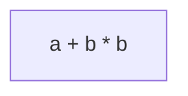
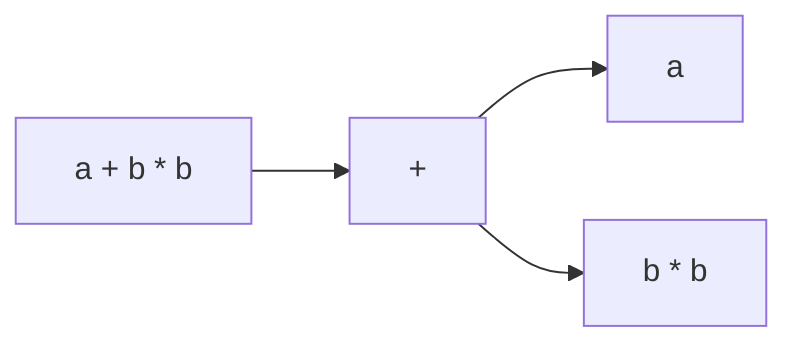
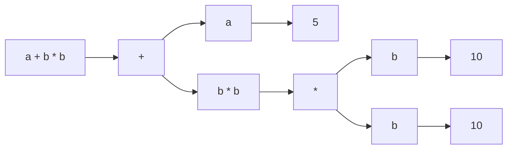
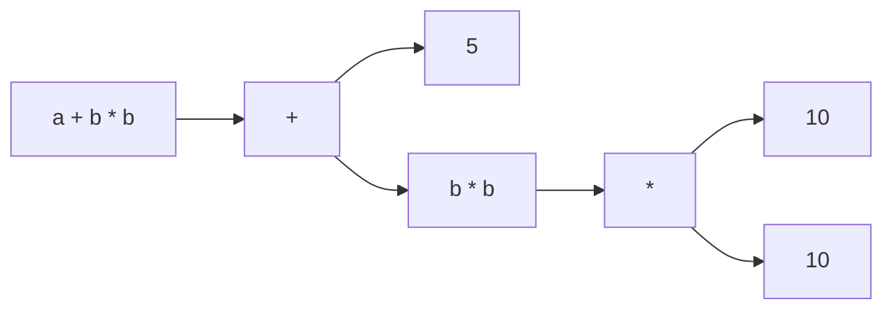
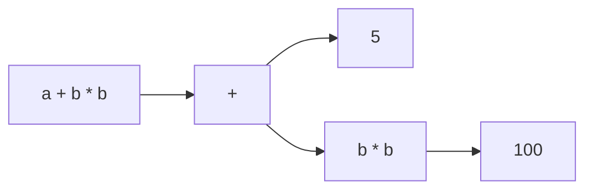
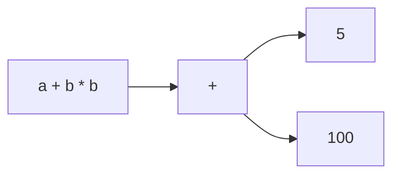
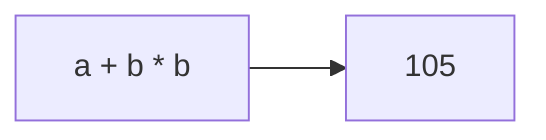
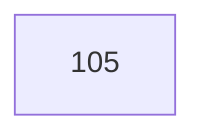
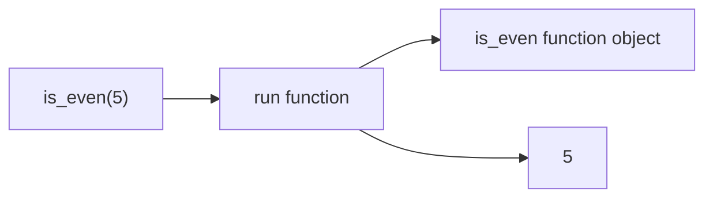

# How do languages work?

---

## Introduction

Almost every single programming language works *generally** the same way.

> They go in (what direction)?

And they

> Evaluate things line by line, token by token

<small>*exceptions apply</small>

---

## Sample

```python
a = 5
b = 10
c = a + b * b
```

If a programming language was a person reading this code, it would do the following:
1. see `a` as the *first character in a line*, 
    - this means it needs to make a **box** called `a`
2. Then it sees the `=` sign, 
    - this means it needs to **put something in the box** `a`
    - and that the thing after the `=` sign is something that needs to be **evaluated**
3. Then it sees `5`

> is the number `5` an expression?

---

## The concept of literal values

In python, and also most languages

the **symbol** `5` is separate from the **value** `5`

Because when you type `5` into the language, you are saying, place the value `5` here 

so

```
a = 5
```

means

```
box a, is equal to, the value represented by the literal 5
```

because, in python, the syntax for variables is

```
identifier equals_symbol expression
```

---

## What exactly is an expression?

An *expression* is anything that can be **evaluated** to **produce** a value

This can be:
- a literal value, like `5` or `10`
- a variable, like `a` or `b`
- a binary operation, like `a + b` or `b * b`
- a unary operation, like `-a` or `+b`
- a grouping, like `(a + b)`
- a function call, like `sum(5)`
- and basically everything else that is *replaced* by a value


---

## Sample

the line
```python
c = a + b * b
```

1. It sees `c` as the *first character in a line*, 
    - Make **box** called `c`

2. Then it sees the `=` sign, meaning, evaluate the expression on the right side, and put the result in box `c`

3. sees that `a + b * b` is an **expression**

This expression has multiple parts, and one of the best ways to visualize it is using a **tree diagram**

---

## Step 1: The full expression



---

## Step 2: implicit groupings



---

## Step 3: further breakdown



---

## Step 4: collapsing down



---

## Step 4: continue



---

## Step 4: continue



---

## Step 4: continue



---

## Step 5: final value



and so the line 

```python
c = a + b * b
```

results in what value being assigned to variable `c`?

---

## In the context of more complex structures

Like functions

```python
def is_even(n):
    if n % 2 == 0:
        return True
    else:
        return False
```

When the language sees the string of characters `def`, 

- it knows it needs to make a **box** 
- that box is called `is_even` that holds code that can be run later

---

## Functions

and if you call the function later

```python
result = is_even(5)
```

It simply evaluates the *name* `is_even`, which returns whatever was in the box called `is_even`

in our case, it returns the `function object`, a blob of code

Then it sees the `(` symbol, meaning it needs to **run** the code from the blob

with whatever is **in-between** the parentheses as inputs



---
layout: center
---

## Demo
