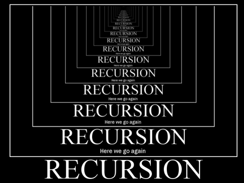
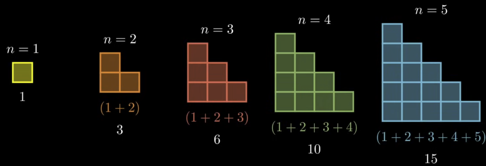
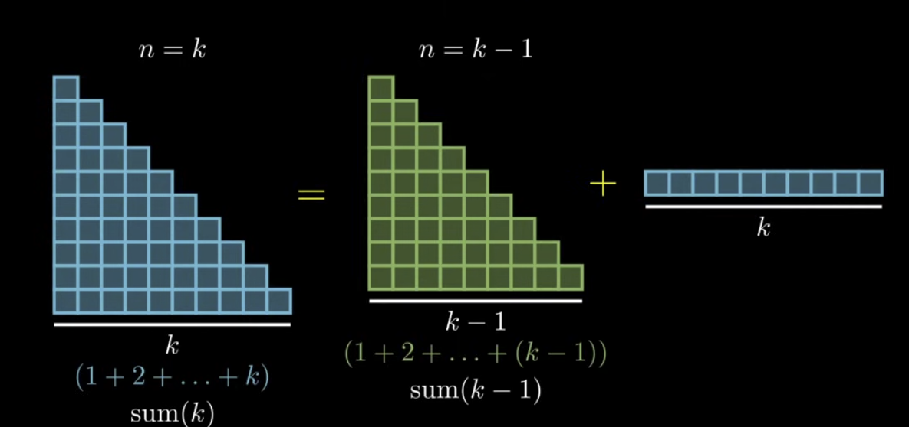
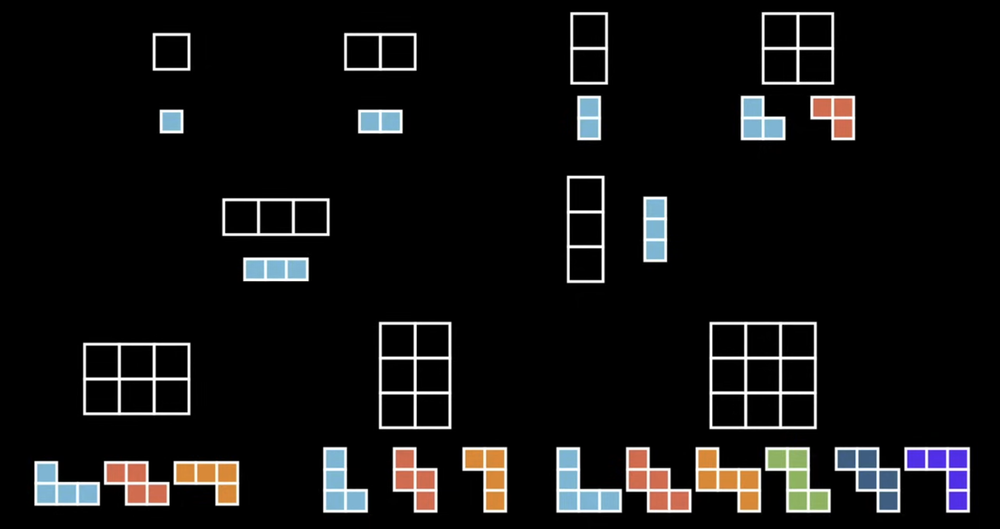
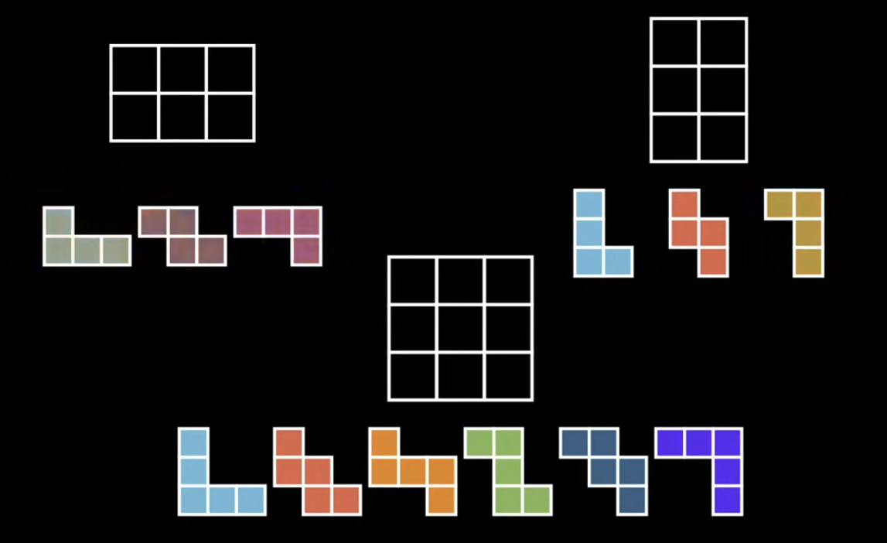
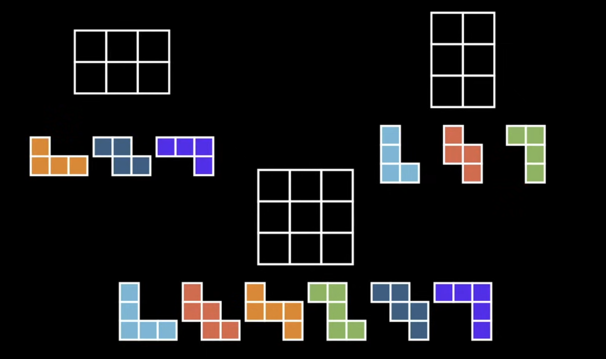

# Recursion

---

## Introduction

Recursion is a programming technique which attempts to solve problems by **calling itself**.



---

## Why

Recursion is useful for a **very small** subset of problems, and most problems can be solved **without** recursion.

Using recursion in those problems would usually lead to a *more complex, less efficient, and less readable solution*.

> So why learn recursion at all?


1. There are some problems where recursion is the **only** natural way to solve them.
2. Recursion exists **naturally** in the wild, and so you must understand it to read and maintain code.
3. Job interviews

---

## Sum of all numbers

Create function `sum`, where given an input `n`, it returns the sum of all non negative integers up to `n`.

Sample Input/Output:

```
sum(5) -> 15
sum(10) -> 55
sum(1) -> 1
sum(0) -> 0
```

---

## Sum of all numbers


```python
def sum(input_number):
    total = 1___
    for 2___ in range(3___):
        4___ = 5___ + 6___

    return 7___
```

---

## Sum of all numbers

If we wanted to make the function recursive, *how would we do it?*

Recursion is all about finding a problem, and

> Solving it using simpler versions of the same problem

---

## Step 1: Base Case

> What is the simplest possible input for the function?
- 0?
- 1?
- 2?
- 5?

---

## Step 1: Base Case

In our example, the simplest possible input is `0`

Because we **know** that the sum of all non negative integers up to `0` is `0`

> It's the only input where we directly provide the answer

This is called the **base case**

---

## Step 2: Examples and visualizing

<small>(Reducible, 2019)</small>


The next step is finding patterns, and a great way of doing that is through examples and visualization

---

## Step 3: relate harder examples to simpler examples

<small>(Reducible, 2019)</small>


Ask yourself the question, if you given the answer for a simpler input, could I solve a higher input?

> If you were given the answer for `sum(4)`, could you solve `sum(5)`?

- is `n=3` related somehow to `n=2`?

---

## Step 4: Generalize the pattern

Let's say we want to figure out the sum for `n` when `n` is equal to `4`

From our previous step, what does `n = 4` equal to?

---

## Step 4: Generalize the pattern

In something a bit more abstract

<small>(Reducible, 2019)</small>



---

## Step 5: write the code, given the base case and the generalized pattern

$$
\mathrm{sum}(n) =
\begin{cases}
0, & \text{if } n = 0, \\
\mathrm{sum}(n-1) + n, & \text{if } n > 0.
\end{cases}
$$

This translates to 

```python
def sum(___):
    if 1___ == 2___:
        3___
    else:
        return 4___ + 5___
```

---
layout: center
---

## Run through

> Assume we run the function with the input of 5

---

## Exercise

Complete the following function

```python
def factorial(n):
    """
    Returns the factorial of a number using recursion
    input: n (int)
    output: n! (int)
    sample:
        factorial(5) -> 120
    """
```

---

## A slightly more complex example

Say that we have a $n * m$ grid, starting from the top left, we want to get to the bototm left, and we can only move down or right 1 unit at a time

> How many unique paths are there given n and m?

Example

```
path(2, 2)
path(3, 2)
path(4, 3)
```

---

## Step 1: Base Case

> what is the simplest possible input for the function?

```
path(1, 1)
path(2, 1)
path(1, 2)
```

---

## Step 2: Examples and visualizing

Given examples, it's good to visualize them in a *sweeping* way. Where each example is close to another one. Why?

(Reducible, 2019)


---

## Step 2: Examples and visualizing

Let's narrow it down a bit

(Reducible, 2019)


---

## Step 2: Examples and visualizing

(Reducible, 2019)


Hint: look at the colors

---

## Step 3: relate harder examples to simpler examples

(Reducible, 2019)


At least for our example, we can see that

Let's test this pattern by working backwards with 

```
solve path(4, 3), using:
path(3, 3)
path(2, 4)
```

---

## Step 4: Generalize the pattern

$$
grid\_paths(n, m) = grid\_paths(n-1, m) + grid\_paths(n, m-1)
$$

And combined with our base cases

$$
\mathrm{grid\_paths}(n, m) =
    \begin{cases}
    1, \text{ if } n = 0 \text{ or } m = 1 \\
    grid\_paths(n-1, m) + grid\_paths(n, m-1)
    \end{cases}
$$

in Code

```python
def grid_paths(n, m):
    if 1___ == 0 2___ 3___ == 1:
        return 4___
    else:
        return grid_paths(5___, 6___) + grid_paths(7___, 8___)
```
---

## References

Reducible. (2019). 5 Simple Steps for Solving Any Recursive Problem. In YouTube. https://www.youtube.com/watch?v=ngCos392W4w
