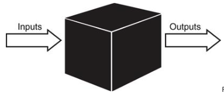
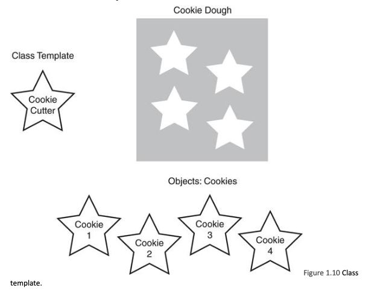
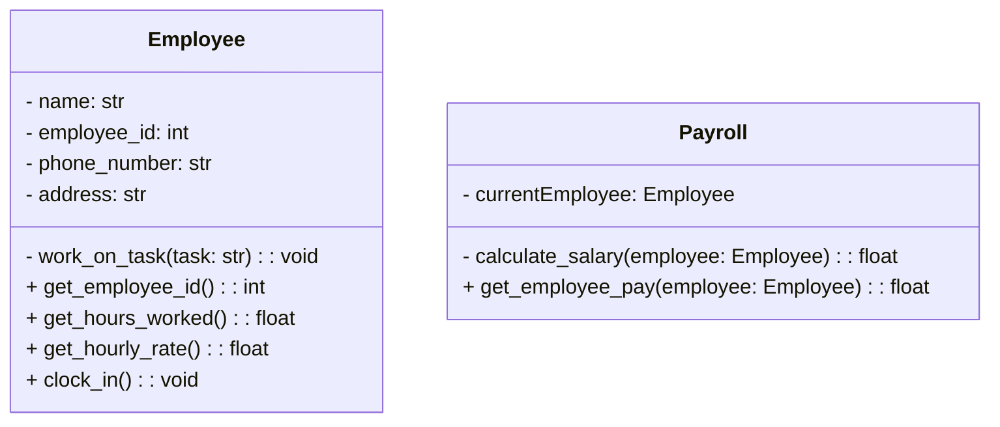
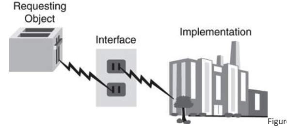
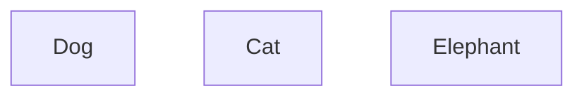
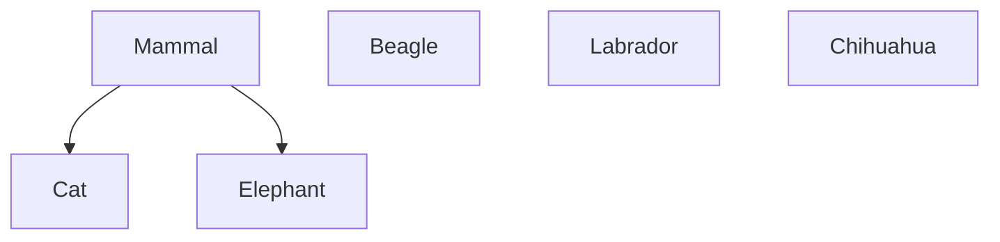
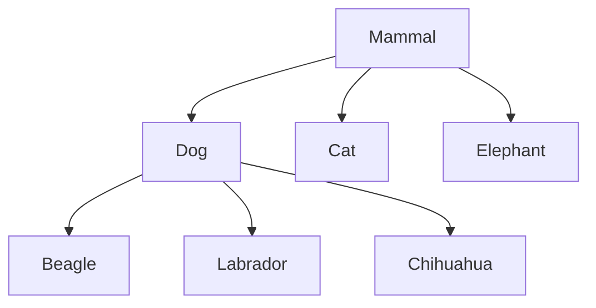
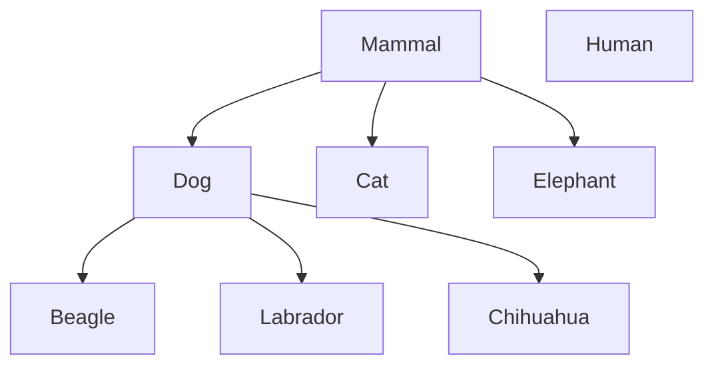
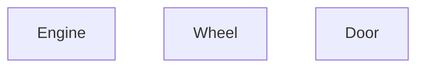
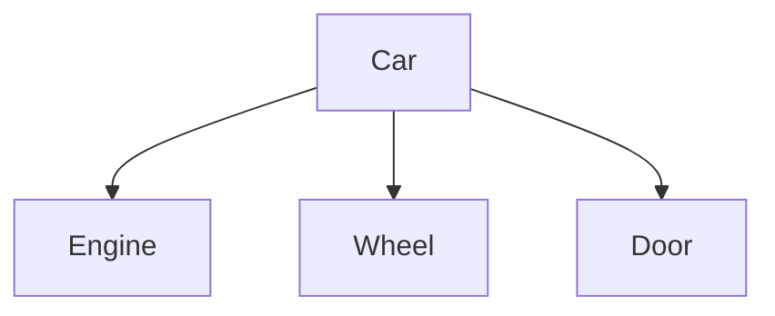

# Object-Oriented Programming

---

## Object-Oriented Programming

3 Main questions

1. What is an object
2. what does it mean to be oriented around objects
3. what does that have to do with fundamentals of programming

---

## Exercise

Make a calculator that supports binary-operations addition, subtraction, multiplication, and division

```python
def calculator(a, b, op):
    """
    Input:
    - a (float): first operand
    - b (float): second operand
    - op (str): operation, one of '+', '-', '*', '/'
    """

    if op == '+':
        return a + b
```

---
layout: center
---

## Exercise 2

I want the calculator to support the operation

```
/*
```

which divides `a` by `b` then multiplies the result by `b`

---
layout: center
---

## Exercise 3

Make only the addition operation support 3 inputs

---
layout: center
---

## Hypothetical Exercise 4

Support the operation

```
---
```

which decrements `a` by 1, `b` times

---
layout: center
---

# Key concepts of OOP

1. Encapsulation
2. Polymorphism
3. Inheritance
4. Composition

---
layout: center
---

# Objects
The core of OOP systems

> A combination of data and behavior in a single unit

---
layout: center
---

## Black boxing and abstraction


 
When you look at a person as an **object**, we can define that object by its 
1. **attributes** and 
2. **behaviors**

---

## Objects

Objects have two main **advantages**

1. They allow us to **model** the real world

This means that it's slightly easier to understand complex systems by aligning them to real world entities

2. They make it easier to **reason** about our code

Each object is **ideally** a self-contained unit that has its own *state* and *behavior*. Meaning we can simply focus on one object at a time without worrying about the entire system

---

## Object data

Represents the **state** of the object

For an imaginary `employee object`, the data could be
- name
- employee ID
- phone number
- address
- etc

---

## Object behavior

Represents the **actions** that the object can perform

For the employee object, the behavior could be: 
- clock in
- work on task
- email coworker
- attend meeting
- etc

In OOP, these behaviors are represented as **methods** of the object

---

## Object Interaction

Objects can interact with each other by sending **messages**

Messages being `method calls` that one object sends to another object

Imagine a `Payroll` object that needs to calculate the salary of an `Employee` object

In order to get that, it needs to send messages to the `Employee` like
1. `get_employee_id()`
2. `get_hours_worked()`
3. `get_hourly_rate()`

Then the `Employee` object will respond with the requested data

---
layout: two-cols
---

## Objects

In python, objects are created using classes. 

```python
class Dog:
    def __init__(self, name):
        self.name = name
        self.energy = 100

    def bark(self):
        print(f"{self.name} Woof!")

    def run(self):
        if self.energy > 0:
            print("run!")
            self.energy -= 10
        else:
            print("tired.")
```

::right::

Where the class is a *template* to actually create objects

```python
powder = Dog()
```

Where `powder` is an **instance** of the *class* `Dog()`, and that instance is an *object*

With methods `bark()` and `run()`, and attributes `name` and `energy`

---

## Objects



---

## Object Messages

In the context of python

```python
class DogHandler:
    #

guy = DogHandler()
dog = Dog("Powder")

guy.train(dog)
```

Any time an object is interacting with another object, it's called a **message**

1. When `object A` **calls** a method from `object B`
2. `object A` **sends** a message to `object B`
3. `object B` **replies** through a `return` value

---
layout: center
---

# Encapsulation
The act of bundling data and methods into a single unit

---

## Encapsulation

Encapsulation is the **core** concept of OOP

It states that a singular `object` should contain both the `data` and `methods` that operate on that data

This means that, if you make a fully object oriented program, you should be able to look at each object in isolation


---

## Side note on Data Hiding

One **primary** advantage of OOP is you don't need to expose all of an object's data and methods to the outside world

This is primarily useful for **teams** because
1. Anyone using an object is **exposed to less complexity**
2. The chances of **misuse** of methods is *reduced*

For example, a `SquareCalculator` needs to provide a way for another object to get the square of an integer

But it doesn't need to expose *how* it calculates the square

This is called **data hiding** and is considered good practice in OOP

---

## Side note, UML diagrams

**U**nified **M**odeling **L**anguage (UML) is a standardized way to visualize the design of a system



Minus (-) means **private** attribute/method, Plus (+) means **public** attribute/method

---

# Interfaces and implementation
Means of communication between objects



An interface is how one object can **message** another object, the `method` which other objects are meant to access

And as long as the `interface` stays the same, the implementation can change and the *user* won't notice

---
layout: center
---

## Note on terminology

- Interface means something completely different from **graphical user interface**.

- It's just a `method` with a set output

- **User** just means another programmer, another object, or another actual user which is interacting with the user

---

## Interfaces and implementation

````md magic-move
```python {all|3-4|6-9|11-13|8-9}
class IntSquare():
    def __init__(self) -> None:
        # private attribute
        self._square_value = None

    # public interface
    def int_get_square(self, x: int) -> int:
        self._square_value = self._int_calc_square(x)
        return self._square_value

    # private implementation
    def _int_calc_square(self, x: int) -> int:
        return x * x
```
```python {all|12-13|7-8}
class IntSquare():
    def __init__(self) -> None:
        # private attribute
        self._square_value = None

    # public interface
    def int_get_square(self, x: int) -> int:
        self._square_value = self._int_calc_square(x)
        return self._square_value

    # private implementation
    def _int_calc_square(self, x: int) -> int:
        return math.pow(x, 2)
```
````

---
layout: center
---

# Inheritance

---

## Inheritance

A way of **abstracting** common elements of classes into a **higher class** a `superclass` 

And then **extending** that superclass to its `subclass`es

Often called an **is-a** relationship

Each `subclass` has to implement the same interfaces the `superclass` implements

The most common example for this would be the `mammal example`



----

## Inheritance



----

## Inheritance



----

## Inheritance



---
layout: center
---

# Polymorphism

---

## Polymorphism

One of the **most powerful** advantages of object-oriented design. 

The ability for a variable to be **one of many** different types

1. Imagine a bunch of different shape objects `circle`, `square`, `triangle`
2. Each of these objects are *subclasses* of a `shape` object, meaning they all have the same `draw()` function
3. Your program could then have

```python
# where shapes is a list of `shape` class instances
for shape in shapes: 
    shape.draw()
```

You don't need to know **what shape it is**, only that it's a subclass of a shape object

It allows a single interface to be used for different underlying data types or objects

---
layout: center
---

# Composition
Another way of doing polymorphism

---

## Composition

Instead of having a `superclass` and `subclass` classes to create objects, you instead use object to build/**compose** a bigger object

Often called a **has-a** relationship

The most common example for this would be the `car example`

This is also the *preferred* way of doing modern OOP design, as it avoids some of the pitfalls of inheritance

The most common example for this would be the `car example`



---

## Composition




---
layout: center
---

# Abstraction

---

## Abstraction

Abstraction is a **core** concept in building any system, not just OOP systems

In OOP this is done by 

- making objects that represent **real-world** entities
- defining clear **interfaces** for how those objects interact
- stating only the **relationships** between objects

`Car` has an `Engine`, `Dog` is a `Mammal` 

---

## Object-Oriented in the context of Beginner Programmers

Object oriented programming can be fairly difficult to understand for beginner programmers, and that's because it requires a certain level of **abstraction** and **design thinking** that is not necessarily intuitive

> it requires experience 

The problem is that most popular APIs, engines, systems, etc. are usually built using OOP and expect you to use OOP

Most game engines, and Godot in particular, are *built using* OOP and *expect you to use* OOP

A lot of web development frameworks are *built using* OOP and *expect you to use* OOP

---

## Project

Create a simple text-based game using OOP principles

Primarily:
1. it should have *at least 3 different objects* (player, enemy, scene, decision, etc)
2. those objects should have *their own data and behavior*
3. those objects *should interact* with each other through messages (method calls)
4. implement either **inheritance** or **composition** in your design

---

## Sample of inheritance

```python
class Enemy:
    def __init__(self, name, health, attack):
        self.name = name
        self.health = health
        self.attack = 10

    def attack(self, target):
        target.health -= self.attack
        print(f"{self.name} attacks {player.name} for {self.attack} damage!")

class Goblin(Enemy):
    def __init__(self, agility):
        super().__init__("Mark", 30, 5)
        self.agility = agility

    def swift_strike(self, target):
        if agility > target.get_agility():
            damage = self.attack * 2
            target.health -= damage
            print(f"{self.name} performs a swift strike on {target.name} for {damage} damage!")
        else:
            print(f"{self.name}'s swift strike missed!")
```
---

## Sample of composition

```python
class MeleeWeapon():
    def __init__(self, name, damage):
        self.name = name
        self.damage = damage

    def use(self, target):
        target.health -= self.damage
        print(f"{self.name} hits {target.name} for {self.damage} damage!")

def Enemy():
    def __init__(self, name, health, weapon):
        self.name = name
        self.health = health
    #    self.weapon = weapon

    def attack(self, target):
        self.weapon.use(target)

sword = MeleeWeapon("Sword", 10)
goblin = Enemy("Goblin", 30, sword)
```

---

## Notes

While combat is a *common theme* for text-based games, feel free to explore other genres as long as you meet the project requirements

For example
1. An exploration game with objects like `Map`, `Mountain`, `Key`, `Door`

```python
dungeon_key = Key("dk", "A rusty old key that opens the dungeon door.") 

dungeon_door = Door("Dungeon Door", is_locked=True, required_key=dk)
dungeon_door.unlock(dungeon_key)
```

2. A dating sim with objects like `Player`, `Romancable`, `Location`, `gifts`

```python
emily = Romancable("Emily", "gems")

mark = Player("Mark")
mark.give_gift(emily, "gems", 5)
```

---

## Recipes

Remember to include a *main loop* to allow the player to make choices and interact with the game world

```python
while True:
    # Initialize game state, enemies, levels, romancable
    # present choices to the player

    choice = input("Enter your choice: ")

    # if statements to handle player choices and update game state
    if choice == "1":
        # do something
        if choice == "1":
    elif choice == "2":
        # do something else
    # etc
```

---

## Recipes

*state management* is an important part of any game, it's easier to put it in an object

```python
class GameState:
    def __init__(self, player, current_location):
        self.player = player
        self.current_location = "village"

    def update_location(self, new_location):
        self.current_location = new_location

while True:
    game_state = GameState(player, "village")
    choice = input("Enter your choice: ")
    if game_state.current_location == "village":
        if choice == "1":
            game_state.update_location("forest")
        elif choice == "2":
            game_state.update_location("dungeon")

    if game_state.current_location == "forest":
        if choice == "1":
```

---

## Notes

1. It can be an RPG, a puzzle game, a dating sim, etc. as long as it meets the above criteria

2. It **must** be a single python file that is runnable in the terminal

3. It **must** be named `lastname_firstname_oop.py` and submitted in NEO

4. The deadline is **February 19th, 11:59pm Friday**

5. I will spend the first ~20 minutes of the next class going over some of the projects

6. **late** submissions will be accepted with a 10% penalty per day late

7. AI use is **discouraged**, but if you do use AI, be prepared to explain what it added

8. Students with the exact or close to exact same code will not be checked

---

## Rubrics

1. Program requirements (10 pts)
- runs with no crashes (5 pts)
- playable from start to finish (4 pts)
- named correctly (1 pts)

2. OOP principles (20 pts)
- at least 3 different objects (6 pts)
- objects have their own data (2 pts)
- objects have their own behavior (2 pts)
- use of inheritance or composition (10 pts)

3. Interaction (10 pts)
- objects interact with each other (5 pts)
- interactions are clear and make sense (5 pts)

4. Completeness (10 pts)
- game is complete and has a clear goal or loop (10 pts)

---

## Brainstorming time

On any piece of paper, brainstorm some ideas for your text-based game

Specifically,

- genre
- how you want it to play
- probable objects
- interactions between those objects

Submit it to me and I'll go over it with you and give you feedback on how to implement it
