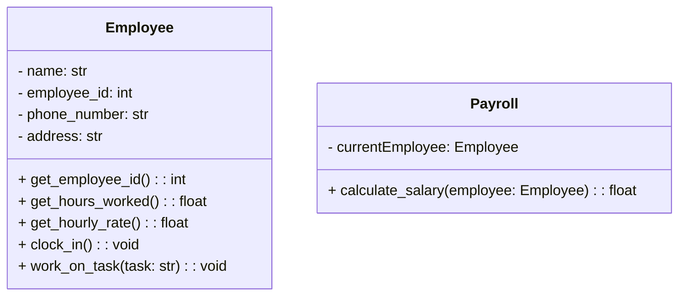
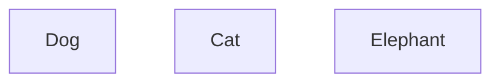
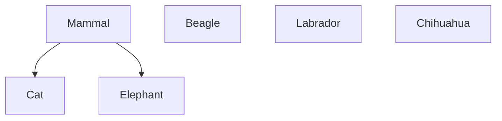
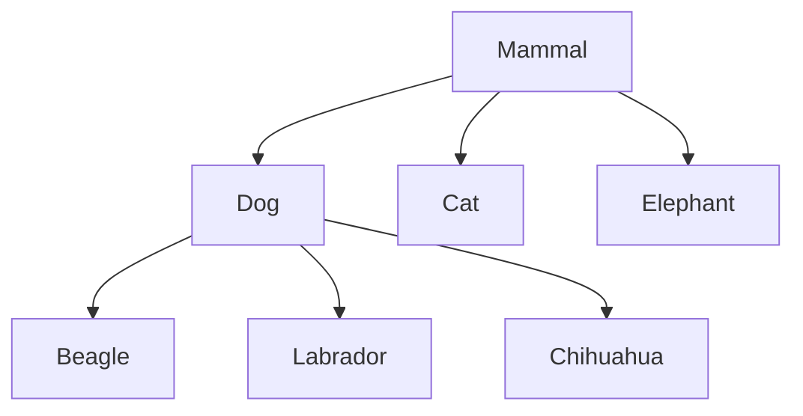
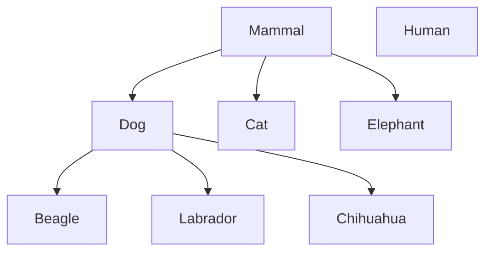
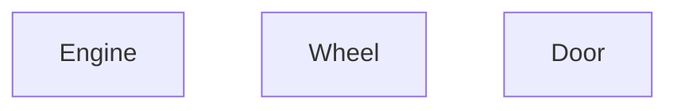
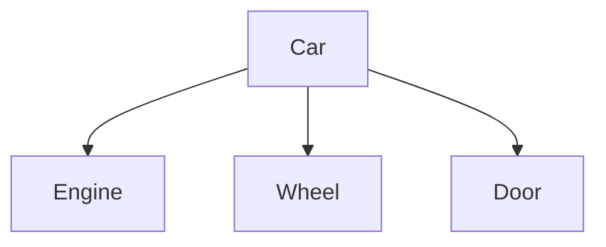

# Object-Oriented Programming

---

## Object-Oriented Programming

3 Main questions

1. What is an object
2. what does it mean to be oriented around objects
3. what does that have to do with programming

---

## Exercise

Make a calculator that supports binary-operations addition, subtraction, multiplication, and division

```python
def calculator(a, b, op):
    """
    Input:
    - a (float): first operand
    - b (float): second operand
    - op (str): operation, one of '+', '-', '*', '/'
    """

    if op == '+':
        return a + b
```

---
layout: center
---

## Exercise 2

I want the calculator to support the operation

```
/*
```

which divides `a` by `b` then multiplies the result by `b`

---
layout: center
---

## Exercise 2

Make only the addition operation support 3 inputs

---
layout: center
---

## Exercise 3

support the operation

```
---
```

which decrements `a` by 1, `b` times

---
layout: center
---

# Key concepts of OOP

1. Encapsulation
2. Polymorphism
3. Inheritance
4. Composition

---
layout: center
---

# Objects
The core of OOP systems

> A combination of data and behavior in a single unit

---
layout: center
---

## Black boxing and abstraction


 
When you look at a person as an **object**, we can define that object by its 
1. **attributes** and 
2. **behaviors**

---

## Objects

Objects have two main **advantages**

1. They allow us to **model** the real world

This means that it's slightly easier to understand complex systems by **breaking them down** into smaller, more manageable pieces

2. They make it easier to **reason** about our code

Each object is **ideally** a self-contained unit that has its own state and behavior. Meaning we can simply focus on one object at a time without worrying about the entire system

---

## Object data

Represents the **state** of the object

For an imaginary employee object, the data could be
- name
- employee ID
- phone number
- address
- etc

Note that these are attributes of the **specific** employee object

---

## Object behavior

Represents the **actions** that the object can perform

For the employee object, the behavior could be: 
- clock in
- work on task
- email coworker
- attend meeting
- etc

In OOP, these behaviors are represented as **methods** of the object and invoked by sending **messages** to the object

---

## Object Interaction

Objects can interact with each other by sending **messages**

Messages being **method calls** that one object sends to another object

Imagine a `Payroll` object that needs to calculate the salary of an `Employee` object

In order to get that, it needs to send messages to the `Employee` like
1. `get_employee_id()`
2. `get_hours_worked()`
3. `get_hourly_rate()`

Then the `Employee` object will respond with the requested data

---

## Sidenote, UML diagrams

**U**nified **M**odeling **L**anguage (UML) is a standardized way to visualize the design of a system



Minus (-) means **private** attribute/method, Plus (+) means **public** attribute/method

---
layout: two-cols
---

## Objects

In python, objects are created using classes. 

```python
class Dog:
    def __init__(self, name):
        self.name = name
        self.energy = 100

    def bark(self):
        print(f"{self.name} Woof!")

    def run(self):
        if self.energy > 0:
            print("run!")
            self.energy -= 10
        else:
            print("tired.")
```

::right::

Where the class is a *template* to actually create objects

```python
powder = Dog()
```

Where `powder` is an **instance** of the *class* `Dog()`, and that instance is an *object*

With methods `bark()` and `run()`, and attributes `name` and `energy`

---

## Objects


---

## Object Messages

In the context of python

```python
class DogHandler:
    pass

guy = DogHandler()
dog = Dog("Powder")

guy.train(dog)
```

Any time an object is interacting with another object, it's called a **message**

1. When `object A` **calls** a method from `object B`
2. `object A` **sends** a message to `object B`
3. `object B` **replies** through a `return` value

---
layout: center
---

# Encapsulation
The act of bundling data and methods into a single unit

---

## Encapsulation

One **primary** advantage of OOP is you don't need to expose all of an object's data and methods to the outside world

This is primarily useful for **teams** because
1. Anyone using an object is **exposed to less complexity**
2. The chances of **misuse** of methods is *reduced*

For example, a `SquareCalculator` needs to provide a way for another object to get the square of an integer

But it doesn't need to expose *how* it calculates the square

This is called **data hiding** and is considered good practice in OOP

---

# Interfaces and implementation
Means of communication between objects


An interface is how one object can **message** another object, the `method` which other objects are meant to access

And as long as the `interface` stays the same, the implementation can change and the *user* won't notice

---
layout: center
---

## Note on terminology

- Interface means something completely different from **graphical user interface**.

- It's just a `method` with a set output

- **User** just means another programmer, another object, or another actual user which is interacting with the user

---

## Interfaces and implementation

````md magic-move
```python {all|3-4|6-9|11-13|8-9}
class IntSquare():
    def __init__(self) -> None:
        # private attribute
        self._square_value = None

    # public interface
    def int_get_square(self, x: int) -> int:
        self._square_value = self._int_calc_square(x)
        return self._square_value

    # private implementation
    def _int_calc_square(self, x: int) -> int:
        return x * x
```
```python {all|12-13|7-8}
class IntSquare():
    def __init__(self) -> None:
        # private attribute
        self._square_value = None

    # public interface
    def int_get_square(self, x: int) -> int:
        self._square_value = self._int_calc_square(x)
        return self._square_value

    # private implementation
    def _int_calc_square(self, x: int) -> int:
        return math.pow(x, 2)
```
````

---
layout: center
---

# Inheritance

---

## Inheritance

A way of **abstracting** common elements of classes into a **higher class** a `superclass` 

And then **extending** that superclass to its `subclass`es

Often called an **is-a** relationship

Each `subclass` has to implement the same interfaces the `superclass` implements

The most common example for this would be the `mammal example`



----

## Inheritance



----

## Inheritance



----

## Inheritance



---
layout: center
---

# Polymorphism

---

## Polymorphism

One of the **most powerful** advantages of object-oriented design. 

The ability for a variable to be **one of many** different types

1. Imagine a bunch of different shape objects `circle`, `square`, `triangle`
2. Each of these objects are *subclasses* of a `shape` object, meaning they all have the same `draw()` function
3. Your program could then have

```python
# where shapes is a list of `shape` class instances
for shape in shapes: 
    shape.draw()
```

You don't need to know **what shape it is**, only that it's a subclass of a shape object

It allows a single interface to be used for different underlying data types or objects

---
layout: center
---

# Composition
Another way of doing polymorphism

---

## Composition

Instead of having a `superclass` and `subclass` classes to create objects, you instead use object to build/**compose** a bigger object

Often called a **has-a** relationship

The most common example for this would be the `car example`

This is also the *preferred* way of doing modern OOP design, as it avoids some of the pitfalls of inheritance

The most common example for this would be the `car example`



---

## Composition




---
layout: center
---

# Abstraction

---

## Abstraction

Abstraction is a **core** concept in building any system, not just OOP systems

In OOP this is done by 

- making objects that represent **real-world** entities
- defining clear **interfaces** for how those objects interact
- stating only the **relationships** between objects

`Car` has an `Engine`, `Dog` is a `Mammal` 

