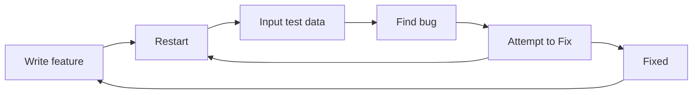

# Testing and test driven development

---

## Debugging loop

A loop that often happens when you make a program is a constant cycle of *making* a feature, *running* that feature, *testing* it a bit with some test input, then repeating

Again, and again, and again, until you have a feature that **works**

This process is *slow*, *prone to error*, and isn't *comprehensive*

---

## Manual Testing

When making a *new* feature, the standard flow tends to be what's show on the right

This works for *smaller* codebases, but at larger scales this forces you to manually test **every single feature** when you add it.



---

## Example

For example, in the context of your Game project

The game might be in a *playable* state, but you want to *add* a new feature, like a new type of enemy in a new area

So you *make the feature*, you run the game, you input *the correct sequence of inputs* to get to the new area, and you find out that the new enemy **doesn't** spawn

You look at your code, you find the bug, *you fix it*, and you run the game **again**, you input the correct sequence of inputs **again**, and you find out that the new enemy **does** spawn, but it doesn't have the correct behavior

So you do it *again*

---

## Another example

Let's say you have a feature that *already works*, but you want to *change* it to allow for it to work *differently*

You want to change the weapon handling system to be able to also use magic

This change could break your *already existing* weapon handling system, and without testing, you might not even know that it broke until you try to use the weapon handling system again, which could be *much later* in the development process

---

## Automated testing

This is where *automated testing* comes into play

It's code you write to check the code you write

It creates a system that *automatically* does a portion of that manual process for 

1. **faster feedback** on whether your code works, and
2. it allows you to catch **silent regressions** in your code

Having an automated testing system allows you to *confidently* make changes to your code, because you can run your tests to check if your changes broke anything, and if they did, you can fix it before it becomes a bigger problem down the line.

---

## Unittest

**Unittest** is a built-in Python module that provides a framework for *writing and running automated tests*.

It's part of the *standard library*, and it's a great way to get started with automated testing in Python.

However, *all* testing frameworks, like programming languages, tend to be similar and the *concept of testing* is more important than the implementation, 

You can easily switch to another more powerful testing framework like `pytest` if you want to later on.

---
layout: center
---

# Core concepts

---

## What is a Test

In the context of a testing framework, a test is a program that *verifies behavior*.

It states

> "Given this input, I expect this output"

In a terminal only game, that would be

> "Given I input 'attack', I expect the next line of output to be 'You attack the enemy!' and the enemy's health to decrease by 10"

---

## Unit Test

A small test that tests a single "*unit*" of functionality, like

1. A single method or function, or
2. A single class, or
3. A single module

The range can vary depending on the person, but the idea is that it's a small test that tests a *specific piece of functionality* in **isolation** from the rest of the codebase.

---

## Assertions

The second part of the statement from before

> I expect this output

Is called an *assertion*, you are **asserting** that reality matches some specific thing

This is the backbone of testing

This can be in the form of checking 

1. if the input is uppercase, or 
2. it can be asserting that the database has a new entry after adding, 
3. or it can be asserting that the enemy's health decreased by 10 after an attack command

> After A, I expect B

---
layout: center
---

# Examples and Unittest basics

---

```python
class Enemy:
    def __init__(self, name, health, attack):
        self.name = name
        self.health = health
        self.attack = attack

    def attack(self, target):
        target.health -= self.attack

class Goblin(Enemy):
    def __init__(self, name, agility):
        super().__init__(name, 30, 5)
        self.agility = agility

    def swift_strike(self, target):
        if agility > target.get_agility():
            damage = self.attack * 2
            target.health -= damage
```

---

```python
import unittest
from game import Enemy, Goblin

class TestEnemy(unittest.TestCase):
    def setUp(self):
        self.player = Player("Player", health=100, agility=15)
        self.high_agi_player = Player("Player", health=100, agility=35)
        self.goblin = Goblin("Gobbo", 20)

    def test_attack(self):
        self.goblin.attack(self.player)

        self.assertEqual(self.player.health, 95)

    def test_swift_strike(self):
        self.goblin.swift_strike(self.player)

        self.assertEqual(self.player.health, 90)
```

---

```python
import unittest
from game import Enemy, Goblin

class TestEnemy(unittest.TestCase):
    def test_swift_strike_miss(self):
        self.goblin.swift_strike(self.high_agi_player)

        self.assertEqual(selfplayer.health, ____)
```

---

## Setup

```python
import unittest
from game import Enemy, Goblin
```

This assumes that you have a file called `game.py` in the same directory as this test file, and that `game.py` contains the definitions for the `Enemy` and `Goblin` classes.

---

## Defining a test

```python
class TestEnemy(unittest.TestCase):
```

We're making a class that *inherits* from the `unittest.TestCase` class, 

Which means that this class will have *all the methods and properties* of the `unittest.TestCase` class,

Note the naming convention, the class name starts with `Test`, which is a common convention for test classes, and it describes what we're testing, in this case, the `Enemy` class.

---

## Setup method

```python
def setUp(self):
    self.player = Player("Player", health=100, agility=15)
    self.high_agi_player = Player("Player", health=100, agility=35)
    self.goblin = Goblin("Gobbo", 20)
```

The `setUp(self)` method is a unique method

It's similar to the `__init__()` method, where it allows you to *set up* variables you can check in your other test

It *is run before every test method*, and so each test method you define will have a unique instance of:
- `Player("Player", health=100, agility=15)`, 
- `Player("Player", health=100, agility=35)`, and 
- `Goblin("Gobbo", 20)`

---

## The tests

```python
    def test_attack(self):
    def test_swift_strike(self):
    def test_swift_strike_miss(self):
```

Notice how *all* of them have the `test_` as their *prefix*. This informs python that these are methods that are used for tests.

Any method that doesn't have `test_` as a prefix is **ignored**, and *won't be run* when you run your tests.

---

## Test methods

```python
    def test_attack(self):
        self.goblin.attack(self.player)

        self.assertEqual(self.player.health, 95)
```

This test does two things
1. It *performs an action* that we want to test, which is `self.goblin.attack(self.player)`, and then
2. It *asserts* that the expected outcome of that action is true, which is `self.assertEqual(self.player.health, 95)`


TODO: ADD custom assertion example, and the other two tests

---

## Running the tests

```python
if __name__ == "__main__":
    unittest.main()
```

To run the test, add this code at the bottom of your test file

This states that
1. If this file is being run *directly*
2. then run the `unittest.main()` function from the imported `unttest` module

And this runs all the classes that inherit from `unittest.TestCase`, and all the methods in those classes that start with `test_`, and it reports the results of those tests in the terminal.

---

## Running the tests

You can run the tests through

```
python -m unittest test_file.py
```

This is saying
> Python, using the module (-m) `unittest`, run the tests in `test_file.py`

And an example output would look like this

```
...
----------------------------------------------------------------------
Ran 3 tests in 0.000s

OK
```

---

## Running the tests

And a failure would look like this

```
======================================================================
FAIL: test_swift_strike_miss (__main__.TestEnemy)
----------------------------------------------------------------------
Traceback (most recent call last):
    ...
AssertionError: 90 != 100

----------------------------------------------------------------------
Ran 3 tests in 0.001s

FAILED (failures=1)
```

Which highlights *what test failed*, and which *assertion failed*

---

## Why tests matter

For these *simple* examples, these tests don't bring us *much value*.

For *smaller personal projects*, 

> tests might not have immediate payoff 

Because *you*, the developer, likely has a *strong enough understanding of the entire codebase* that tests aren't required

The time spent *writing tests* might be better spent *writing code* for the project, and you can just *manually test* your code as you go along

---

## Why tests matter

However, for *larger projects*, and projects where you're working with *multiple people*

Tests become an invaluable tool to make sure that your *changes work as expected*, and that you aren't required to *learn the entire codebase every time you need to make a change*

As projects get larger and more complex, manual testing becomes *more difficult* and *time-consuming*, 

And the extra effort to *set up* and **maintain** automated tests will be worth it

---

## Maintaining Tests

Tests that don't accurately reflect the *current state of the codebase* are **worse** than no tests at all, 

Because they give you a *false sense of security* that your code works when it actually doesn't

The moment you start writing tests, you need to *commit* to maintaining those tests, 

And *updating* them whenever you make **changes to your code** that would affect the expected behavior of those tests

---

## Addition to the project

In your `OOP` game project, add at least *one* automated test

For example, you could create a test for the `Enemy` class that tests the `attack()` method, and asserts that the player's health decreases by the expected amount when attacked by an enemy.

Or you could make a test for the `Player` class that tests which romance options are available to the player based on their choices in the game, and asserts that the correct romance options are available based on those choices.

Then, you can run your tests whenever you make changes to your code, to ensure that your changes don't break any existing functionality.

Put the test on a separate file, and name it `game_test.py` and submit it *along* with your game to NEO

