# Godot

---
layout: center
---

# 3 main reasons
To use Godot

---

## Knowing how tooling works

It's fairly rare to work on a project where you write **all** the code

Even in simpler project, we use libraries and plugins as a *shortcut* to get things done faster

In anything *larger*, we'll need to start working with **frameworks** and **engines** to get things done

The way you interact with any *framework or engine* is through is similar

    
    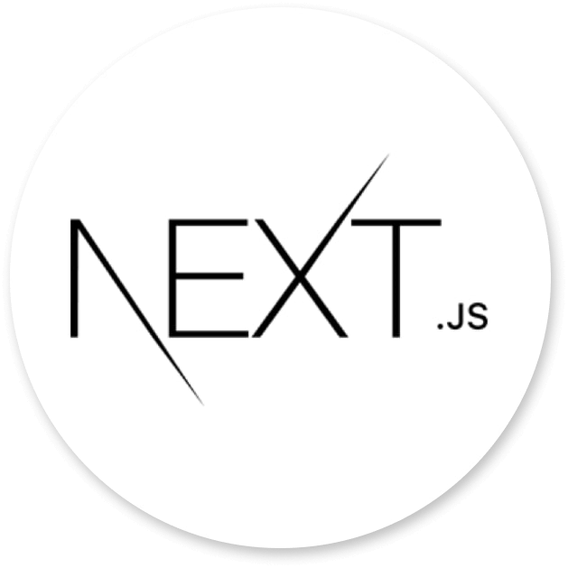

`Godot` is just a good example since it's all encompassing

---

## Game development has more problem solving

In a lot of development, there are clearer "*right answers*" to problems

Even the *same problem* can have *multiple solutions*, and it's not always clear which one is best

This forces you to develop **raw problem solving skills**

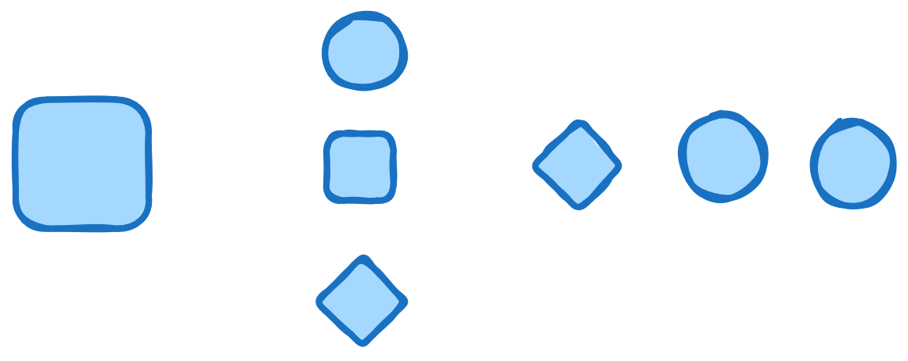

It let's you use **solutions**, gained from tutorials and courses, and the **tools** those solutions use

To solve *unique* problems using the same tools

---

## Game dev is visual and interactive

This is a **huge** motivator for learning and improving

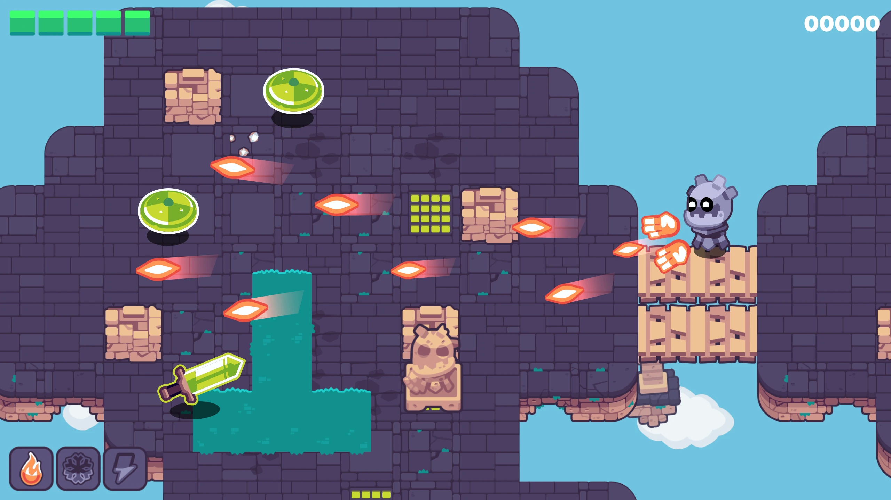

And also a great way to obtain an **instinct** for how things work

> Programming can tend to be *abstract*, especially on the algorithms side

Game development allows you to *feel* and *see* the results of your work, 

Which is a powerful feedback loop for learning and improvement

---
layout: center
---

# Why Godot

I don't technically have to sell you godot, but I will

---
layout: two-cols-header
---

## It's easy to install, run, and get started with

Godot is a single executable, with *no installation process*, and no dependencies

It is **batteries-included**, meaning it has a lot of niceties built in, like a *code editor*, *file manager*, *game viewer*

::left::

    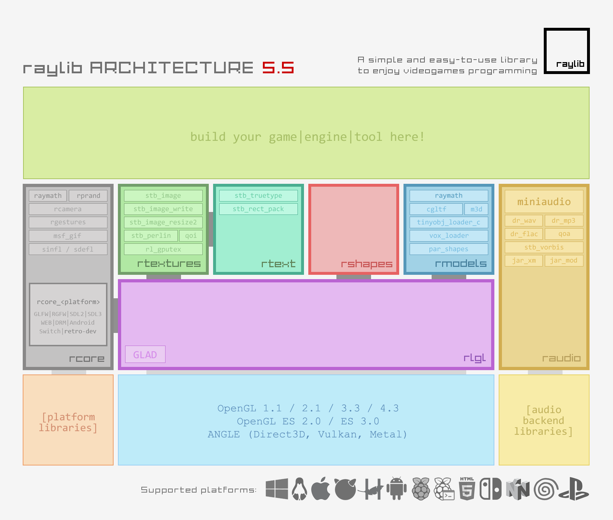
    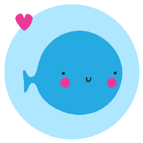

Compared to *smaller engines*, like `raylib` and `love2d`, 

Which require you to set up your own code editor, file manager, and game viewer

::right::

    
    

And Compared to *larger engines*, like `unreal` and `unity`, 

Which have a much more complex installation process

---

## It's free as in freedom and runs on anything

Godot is **free and open source software**, licensed under the `MIT license`

This means you can do whatever you want with it, and even contribute to the engine itself

> As a student, this is important mainly:

1. You can use it for free, without worrying about *licensing or costs*
2. When you graduate, the *skills* you learned won't be behind a paywall

<small>It also has really low system requirements, and can run on almost all platforms</small>

---

## It's pretty popular

It's been proven to work for a lot of different types of games, and has a large and active community

    
    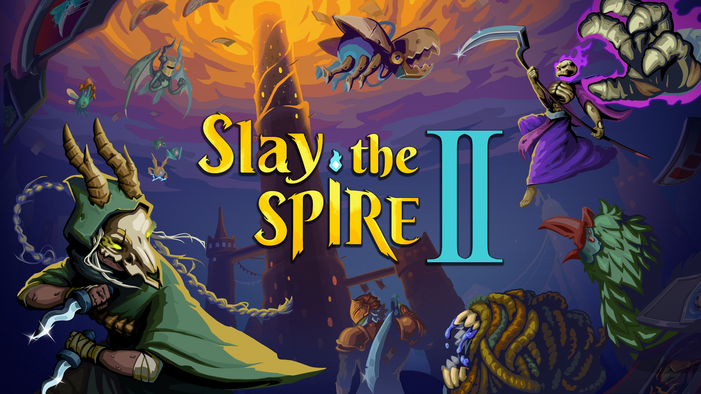

[2025 showcase](https://youtu.be/7ZwEmxihlw4?si=v1Bvp0gMrKSOveej)

---
layout: center
---

# Godot

---

## Installation

Go to the [Godot download page](https://godotengine.org/download)

Godot is a bit *unique* in the sense that it doesn't have an installation process, it's just a *single executable*

`Unzip` the downloaded file, and *run* the executable

---

## Godot as an Engine

Godot is a *game engine*, which means it provides a lot of *tools and features* to help you make *games*

And it runs using the `GDscript` programming language, which is a *Python-like* language designed specifically Godot

---

## A side note on programming languages

As a programmer, you **will** have to learn *multiple languages*

    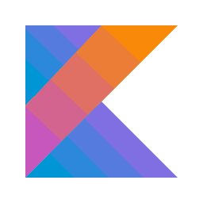
    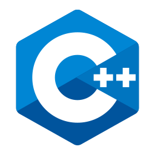
    
    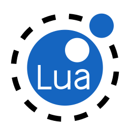
    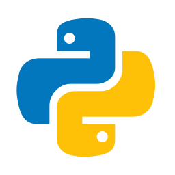
    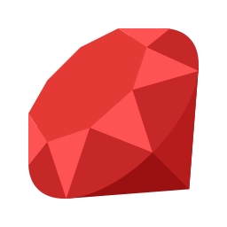
    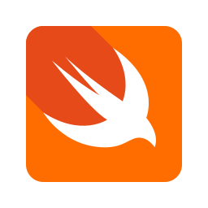

Most programmers are expected to know *at least a few languages*, be able to *learn new ones*, and be **good** at one or two

This is not as **difficult as it sounds**, because most programming languages share a lot of *common concepts* and *structures*

A mastery of basic programming concepts, like *variables*, *functions*, *classes*, *data structures*, and *algorithms* will allow you to pick up new languages quickly

A good resource is [learn x in y minutes](https://learnxinyminutes.com/), which provides quick overviews of many programming languages

---

## GDscript

All that to say, you will be learning `GDscript` to use Godot

It's *python-like*, emphasizes readability, and is designed to be easy to learn for beginners

But it's still a whole new language, with its own syntax, semantics, and quirks

We'll be using `Learn GDscript` by `GDQuest`, which is a great resource for learning the language and how to use it with Godot

[Learn GDScript from Zero](https://gdquest.github.io/learn-gdscript/?ref=godot-docs)

---

## Activity

In Learn gdscript, complete the first 9 lessons

Make a screenshot of your lesson progress

Submit it on neo
