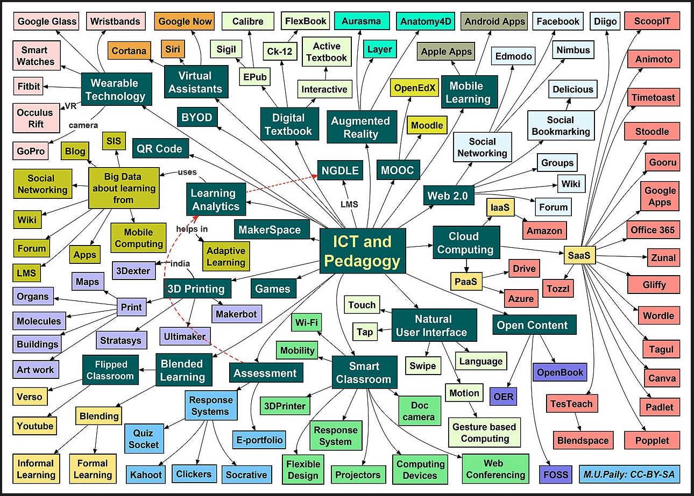

# Introduction to Information and Communication Technology

---

## What is ICT?

Communication, from the Latin "*communicare*", means to *share or exchange* **information**.

Technology, from the Greek "*techne*", means art, skill, or craft. Though more commonly, it refers to **tools and machines** that help solve problems or perform specific functions.

Give me an example of technology used for communication

https://www.britannica.com/topic/postal-system/History

<!--paper-->

---

## What is ICT?

An umbrella term that includes any communication device or application

---

## Components

1. Hardware, in physical space
2. Software, in virtual space 
3. Network, method of travel
4. Data, content

---
layout: center
---

# Examples
communication, productivity, web services

---
layout: center
---

# Impact

---

## Personal

1. Have you recently bought anything using a qr?
2. When was the last time you texted someone with standard load?
3. Do you read reviews before buying something online?

- Social
- Financial
- Educational

---

## Education

1. When you were struggling with a subject, what did you do?
2. When you wanted to learn something new, what did you do?
3. When school was suspended, where did they continue it?

---

## Business and work

1. Gaisano has less stores, why?
2. How do you pay utility bills?
3. Where do you search if you need to buy something local?

---
layout: two-cols-header
---

# Pros and Cons

::left::
## Pros
1. speed
2. access
3. growth

::right::
## Cons
1. access
2. privacy
3. dependency

---

# Activity
in your neo

1. You will form groups of 5 members each
2. you will be assigned a specific business model (eg. retail, service, manufacturing)
3. discuss how ICT has affected that business model (both positively and negatively)
    1. what tools are commonly used
    2. how has it changed the way they operate
    3. what challenges has it brought
4. prepare a single page, a4, infographic
5. present your findings to the class

