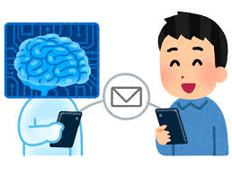
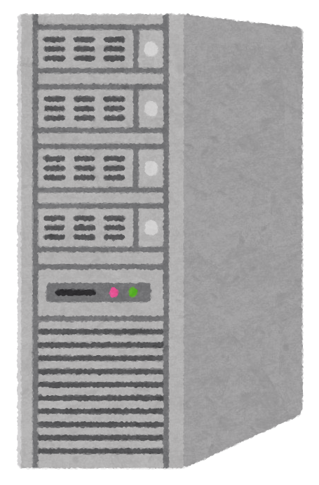
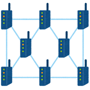

# Information and Communication Technology
An introduction

---

## What is ICT?

Communication, from the Latin "*communicare*", means to *share or exchange* **information**.

Technology, from the Greek "*techne*", means art, skill, or craft. 

Though more commonly, it refers to **tools and machines** that help solve problems or perform specific functions.

Give me an example of technology used for communication

---

## What is ICT?

An umbrella term that includes any communication device or application

---
layout: two-cols-header
---

## Components

::left::
1. **Hardware**, in physical space

2. **Software**, in virtual space 

::right::
3. **Network**, method of travel

4. **Data**, content

---
layout: center
---

# Examples
communication, productivity, web services

---
layout: center
---

# Impact

---
layout: center
---

## Personal

1. Have you recently *bought* anything using a qr?
2. When was the last time you *messaged* someone?
4. Do you play any *online* games?

---
layout: center
---

## Education

1. When you were *struggling* with a subject, what did you do?
2. When you wanted to *learn something new*, what did you do?
3. When school was *suspended*, where did they continue it?

---
layout: center
---

## Business and work

1. Gaisano has less stores, why?
2. How do you pay utility bills?
3. When you want to buy something?

---
layout: two-cols-header
---

# Pros and Cons

::left::
## Pros
1. General speed
2. Increased accessibility
3. Growth and opportunities

::right::
## Cons
1. Lack of access
2. Lowered privacy
3. Singular dependencies

---
layout: two-cols
---

# Activity
in your neo

1. You will form **groups of 5** members each
2. you will be assigned a **business model**
3. discuss how ICT has affected that business model (both positively and negatively)
    1. what tools are commonly used
    2. how has it changed the way they operate
    3. what challenges has it brought
    4. extra facts, history, and figures are encouraged
4. prepare a **single page, a4, pdf**, infographic
5. **present** your findings to the class
    - 3-10 minutes
    - every group member must speak once

::right::

## Rubrics
- Content and correctness (5pts)
> Did you cover the majority of the ways ICT has affected the business model? 

at least 5 is a good target, less is ok, more is preferred

- Visual appeal (5pts)
> Does your infographic look good 

- Readability (5pts)
> Is organized well and easy to read?

- Presentation (5pts) (individual)
> Did you speak clearly and confidently?

**Deadline**: January 22, 2025 (Thursday)

---
layout: two-cols
---

## Example

Business Model: Retail

ICT Tools: 

- digital payment systems, 
> Lorem ipsum dolor sit amet, consectetur adipiscing

- inventory management software, 
> porta sit amet orci ut placerat. Integer aliquet erat et purus vulputate 

Challenges:
- Cybersecurity threats
> non diam tempus, et consectetur ligula egestas

::right::

---
layout: center
---

## Topics

1. Retail
2. Service
3. Manufacturing
4. Marketplaces
5. Movies
6. Education
7. Healthcare
8. Finance
9. Tourism
10. Media

