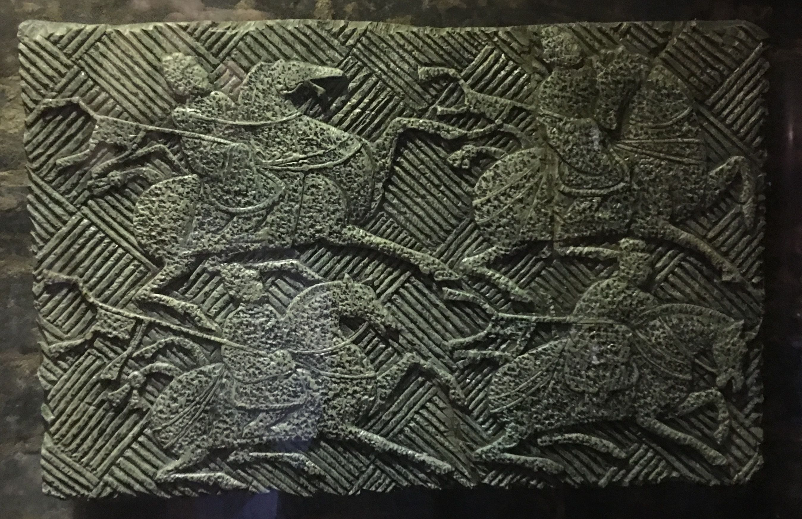
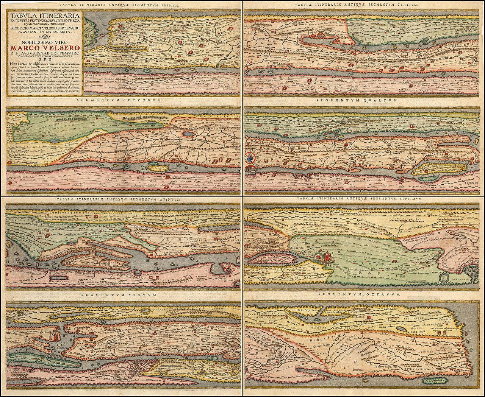
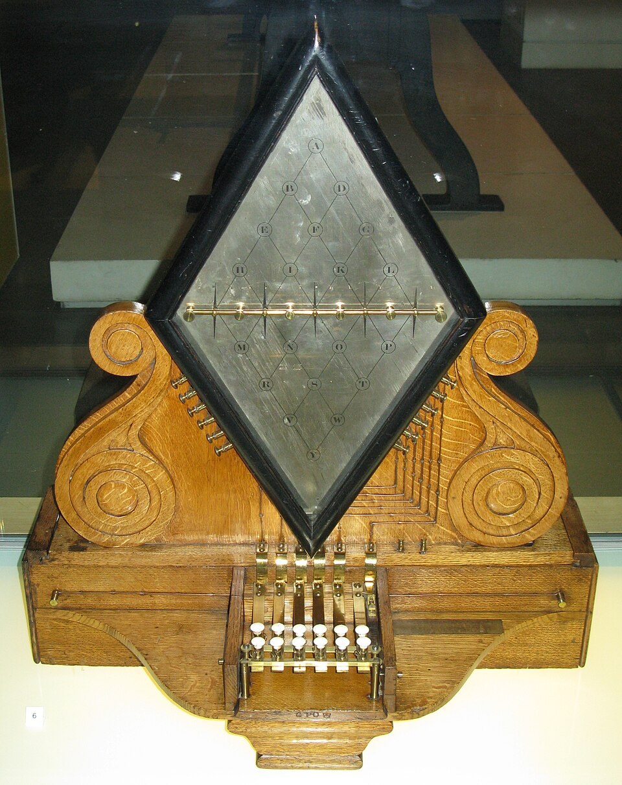
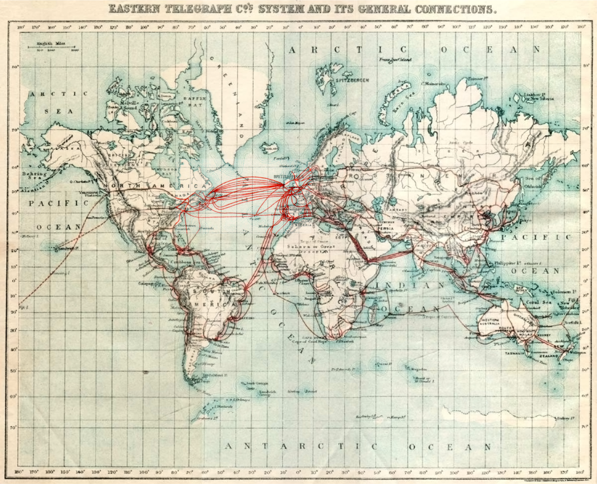
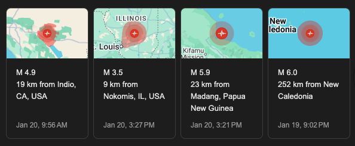

# The postal service and ICT

---
layout: center
---

## A question

Have you sent a physical letter through the post office recently?

---
layout: two-cols
---

## The postal service

The concept of sending information over a distance predates modern technology by thousands of years.

Phiedippides, a Greek *messenger*

- is said to have run from Marathon to Athens (about 26 miles) to deliver news of a military victory in 490 BC.

::right::

Since the dawn of civilization, humans have realized that

> I need to be able to talk to people who are far away.

One of the oldest known mentions being in ancient Egypt around 2000 BC.

1. Hardware
2. Software
3. Network
4. Data

---
layout: center
---

# Goals
1. Understand ICT through a familiar example
2. See how changes in technology affect communication
3. See the impact of the development of ICT

---

## Systematization of the postal service

China, even before it's unification, was an incredibly large set of territories.

And so a more organized postal system was needed and created, with the first mentions dating back to the Shang and Zhou dynasties (1600-256 BC).

This included an **upgrade** in hardware, software, and network that allowed for more efficient communication.

---
layout: two-cols-header
---

## ICT as a Requirement

::left::

::right::

Larger empires and nations **required** communication systems to maintain control.

Rome, at around the fifth century, conquered a huge area around the Mediterranean, 

> and so they developed the *cursus publicus*, a state-run courier and transportation service.

And at its peak, there were claims that it could cover 270 kilometers in 24 hours, roughly the distance between Butuan and Cebu

---

## Adoption and Survival

In the west, the *cursus publicus* survived the fall of the Roman Empire

Almost every kingdom that rose after it adopted some form of the system.

And to this day, we still have a *government-run* postal service

at 2021, there were still at least 99 million letters being sent through domestically

---

## A large upgrade in hardware and its impact

In the early decades of the 20th century, **planes** started existing.

And for the first time in human history, you could send information across the world in a matter of **days**.

And even before then, **train** systems allowed for much faster communication across large landmasses.

---
layout: center
---

# Which of the components of ICT did not change?

---

## A change in systems

The telegraph was invented in the early 19th century, and was used to send messages across long distances using electrical signals.

It was **instantaneous**, but had significantly higher costs, required specialized hardware and knowledge to use, and wasn't available to the general public.

---
layout: two-cols
---

## Building infrastructure

The telegraph required a vast **network of wires** and relay stations to transmit messages over long distances.

And so the *infrastructure for the infrastructure* had to be built from scratch. Knowledge of electricity, engineering, logistics.

> How to place wires across the ocean

And while the telegraph is now obsolete, it laid the groundwork for future technologies and is the backbone of modern communication systems.

::right::

---

## Quantity as a different quality

A large amount of something can fundamentally change its nature or impact

The difference between a car with 300 horsepower and a car with 3000 horsepower 

> is not just speed

---

## A glimpse of the present

> Do you get earthquake notifications on your phone? 

The speed of modern ICT systems are so much faster than traditional systems that they affect the world fundamentally differently.

- It's not just asking your boss for directions, it's giving real-time updates during emergencies.
- Press conferences live streamed minutes after a scandal
- It's videos reaching billions of people in hours
