# History of Computers and Basic Computing Periods

---
layout: center
---

## Are computers considered ICT?

---
layout: center
---

## Computers

One of the most important machines in modern society

---
layout: two-cols-header
---

## Early computing

::left::
Defined by mechanical machines

- tally sticks
- abacus
- slide rules
- equation tables

> Why were these created?

::right::

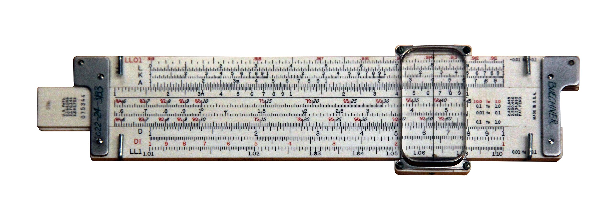

---
layout: two-cols-header
---

## Mechanical Calculating Machines
::right::
Examples:
- Pascaline, mechanical adder and subtractor
- step reckoner, could do multiplication and division
- the difference engine, could compute polynomial functions

Expensive, not widely available, and most problems require multiple steps and more than just arithmetic

> One big flaw

::left::

---

## The Analytical Engine and Charles Babbage

A **general** purpose computer, able to solve any problem given the correct instructions

Defined many of the concepts we use in modern computers, both in concept and in implementation

---
layout: two-cols-header
---

## Vacuum Tubes

::left::
> Circa 1940s

- mostly used in military applications
- primarily for breaking codes during WWII

The **COLOSSUS**, the **ENIAC** were the standard bearers of this era

Characterized by being large, power-hungry, unreliable machines

::right::

---
layout: center
---

> Have you heard of the term binary?

---

## How a computer works

Computers operate on the simple concept that you can represent information using two states

- on or off

A vacuum tube can be **on** (allowing current to pass) or **off** (blocking current)

And combinations of vacuum tubes can be used to represent and manipulate information

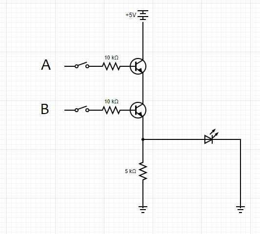

---
layout: two-cols-header
---

## Transistors

::left::

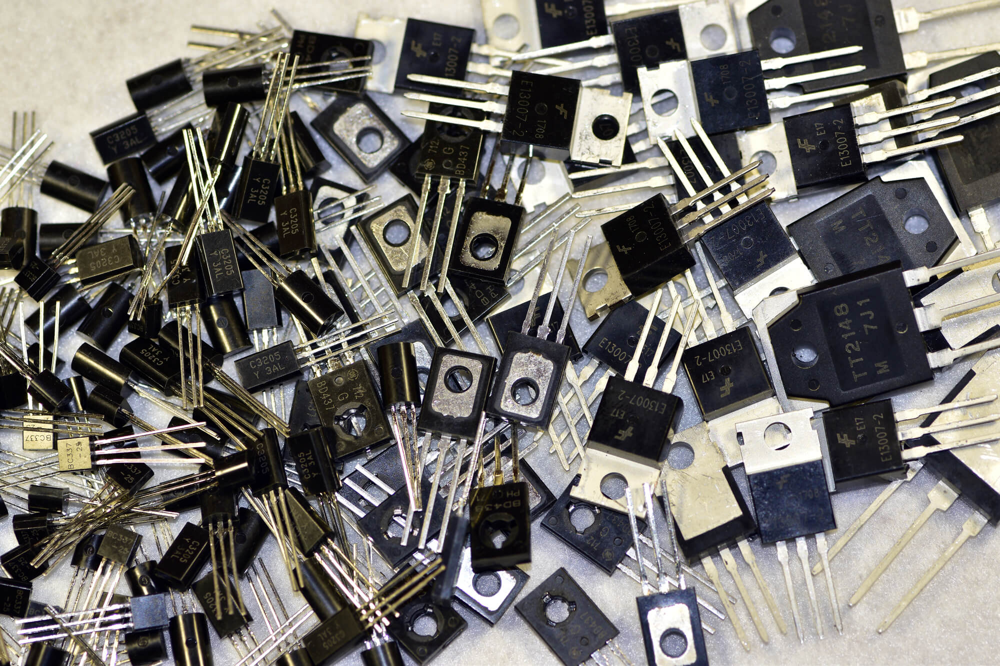

::right::
> Circa 1950s

Invented by *John Bardeen*, *Walter Brattain*, and *William Shockley* at Bell Labs in 1948

These were 
- smaller, 
- more stable, and 
- more energy efficient than vacuum tubes

---
layout: two-cols-header
---

## Integrated Circuits

::left::
> Circa 1960s

Silicon integrated circuits (ICs) allowed multiple transistors to be placed on a single chip

- Developed by *Jack Kilby and Robert Noyce*

ICs **did not** allow for more computation per unit, but they did allow for **smaller individual units** packaged together. This was achieved by placing multiple transistors and connections on a single piece of silicon

> More transistors = more computing power

::right::
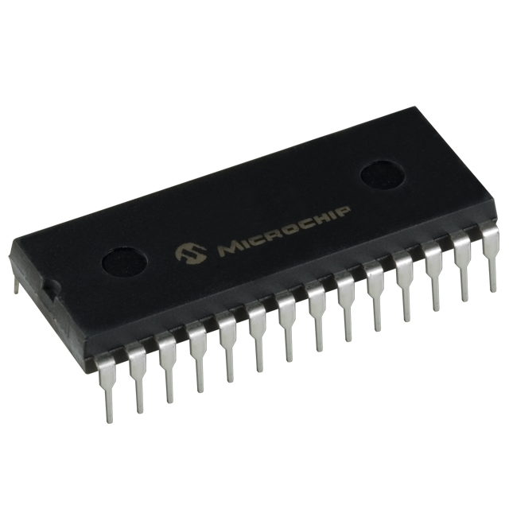

---
layout: two-cols-header
---

## VLSI or Chips

::left::
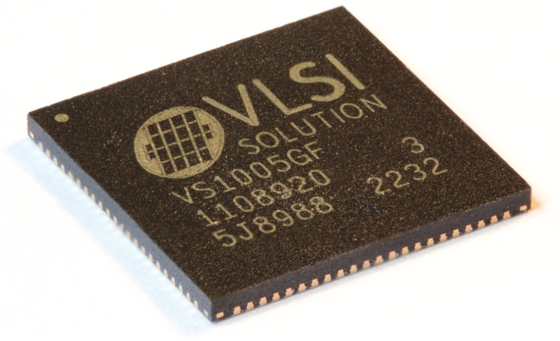

::right::
> circa 1980s+

Our current era of computing

**Millions** of transistors placed on a single silicon chip

Where the chip is engraved with millions of tiny transistors and connections between them

At this point, the price of computers have dropped enough that they are starting to become *widely available* to the public

---
layout: center
---

# From the perspective of economics
things got cheaper

---
layout: two-cols-header
---

## The economics of computers

::left::
Every year, computers get more and more transistors

This is usually called **Moore's Law**, though in modern times it has slowed down a bit

::right::

This caused a **cycle** in early computing
1. Advancements led to better products at lower prices
2. Lower prices led to new applications
3. New applications led to new markets
4. New markets led to new companies
5. New companies led to more competition

This doesn't just apply to computers, but to other supporting technologies like telecommunications and memory 

---

## Disposable computers

Modern day computing is expensive, but the cost of individual components, especially low power ones, has dropped significantly

This led to a rise in **disposable computing** devices

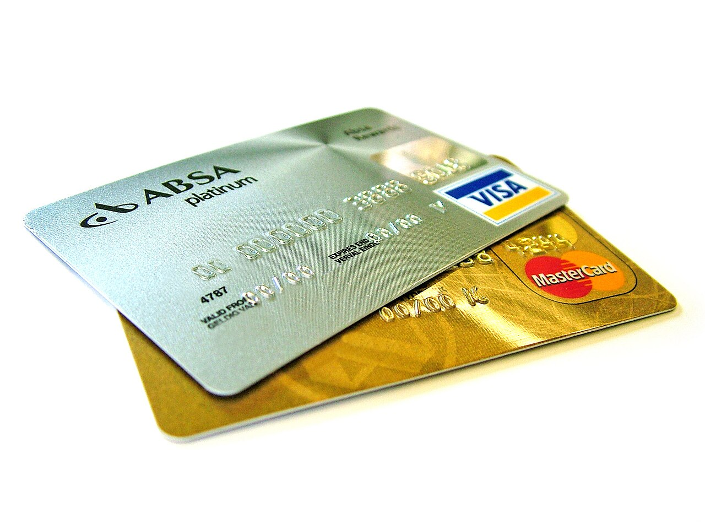

While they're mostly **e-waste**, some applications, such as **RFIDS** have become incredibly important pieces of modern tech

---

## Microcontrollers

Almost everything that isn't "smart" but has some kind of computing power has a **microcontroller** inside it

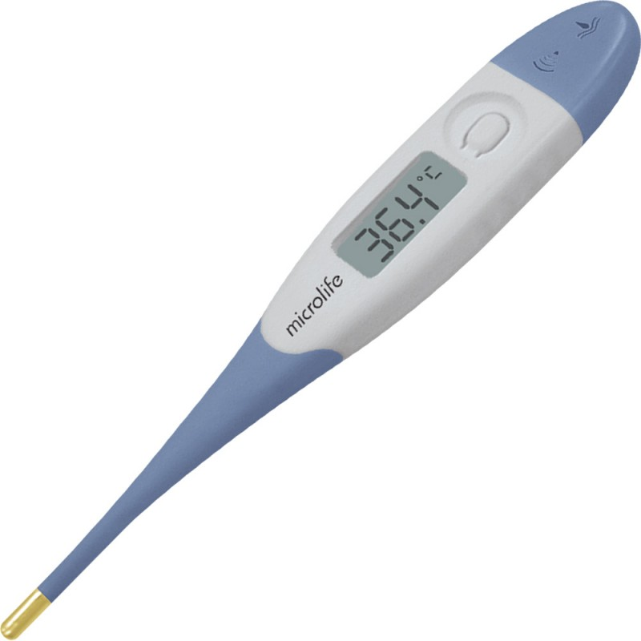

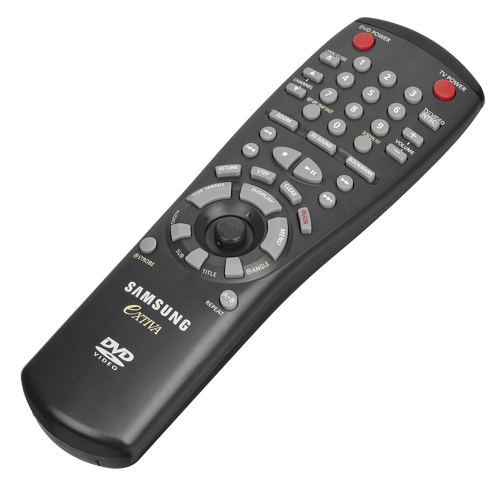

Appliances, communications, peripherals, cameras, medical devices, weapons

Unlike something like an RFID, these are considered **"Complete"** computers

---
layout: two-cols-header
---

## Mobile and game computers

::left::
While the distinction between these and the next level of computers is *blurry*

With modern smartphones and gaming consoles being as powerful as some personal computers

The majority of mobile and game computers are still built with a **lower power budget** and **different use cases** in mind

::right::
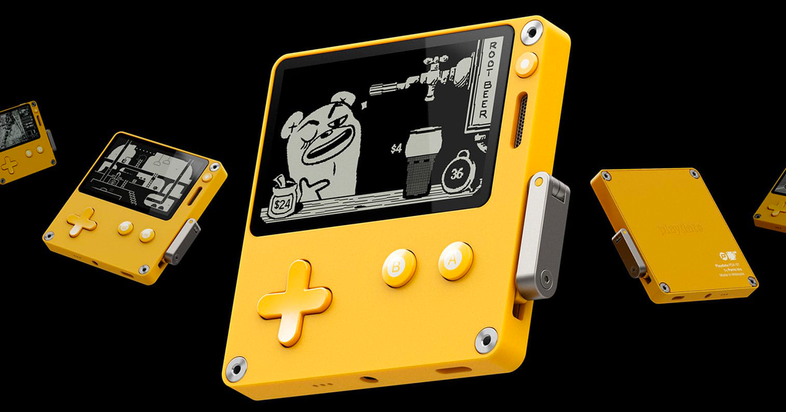
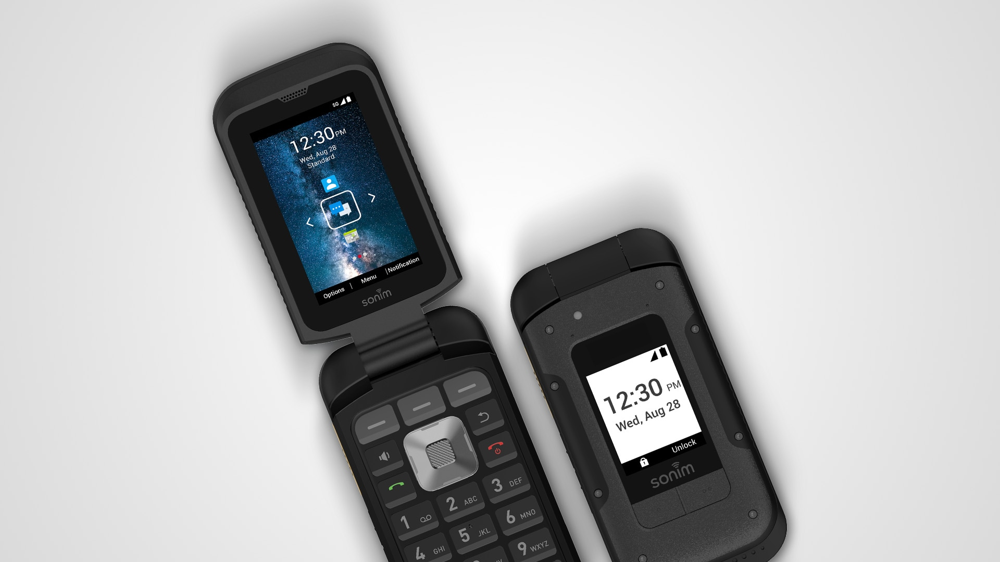

---

## Personal computers

When you think of "computers"

The personal desktop computer is probably what comes to mind

These are **general purpose** computers designed for individual use

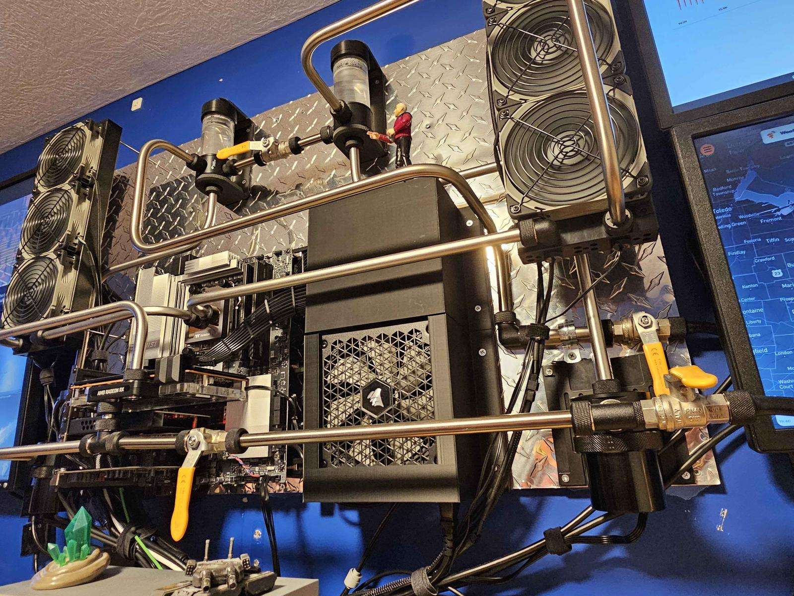

---
layout: two-cols-header
---

## Servers

::left::
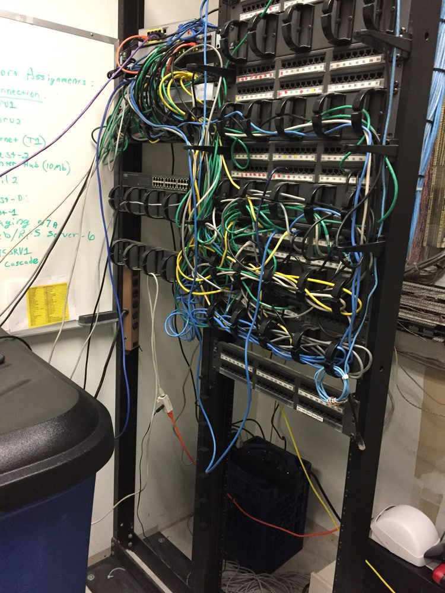

::right::
Technically, still at the *same level* as personal computers

With their main difference being **use case and scale**

Servers are designed to provide services to multiple users at once

And they tend to be larger, more powerful, have reliability considerations, and specialized hardware

---

## Data centers and cloud computing

**Still** technically the same level as personal computers

But now scaled up to massive levels

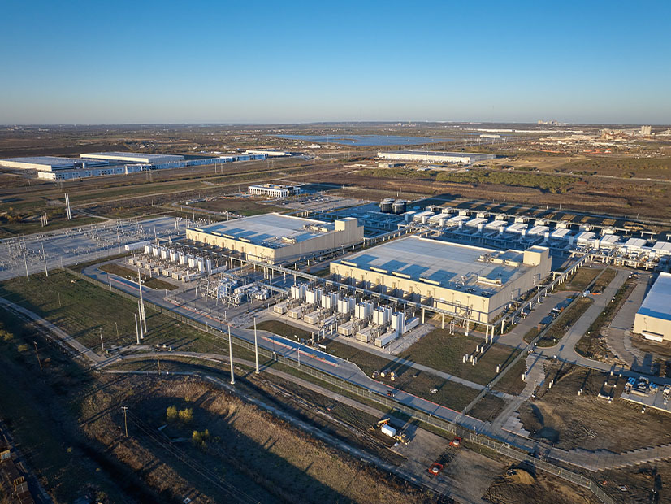
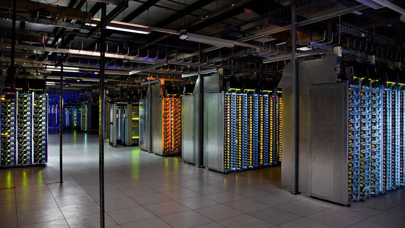

If a server is a computer that provides services to multiple users, a data center is a facility that has enough servers to provide services to **thousands or millions** of users
