# Computers

---

## The computer revolution

Digital computers fundamentally changed how we live and work

Not just in the obvious ways, like IT, but in the underlying systems we use every day

We are at the point where **any** piece of technology you interact with **is** a computer or is interacting with one

---
layout: center
---

# Hardware

---

## Goals

Computers are **infinitely** complex, and each individual component is a field of study in and of itself.

Instead of going over every component in detail, we'll:
1. Cover the **basics** of how they function,
2. Cover how they **contribute** to the overall system
3. Talk about standards, performance, compatibility, and other **consumer-facing** topics

---
layout: center
---

# Central Processing Unit

---
layout: two-cols-header
---

## Central Processing Unit or CPU

::left::
The "brain" of the computer, also called a *processor*

At it's core, a cpu is a billion on and off switches that can perform **basic arithmetic and logic operations**

Combinations of which allow for complex programs to be run

It's the **core** of a computer system, a computer isn't a computer without a cpu

::right::

---

## Architecture

The way a computer works depends on **it's architecture**, think of the architecture as a completely different tools for the same job

- A broom, a vacuum cleaner, a roomba

They all clean the floor but in different ways, they have **different instructions**

A programmer, when writing a program, has to follow those instructions, defined by the architecture*

> This is why some apps only work on ios or android

---

## Intel and AMD, and Apple

There are two primary CPU manufacturers, Intel and AMD, and Apple

- **Intel** and **AMD** makes cpus for **most** computers running on the architecture called `x86_64`
- **Apple** makes cpus for their macs running on the architecture called `ARM`

    
    
    

Each has their own naming schemes, strengths, weaknesses, and market segments

But fundamentally, they all do the **same thing**

---

## Generations

All 3 major manufacturers release new **generations** of cpus every year or two

These define new features, performance improvements, and efficiency improvements

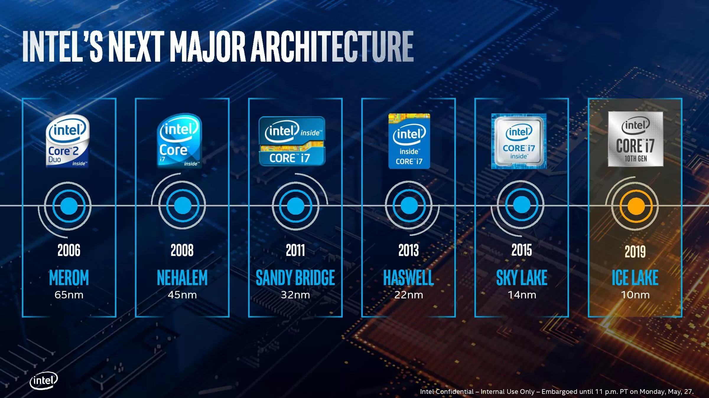

With each generation, it's important to note that things like **motherboard compatibility** and **performance** can change significantly

---

## Naming schemes

All 3 manufacturers have their own naming schemes which can be confusing, and do change over time

    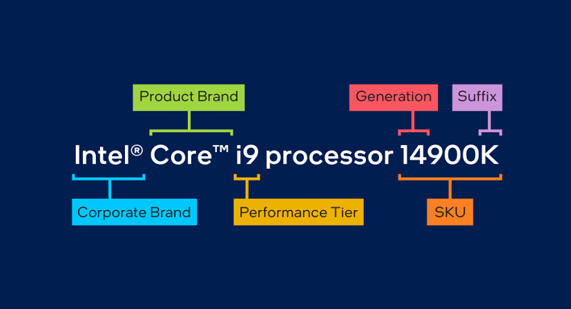
    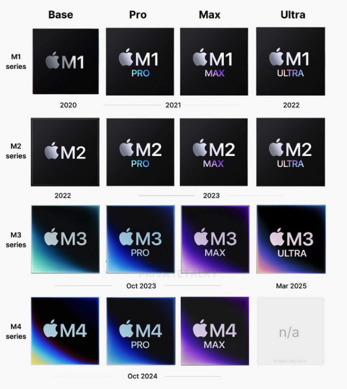
    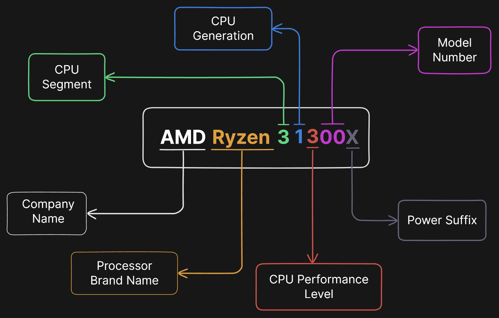

As a consumer, it's important to **research** what each name means, as they can indicate performance, generation, and market segment

The two main parts you need to care about is the **market segment** and the **generation**

---
layout: center
---

## Main Consumer Question

1. "Can this do what I need?"
    - does it meet the minimum requirements for my use case
2. "How recent is this?"
    - which generation is this from

---
layout: center
---

## A note on Gigahertz (GHz)

Gigahertz *used* to be a good indicator of performance, but with modern cpus, it's not as important

Core count, thread count, and architecture improvements have made performance more complex than just clock speed

---
layout: center
---

# Motherboard

---

## Motherboard

The motherboard is the piece of plastic that **connects** everything together

All your parts do a specific function, and they need some way to **communicate** with each other

The motherboard acts as the **central hub** or highway for all the components

---
layout: two-cols-header
---

## Architecture

Certain motherboards only support certain cpus, this is called the **socket** and the **chipset**

::left::
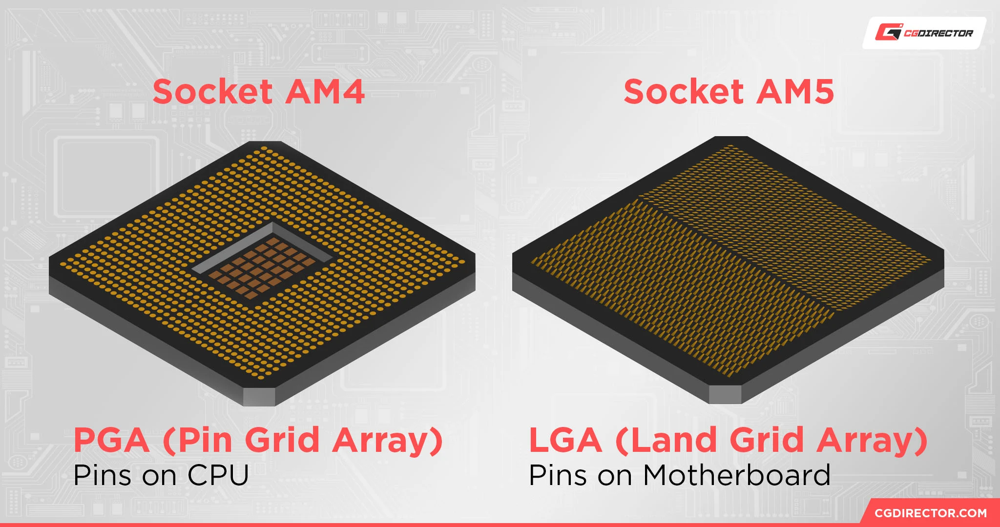

The **socket** is the physical connection between the cpu and the motherboard

A wrong socket means the cpu **won't fit**

::right::

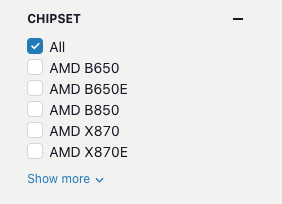

The **chipset** is the set of features and capabilities the motherboard supports

Certain cpus, and even other components, only work with certain sockets and chipsets

A wrong chipset means the cpu **won't work**

---

## Form Factors

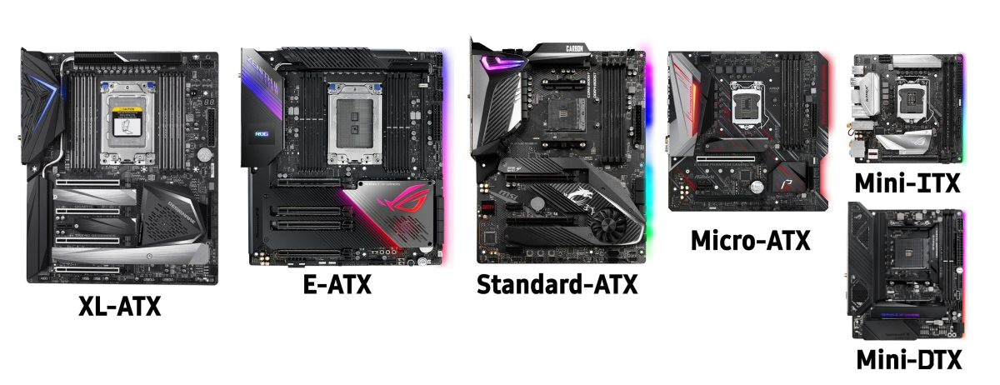

Motherboards come in different **sizes** called form factors

These mostly define the physical size of the motherboard, and what cases they fit in

But also how many components they can support

Smaller sizes usually mean fewer slots

---
layout: two-cols
---

## Features

Certain motherboards will have different features such as

- Availability and count of ports
- wifi support
- bluetooth support
- memory slots
- m.2 slots
- sata slots

When choosing a motherboard, make sure it has the features you need

Note that more features usually means a higher price

::right::

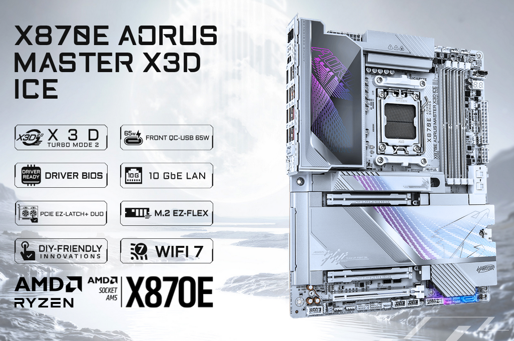

(25,000 php)

---
layout: center
---

## Main Consumer Question

1. "Does this support my cpu?"
2. "Does it have enough slots for my other parts?"

### Sub questions

1. "Does it have features I want"
2. "Does it fit in my case?"
3. "Does it look good?"

---
layout: center
---

# Graphics Processing Unit

---

## Graphics Processing Unit

Modern computers use a **dedicated** graphics processing unit or gpu to handle rendering images, video, and animations

Without a GPU, modern systems **cannot** display graphics

---
layout: two-cols-header
---

## Graphics Processing Unit vs Graphics Card

Many CPUs have in-built graphics processing units, graphics cards are more efficient

::left::
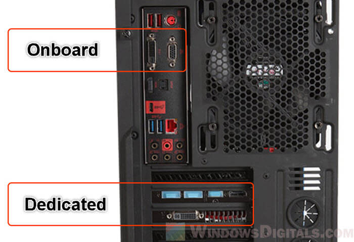

::right::

A **graphics processing unit** or gpu is the actual chip that does the processing

A **graphics card** is the entire component that houses the gpu

Integrated graphics use a portion of the CPU, while dedicated graphics use a separate graphics card

---
layout: center
---

## Main Consumer Question

1. "Does this support my use case?"

### Sub questions

1. "Do I need NVIDIA features?"

---
layout: center
---

# Power Supply Unit

---

## Power Supply Unit

Supplies power to all components in the computer

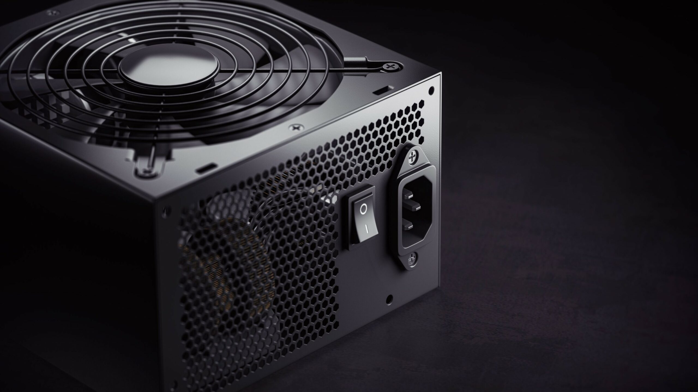

Primarily, it **converts** the power from the outlet (220V AC) to the power the components need (12V DC, 5V DC, 3.3V DC)

It also **regulates** the power to ensure a steady supply

---

## Wattage

PSUs are rated by their maximum **wattage**, which indicates how much power they can supply

Higher wattage means more power, which is necessary for high-performance components

Primarily, you need to ensure that your PSU can handle the total consumption of your **processor** and **graphics card**

---

## Rating and Efficiency

PSUs have **efficiency ratings**, which indicate how efficiently they convert power from the outlet to the components

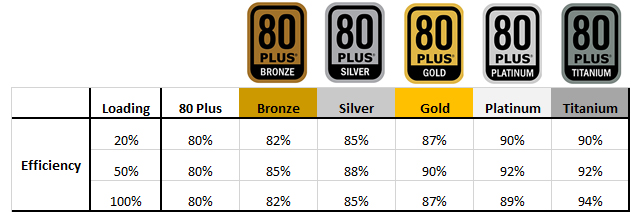

80 Plus ratings are common, with levels like Bronze, Silver, Gold, Platinum, and Titanium

[zttbuilds.com/pages/psu-tier-list](https://zttbuilds.com/pages/psu-tier-list)

Note that while the ratings indicate efficiency, they do not necessarily indicate quality or reliability

---
layout: center
---

## Main Consumer Question

1. Does this have enough capacity for my build?

---
layout: center
---

# Random Access Memory

---

## Random Access Memory or RAM

Usually called main memory, it's where the computer stores data that is being **actively** used or processed

RAM is **volatile**, meaning it only retains data while the computer is powered on

When the computer is turned off, all data in RAM is lost

But it's much faster to read from and write to than other types of storage

---
layout: two-cols
---

## Generation

Ram is constantly evolving, with new generations being released every few years

as of 2025, the most common generations are **DDR4** and **DDR5**

They mainly differ in speed, capacity, and power efficiency

Note that compatibility with motherboards **is not** preserved across generations

::right::

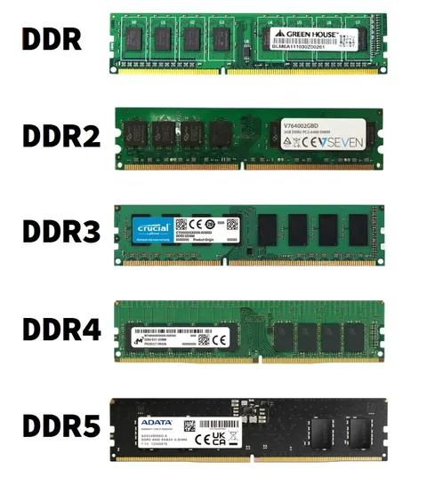

---

## SO-DIMM vs DIMM

There are two main form factors for RAM modules: **DIMM** and **SO-DIMM**

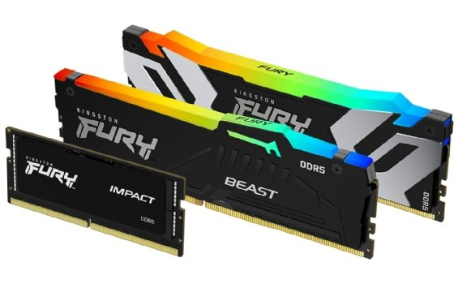

SO-DIMM (Small Outline DIMM) is smaller and used in laptops and compact systems

DIMM (Dual Inline Memory Module) is larger and used in desktops and servers

---

## Capacity

RAM capacity is measured in gigabytes (GB)

More RAM allows the computer to handle more data simultaneously, which can **improve performance**, especially for multitasking and memory-intensive applications

Usually sold in increments of 2 GB, common sizes include
- 4 GB
- 8 GB
- 16 GB
- 32 GB

---

## Speed

RAM speed is measured in **megahertz** (MHz)

Usually higher speeds can improve performance, especially in tasks that require frequent memory access

However, the performance gain from higher speeds is often **less noticeable** than increasing capacity

---

## A note on Dual Channel

There exists a feature called **dual channel** which allows for increased memory bandwidth by using two RAM modules in tandem

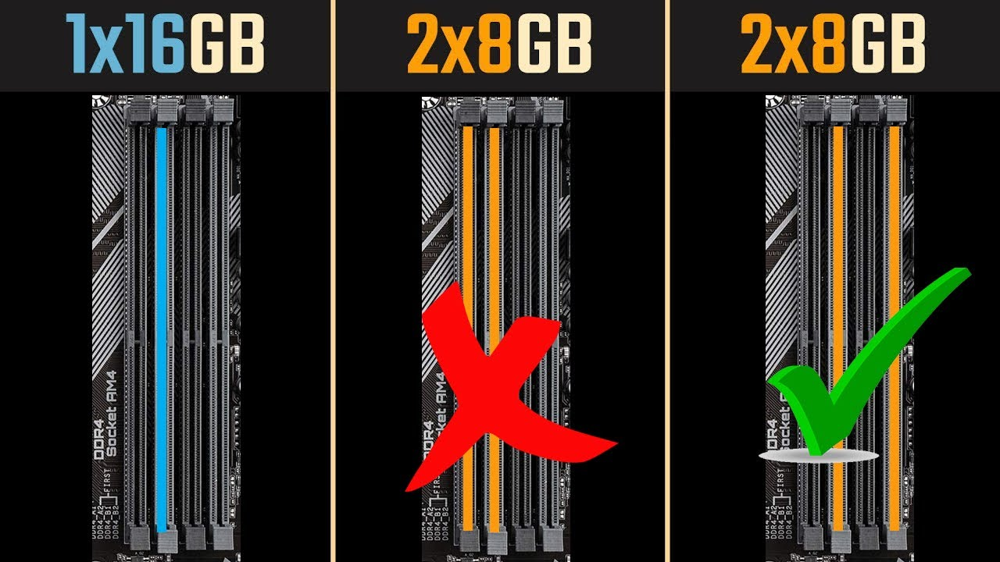

This boosts performance, but needs a **pair** of RAM modules

---

## A note on non matching RAM

Modern systems can **use** non matching RAM modules, but it's not recommended

Using non matching RAM can lead to suboptimal performance, as the system may default to the speed of the slower module

But it **should** still function correctly, with some slight instability in some cases

---
layout: center
---

## Main Consumer Question

1. "Do I have enough RAM for my use case?"
    - 16GB is usually good for most use cases
    - 8GB is the minimum for modern systems
2. "Is this compatible with my motherboard?"

### Sub questions
1. "Do I plan on buying more RAM later?"

---
layout: center
---

# Storage

---

## Storage

**Non-volatile** memory where data is stored even when the computer is powered off

Access to these is **significantly** slower than RAM, but they provide **much** larger capacities

---

## Types of Storage

There are three main types of storage devices used in modern computers:

1. **Hard Disk Drives (HDDs)**: Traditional spinning disks, larger capacities at lower costs, but are slower.
2. **Solid State Drives (SSDs)**: Faster, but generally more expensive per gigabyte.
3. **NVMe SSDs**: The fastest type of storage, uses a separate slot.

The price per gigabyte decreases as you go from NVMe to SSD to HDD

---

## A note on having multiple storage devices

Most people have multiple storage devices in their systems

A common setup is
1. a smaller NVMe or SSD for the operating system and frequently used applications
2. larger HDDs for mass storage of files

It is heavily recommended to have at least one SSD for the operating system

---
layout: center
---

## Main Consumer Question

1. "Do I have enough storage for my use case?"
    - 256GB is the minimum for modern systems
    - 512GB is usually good for most use cases

---

# Activity

## Activity Build a PC

[pcpartpicker.com](https://pcpartpicker.com)

Build a PC you would want under 25,000 Pesos, get a screenshot, and submit it on NEO

Justify why you chose each part

i.e. "I chose these parts because my needs are fairly low, so I went for a budget build, but made sure the motherboard had bluetooth"
