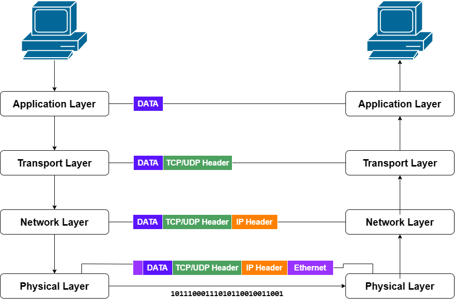
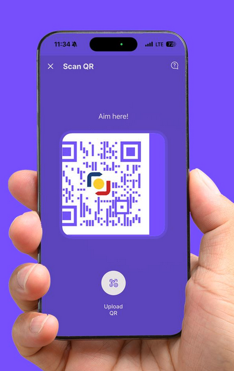

# How the internet works

---

## History of the Internet

The internet start at around the 1960s from a US-army-funded research project which evolved into public infrastructure in the 1980s.

The way it works hasn't changed much since then.


---

## A simple network

When two computers need to communicate, we need to link them, either **physically** or **wirelessly**.


You can now send data between the two computers.

---

## A "simple" Network

And you can simply connect as many computers as you want in a network.


---

## Network Switch

To solve this problem, we use a **network switch**.


A **network switch** is a special computer that acts like a traffic controller.

So to send a message from A to B, then A sends the message to the switch, and the switch forwards it to B.

These are sent using something called a **mac address** which is a unique identifier for each computer in the network.

---

## A network of networks

A single network switch can only scale so much, so if we wanted to connect even more computers, we simply **connect computers again**

> A network switch is a computer, so we can connect it to other network switches.


---

## Even more networks


In reality, this approach to connecting computers present two major problems:
1. latency
2. failure points

---

## Routers


To solve this we connect a **local** network (meaning computers from one switch) using something called a **router**

The router acts like a post office, it's main job is to send messages between networks (between other routers). And it sends things based on an **ip address**.

When a computer sends the router a message, the router reads the address of the destination computer, and decides the best way to send the message.

This is **close** to how the internet works

---
layout: two-cols-header
---

## Modem

::left::
Now all we need to do is to connect all our routers, this infrastructure already exists

So we connect our local network to a **modem** which connects to the internet service provider (**ISP**) infrastructure.

<small>(note that most commercial routers is usually a combination of a network switch, a router and a modem)</small>

And the ISP have access to all the other routers connected to their infrastructure

**But** it can also access other ISPs infrastructure

::right::


---

## Finding computers

To send a message to another computer, you have to specify its **address**.

This is called an **IP address** (Internet Protocol address).

It's a series of numbers and dots that uniquely identifies a computer on the internet.

```
192.0.2.172
```

Try out
```
142.250.190.78
```

---
layout: center
---

## The internet vs The web

The internet is the **infrastructure** that connects computers together.

The web is a **service** that runs on top of the internet.

---
layout: center
---

# How the web works

---

## Clients and servers

The core parts of the web are computers either called **clients** or **servers**.


They are **both** computers, and can both be clients and servers at the same time. 

But for the purposes of this course, we'll treat them as static states

---
layout: two-cols-header
---

## Client Server Interaction


::left::
1. The client sends a **request** to the server
    - usually by using a piece of software called a **web browser**
2. The server receives the request,
    - note that a server is simply a computer
    - in that computer there exists files
    - when the server receives a request, it finds the requested file
    - then it **responds** to the client with the file

::right::
3. The client **receives** the response
    - then the **web browser** displays the file to the user

> try ctrl + s

---

## Other Tools Needed in the Web

If we imagine the internet as a **road**, 

- and on one end we have the **client** (your house)
- and on another end, we have the **server** (a shop)

To get **data** (*goods*) from the server (*shop*) to the client (*your house*), we need a few things:
1. The road itself (*internet*)
2. the transport mechanism, like walking, biking, driving (*TCP/IP*)
3. The address of the destination (*DNS*)
4. The language we use to ask for the goods (*HTTP/HTTPS*)
5. The goods themselves (*files*)

---

## TCP IP

Transmission Control Protocol / Internet Protocol is a **protocol** that defines how data is sent and received over the internet.

It guarantees that data sent from one computer to another arrives intact and in the correct order.

> Method of transport and organization of data that both sides agree with

---

## DNS

Domain Name System is like the phonebook of the internet.

It **translates** human-friendly domain names 

`www.google.com` into IP addresses `142.250.190.78`

A DNS is already **built into** your operating system and web browser, so you don't have to worry about it.

It's basically a website that tells your browser where to find other websites.

[howdns.works/ep1/](https://howdns.works/ep1/)

> A way of finding the address of a server given its name

---

## HTTP

**Hypertext Transfer Protocol** is the protocol used for transferring web pages on the internet.

When you type a URL into your web browser, it sends an **HTTP request** to the server hosting that website.

This request is the **format** that both the client and server understand to communicate.

It includes information like:
- the method (GET, POST, etc)
- headers (metadata about the request)
- body (data being sent, if any)

And other things

> The language both sides agree to use

---
layout: center
---

## So what happens exactly?

---

## Process

1. You type in a URL in your web browser


Your browser then goes to a **DNS server** to find the IP address of the server that hosts the website


---

## Process

2. The browser gets that IP address back, then it sends an **HTTP request** to that IP address

When it's being sent along, it's using the **TCP/IP** protocol to get there



3. The server then responds with a 200 OK, 

Meaning that file **exists**, they've done the processing they needed to do ,and you can look at it, 


---

## Process

Then starts sending the website's file back to your browser in small chunks called **packets**


4. The browser **assembles** those small chunks into a complete page and displays it to you

<div class="flex flex-row gap-4 mt-2">
    
    
</div>

---
layout: center
---

# Case Study
Instapay

---
layout: two-cols-header
---

## Terminology

::left::
### QR Code

A way to **encode data** in a visual format that can be easily scanned and read by devices like smartphones.

> this is a way to store data visually

### QR PH

A national standardized qr system mandated by **Bangko Sentral ng Pilipinas**

> This standard allows **interoperability** 

### Instapay

Is a real-time fund transfer service owned by **BancNet**

> This is a service that does the actual transfer of funds between banks

::right::

<div class="flex flex-col justify-center items-center gap-4 h-full">
    
    
    
</div>


<style>
.two-cols-header {
  grid-template-columns: minmax(0,1.2fr) minmax(0,0.6fr);
}
</style>

---
layout: two-cols-header
---

## What happens when you scan
::left::



When you scan the QR code using your bank's mobile app,

::right::

It reads the data encoded in the QR code, which contains:
- the recipient's bank information
- the amount to be transferred
- a reference note
- etc.

Then your bank's app sends an **HTTP request** to your bank's server with that information


Then the bank app makes a request to BancNet's server to initiate the transfer **with** that information

---
layout: two-cols-header
---

## Server Process

::left::


<div class="flex flex-col justify-center items-center gap-4 h-full">
    
    
</div>


::right::

**BancNet's server** then **processes** the request, verifies the *details*, and initiates the fund transfer between the banks involved.

Then BancNet's server *responds* back to your bank's server with a **confirmation** of the transaction status, which it then forwards to your bank's app.


Then your bank's app **receives** that data 

And finally, **displays** the confirmation to you


---

## Big Picture

1. send
2. receive
3. process
4. respond
5. display

If any of these steps fail, the status of the transaction will depend on which step failed
