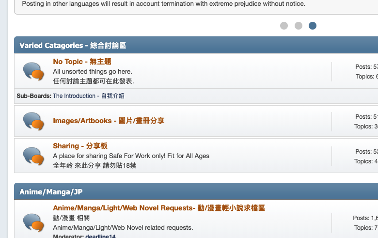
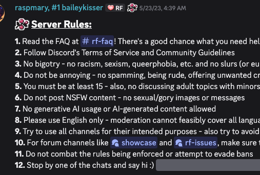

# Netiquette

---
layout: center
---

# What is Etiquette?

> Defined as a set of norms of personal behavior in *polite* society, usually in the form of an *ethical code* of the expected and accepted social behaviors that accord with the conventions and norms observed and practiced by a society, social class, or a social group - *Wikipedia*

---

## What is Etiquette?

Pretty dense

> Defined as a set of norms of personal behavior in *polite* society, usually in the form of an *ethical code* of the expected and accepted social behaviors that accord with the conventions and norms observed and practiced by a society, social class, or a social group - *Wikipedia*

But can be summarized as:

1. Set of **norms**
2. Based on **expectations** and acceptance
3. Depending on **cultural context**

---

## Netiquette

Is simply a set of rules for interaction through the internet

> Because back in the day, the internet and the real world had **very strong** separations

And so there were different expectations for behavior, different enough to warrant a **different term**

---
layout: two-cols-header
---

## Netiquette

In the modern day, the lines are more **blurred**

> The cultural context of the internet is more similar to real life

And so many rules of netiquette now are just **common sense** rules of politeness

::left::

::right::

---

## Netiquette

But there are still some **specific** rules that are important to follow online, such as:

1. Being aware of the **person** 

It's very **very** easy to forget that there is a **real person** on the other side of the screen

2. When inside a community, follow the **community rules**

    
    

Things like staying on **designated topics**, or following specific posting **formats**

---

## On social media

Social media is a special case, since there exists **sub groups** and sub-cultures inside each platform where the cultural rules are different

<Youtube height="340" id="X-GBlgnCMEk"/>

---

## On privacy

In an ideal world, 

1. Everyone would **respect** each other's privacy online, 
2. No one would **share** information without consent
3. No one would post anything that **reveals** personal information

Because someone can do **a lot** of damage with just a little information

> Try not to share too much personal information

And note that certain types of information, when **combined** with time of *posting*, should be kept private, such as:
- If you're going on a vacation
- Where you are currently

---

<Youtube height="440" id="mJNiQdMHlso"/>

