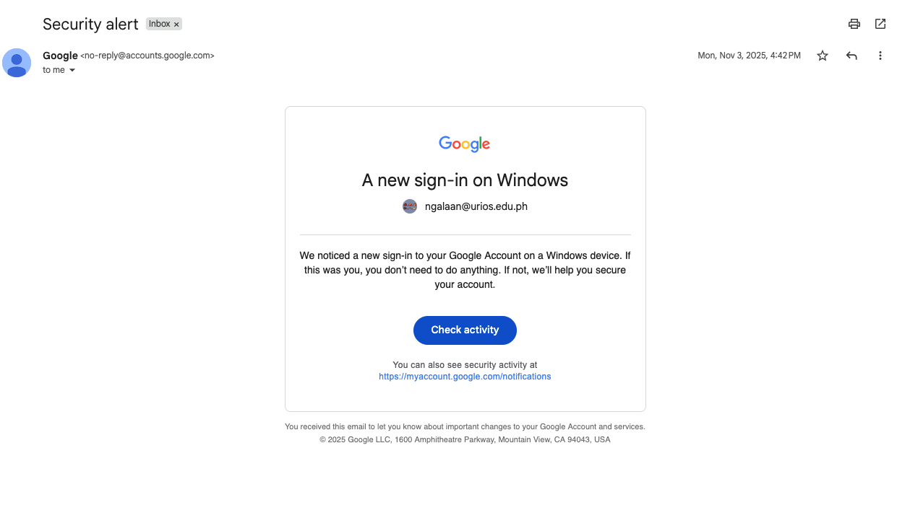
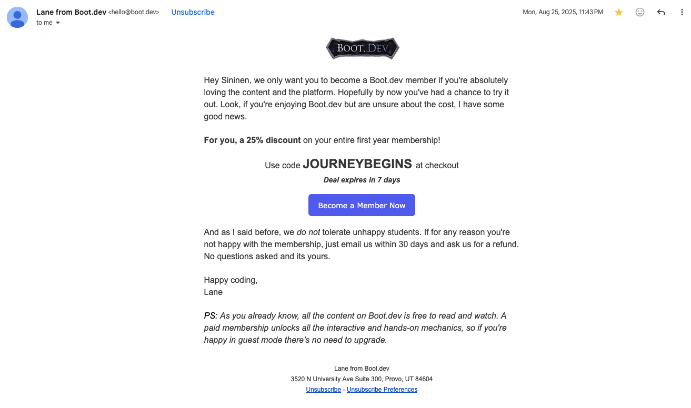
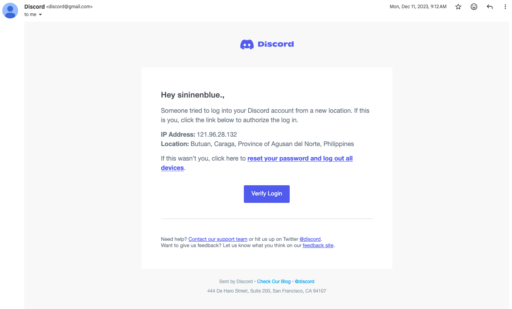

# Digital threats and cybercrimes

---

## Would you click on this link?

---

## Would you click on this link?

---

## Would you click on this link?

---
layout: center
---

# Digital Threats

---

## Types of threats in the digital world

The two most common threats:
- malware
- phishing

These threats are all methods of **compromising** a person's device, data, or identity

And if successful, can lead to **cybercrimes** such as:
- data breaches
- financial fraud
- identity theft

---

## Malware

**Malware** or **malicious software** is any software that is designed to cause harm to a computer, server, client, or computer network

This means
1. slowing your computer down
2. showing you ads
3. causing system crashes
4. stealing your data

In the modern day, malware is mostly used for financial gain, 
- Either by **stealing data** that can be sold, 
- Holding your data **hostage** until you pay a ransom, 
- Or by using your computer to **mine cryptocurrency** for the attacker

---
layout: center
---

# Types of Malware

---

## Types of Malware

1. adware
2. spyware
3. trojan
4. ransomware
5. rootkit
6. keylogger

---

## Threats aided by the digital world

- Social engineering
- Identity theft
- Harassment
- Scams

Once again, these are all methods of **compromising** a person's device, data, or identity. 

And while possible **without** the internet, the digital world has made these threats much more **prevalent** and **dangerous**

Especially with the rise of **social media** and **AI**, where it's now possible to create **deepfakes** and **fake profiles** that can be used for social engineering, harassment, and scams

---
layout: center
---

## Laws

Cybercrime prevention act of 2012 (Republic Act No. 10175)

> AN ACT DEFINING CYBERCRIME, PROVIDING FOR THE PREVENTION, INVESTIGATION, SUPPRESSION AND THE IMPOSITION OF PENALTIES THEREFOR AND FOR OTHER PURPOSES

---
layout: two-cols
---

## Laws

Punishable offenses include:

- *against confidentiality*
    - illegal access
    - interference
    - misuse of devices
    - cyber-squatting

::right::
- *using computers*
    - forgery
    - fraud
    - identity theft

- *against content*
    - cybersex
    - child pornography
    - unsolicited commercial communications
    - libel

---

## Laws

Penalties include

- at least two hundred thousand pesos (200,000.00) in fines
- up to five million pesos (5,000,000.00)
- prision mayor (6 years and 1 day to 12 years)

---

## How to protect yourself from these threats

**Personally**:
- Slow down

The most common way people get hacked, scammed, or otherwise compromised is by *clicking on a link* or *downloading a file* that they shouldn't have

Whenever someone sends you a link, a file, especially if it's from *someone you don't know*, or if it's unexpected, take an extra moment to **think** before you click

Cybercrimes **filter** out the most vulnerable targets

> You might not get caught by obvious scams, but that leaves you confident

---

## How to protect yourself from these threats

**On the software side**:
- stay up to date: your operating system, your browser, and other apps have *security updates* that fix vulnerabilities, so make sure to install them as soon as they are available
- Strong passwords: 
    - ideally use a *password manager* to generate and store strong, unique passwords for each of your accounts
    - otherwise, make them **long**, **mixing** letters, numbers, and symbols
    - and **don't** use the same password, at least try to make them different
    - I recommend using a **passphrase** instead of a password, which is a sequence of random words that is easy to remember but hard to guess
- Use Two-factor authentication

