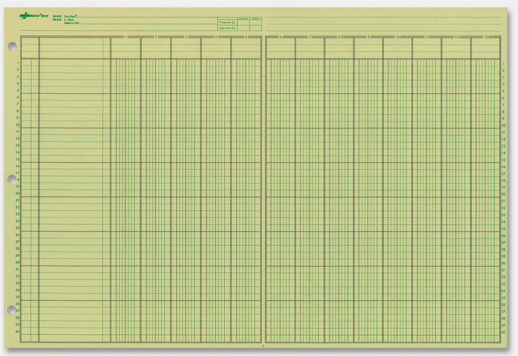
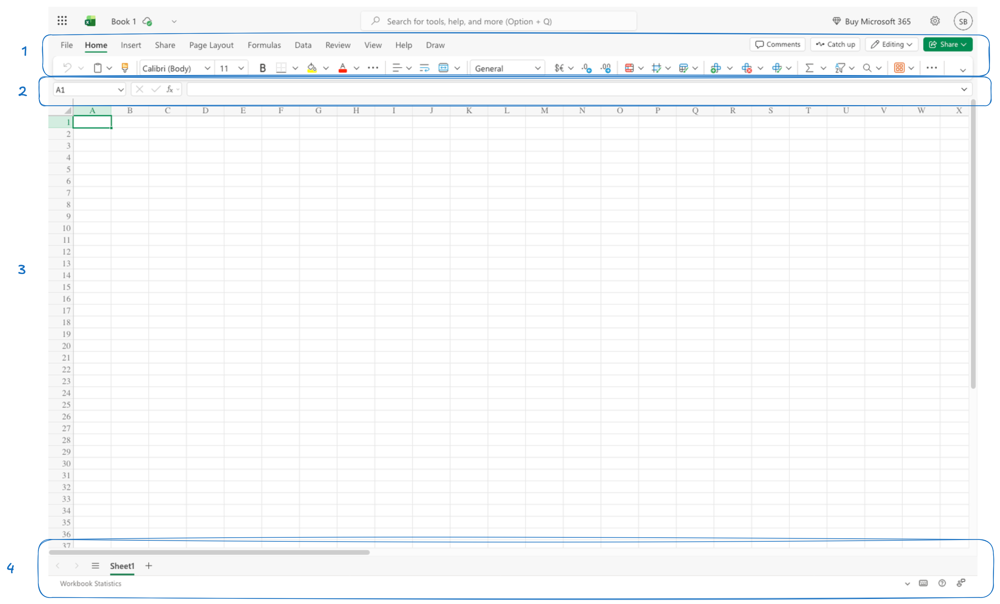
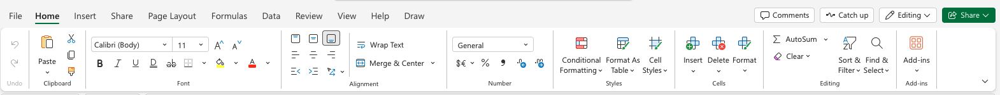
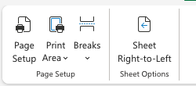
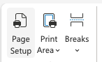
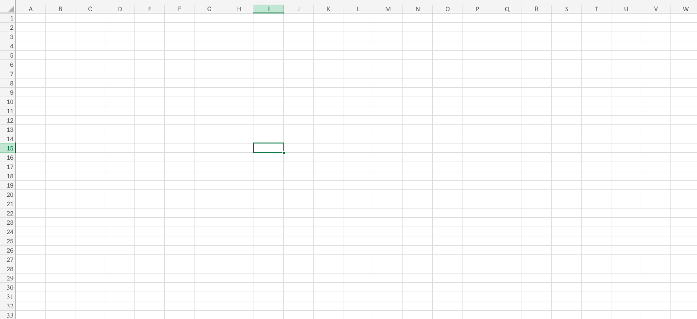
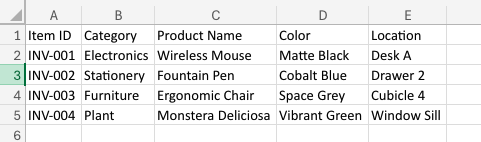
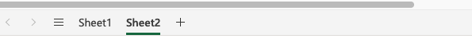
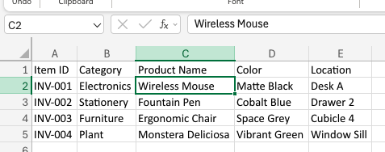
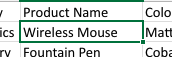

# Excel Basics

---

## Note

I'm using is the online web version of Excel, so it may look different from the desktop version. However, the core functionalities are the same.

---
layout: center
---

## What is Excel?

Specifically

> What analog tool does Excel replace?

---

## The analog spreadsheet

Excel is so widespread, so common, and so old that many people think of it as a *generic* term for spreadsheets, just like how we use "*Google*" to refer to any search engine, or "*Xerox*" to refer to any photocopier.

Spreadsheets are a type of document that *organizes data in rows and columns*, and allows you to perform calculations and analysis on that data.

---
layout: center
---

# The interface

---

## Interface

1. **Ribbon**, where you can find the *tools and features* of Excel, organized into tabs and groups.
2. **Formula bar**, where you can *enter and edit formulas* and data in the selected cell.
3. **Worksheet area**, where you can *see and interact* with your data in a grid of cells.
4. **Sheet tabs**, where you can *switch* between different worksheets in the same workbook.

---

## Ribbon

The ribbon is a way of organizing the tools into *different tabs*, they let you ask the question

> I want to change how my worksheet looks when it gets printed, where do I go?

And come to a *logical guess* as to where it is, *even if you have never used Excel before*.

Of these, which one do you think contains lets me change how my worksheet looks when it gets printed?

---

## Ribbon Groups

Each tab is further organized into *groups*, which are collections of *related tools* that are often used together.

Which of these groups do you think lets me change how my worksheet *looks* when it gets printed?

---

## Tools and Features of Excel

Excel has *thousands* of tools and features, the ribbon let's us find them easily

Let's say, I want to

1. Make sure that my worksheet is printed in *landscape* orientation, and
2. Only print the *first 10 rows* of my worksheet

Which of these should I use?

---
layout: center
---

## Exercise

> I want to turn data into a bar chart so it's easier to read in my presentation

1. Of the main tabs, which one do you think contains the tools to create a *bar chart*? 

hint: I want to *add* a bar chart to my worksheet

2. On that tabs, which group do you think contains the tools to create a bar chart?
3. Which tool do you think I should use to create a bar chart?

---
layout: center
---

## Exercise

> I want to alphabetize a list from a to z, and I need to remove any duplicates

1. Of the main tabs, which one seems dedicated to *managing, sorting, and cleaning* data?
2. Which ribbon group seems to be dedicated to *sorting* data?
3. Which ribbon group seems to be dedicated to *removing duplicates* from data?

---
layout: center
---

## Exercise

> I want to make the text in this row bold, change the background color to yellow, and center the text

---

## Worksheet Area

The worksheet area is where you can see and interact with your data in a *grid of cells*.

It's labeled with 
- *letters for columns*, and
- *numbers for rows*.

---
layout: center
---

## Side note on importing data

Excel is able to import data from almost *any* source, such as *databases, web pages, text files*, etc.

1. Create a new blank *workbook* (an excel file)
2. > What tab do you think contains the tools to import data from a text file?

On your NEO, there is a `data.csv` file, which contains some data, import it to Excel

It should look something like this:

---
layout: center
---

## Exercise

1. what is the exact *cell address* of "*Ergonomic Chair*"?

Note that it's always *column letter* followed by *row number*

---
layout: center
---

## Exercise

2. What is in "*C2*"?

---
layout: center
---

## Exercise

3. You want to make all the headers in the *first row* bold (Item ID, Category, etc), what *range* would you select?

A range is a *block* of cells, and it's denoted by the *top-left cell* and the *bottom-right cell*, separated by a colon.

`A1:C1` refers to the range of cells from A1 to C1, which includes A1, B1, and C1.

---
layout: center
---

## Exercise

4. You want to copy the *product names and colors* for the *first three items*, and paste them into a new worksheet
    - what is the range for that *3x2* block of data?

---
layout: center
---

## Exercise

5. What does *B2:B5* refer to?

---

## Sheet Tabs

A work*book* can have multiple work*sheets*, and you can switch between them using the sheet tabs at the bottom of the worksheet area.

This is useful for organizing your data into *different sections*, or for keeping *related data together* in the same file.

---

## Formula Bar

The formula bar is where you can enter and edit formulas and data in the selected cell.

You can use the formula bar to enter *any* data into a cell, such as text, numbers, dates, etc.

It's also where the data of the *currently selected cell* is displayed

---

## Cells

What are cells?

Cells are "*boxes*" of data

Fundamentally, they are *containers* for *expressions* that evaluate to a *value*.

What is the difference between

1. The arabic numeral `5`
2. five objects, like `five donuts`
3. and `3 + 2`

This *model of thinking* lets us more easily understand how Excel works, and how to use it effectively.

Especially when we get started with *functions*

---

## Assignment

The goal of this *assignment* is to get familiar with the *interface of Excel*

Create an excel file, and create a schedule

It must have the day as the headers, the time as rows, and the activities in the cells

Name the file `lastname_firstname_schedule.xlsx` i.e. (`alaan_neil_schedule.xlsx`), and submit it to NEO

- 5 pts for having a schedule with days as headers, time as rows, and activities in the cells
- 4 pts for usage of formatting tools, such as bold, background color, borders, etc
- 1 pts for correct file name

