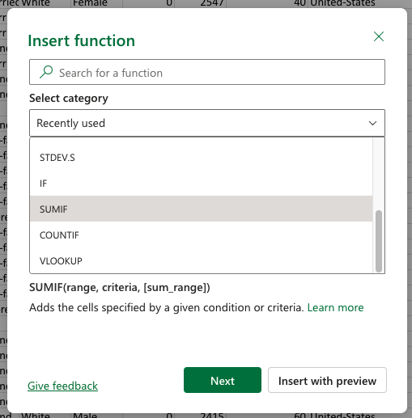

# Excel Formulae

---

## What is a formula?

In a cell, you can enter data *or formulae*

A *formula* is an *expression* that *evaluates* to a value

For example
- `=1+2` evaluates to `3`, 
    - because the value represented by `1` and the value represented by `2` are added together to give `3`
- `=A1+B1` evaluates to the sum of the values in cells `A1` and `B1`
    - assuming that `A1` is equal to `1` and `B1` is equal to `2`
- `=SUM(A1:B1)` evaluates to the sum of the values in cells `A1` and `B1`
    - which is also `3` if `A1` is equal to `1` and `B1` is equal to `2`

---
layout: center
---

## Case Study

Given the data present in NEO, titled `cencus.xlsx`, you can make a function like so

```
=IF(AND(B2<>"?",OR(D2="HS-grad", D2="10th", D2="11th")), "Yes", "No")
```

This formula answers the question

> "Is this person someone who's working class with a high school education or less?"

---

## Documentation

All Excel formulas are documented in many places, most of which being one google search away

While you **can't** use online documentation during the exam, you **can** use the documentation that is built into Excel, 

Which is accessible by typing `=` in a cell and then clicking on the `fx` button next to the formula bar

---
layout: two-cols-header
---

## Formula Format

::left::
An excel formula is formatted as follows

```
=FUNCTION_NAME(ARGUMENT1, ARGUMENT2, ...)
```

- It *always* starts with an `=`, which indicates that it's a formula

- Then, it has a **function name**, which is the name of the function being used

- Finally, it has a **list of arguments**, which are the inputs to the function, enclosed in *parentheses* and separated by *commas*

Note that arguments with `[ ]` around them are *optional*, and you can choose to omit them when using the function

::right::


---

## References

In a formula, you can refer to other cells by using their *cell addresses*

In the formula

```
=SUMIF(A1:D1, A2)
```

`A1:D1` is a reference to the range of cells from `A1` to `D1`, which includes `A1`, `B1`, `C1`, and `D1`

And `A2` is a reference to the cell `A2`, which contains `>=3`

If the range `A1:D1` contains `[1, 2, 3, 4]`

What is the *output*

---

## Nested Formulae

A formula can also contain *other* formulae as arguments, which is called *nesting*

This is because a *formula* is an **expression** that evaluates to a value, and that value can be used as an *argument in another formula*

```
=IF(AND(B2<>"?",D2="HS-grad"), "Yes", "No")
```

- Always start at the **innermost** formula, which is *usually* the one with the *most parentheses* containing it, and evaluate it first

---

## Project Part 1

`cencus.xlsx` is a dataset of adults in 1992 United States

1. **Import** the dataset into Excel
2. make a cell that calculates *how many people ear more than \$50K per year*

> Hint: Put this in the bottom, the formula would likely be `COUNTIF`, 
> note that you should compare *strings* so the condition would be something like `"more than 50 thousand"` with the quoatation marks

3. Then add another cell that checks *how many people earn less than \$50K per year* 

> Hint: This would also likely be `COUNTIF`, but with a different condition

4. Then figure out the *Proportion of people who earn more than \$50K*

> Hint: A proportion is calculated by dividing datapoint A by the total number of datapoints

5. Finally, figure out the *Ratio of people who earn more than \$50K to people who earn less than \$50K*

> Hint: A ratio is calucated by dividing datapoint A by datapoint B, so you can just divide the two cells you made in steps 2 and 3

---

## Project Part 2

In the same file

1. What is the *average age* of people who earn more than \$50K per year?

> Hint: You can either use one nested formula, or separate formulas in different cells

This requires 3 values:
1. the *sum* of all the ages of people who earn more than \$50K per year

> Hint: look at the arguments for sumif, and press learn more

2. the *count* of all the people who earn more than \$50K per year
3. the *average* age, which is calculated by dividing the sum of ages by the count of people
