# Charts

---

## Charts

A way of visually representing data. 

They can be used to show *trends, patterns, and relationships* in data. 

There are many different types of charts, each with its own strengths and weaknesses. 

Some common types of charts include:
- *Bar charts*: used to compare different categories of data
- *Line charts*: used to show trends over time
- *Pie charts*: used to show the distribution of data
- *Histograms*: used to show the distribution of a single variable

---

## Interpreting Charts

Charts represent *data*, and because of that, they have more **authority** than regular text

It feels more **objective** to say "*the data shows that...*" than to say "*I think that...*"

But because of this, it's important to be critical when interpreting charts, and to not take them at face value.

When interpreting charts, it is important to consider the following:
- The scale of the axes
- The labels and titles of the chart
- The data points and their relationships to each other
- The context in which the chart is being used

---

## Scale of the axes

The scale of the axes can greatly affect how a chart is interpreted.

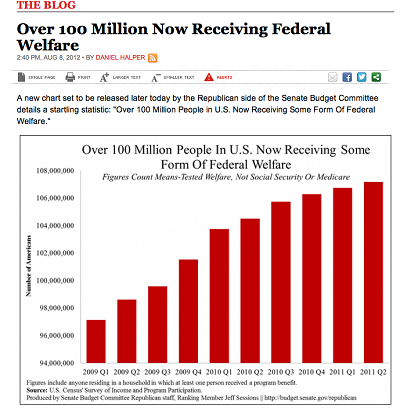

This chart shows the number of people receiving federal welfare in the USA from *2009 - 2011*

And from a glace you can assume

> The number of people receiving federal welfare has gone up quit a bit

---
layout: two-cols
---

## Scale of the axes

But if you look at the *Y-axis*,
1. What value does it start at?
2. What value does it end at?
3. What's the difference between the two values?

::right::

---

## Scale of the axes

The scale of the Y-axis can greatly affect how a chart is *interpreted*.

In this case it *starts* at 94 million, and *ends* at 108 million, which means that the difference between the two values is only *14 million*.

Still a large number, still objectively correct, but a *reasonable* number give the time frame

---

## Scale of the axes

    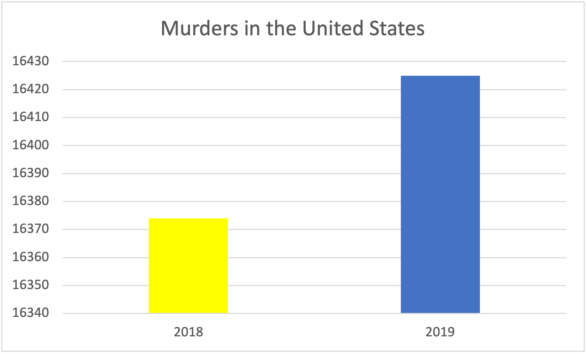
    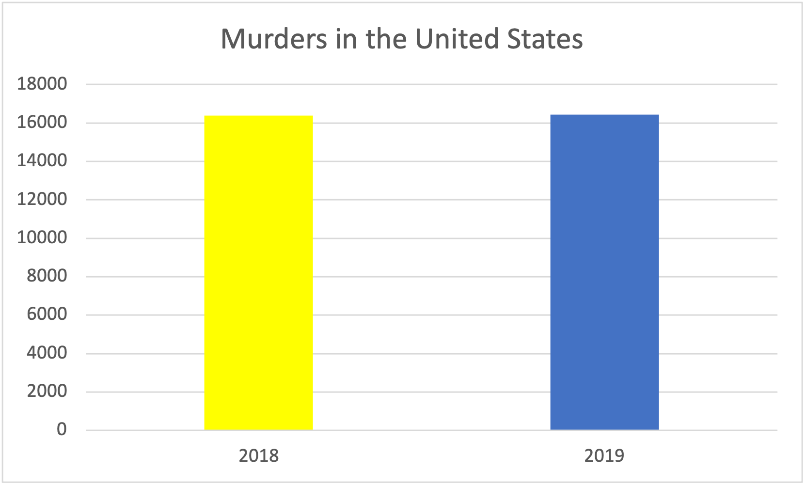

    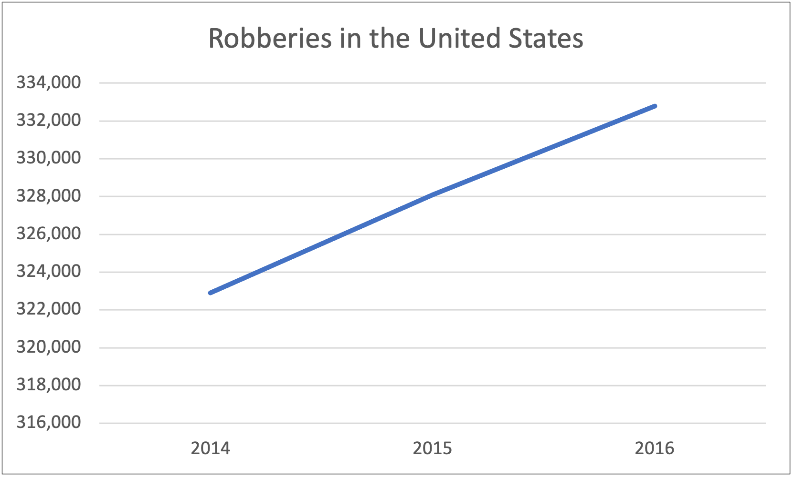
    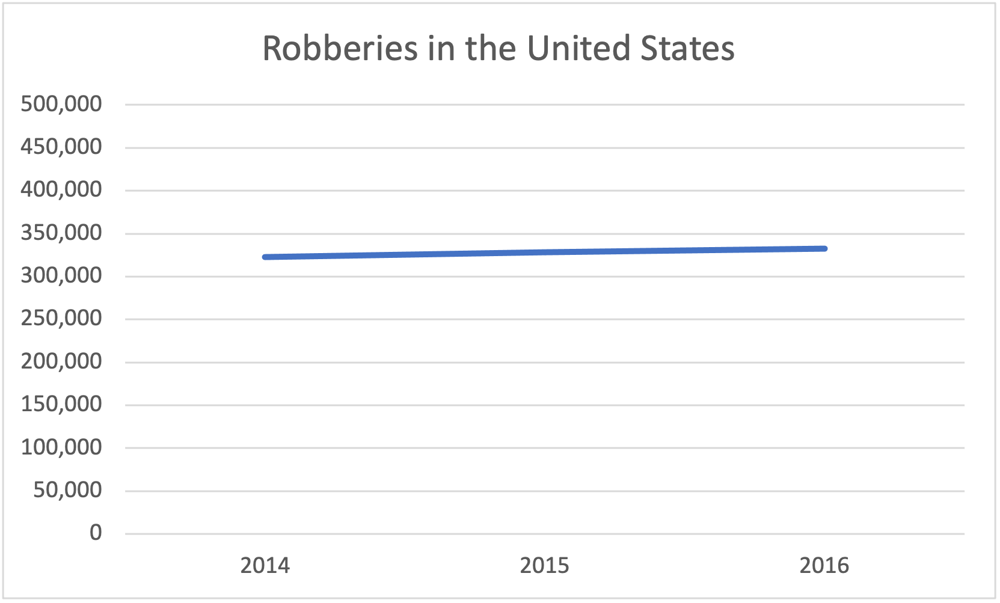

Are the charts on the left, representing the same data as the charts on the right?

---

## Scale of the axes

The x-axis can also be manipulated to make a chart look more dramatic than it actually is.

Or to push for a certain narrative.

Notice how this graph starts at 2014 and ends at 2016, but when when we expand out the data to include 2019

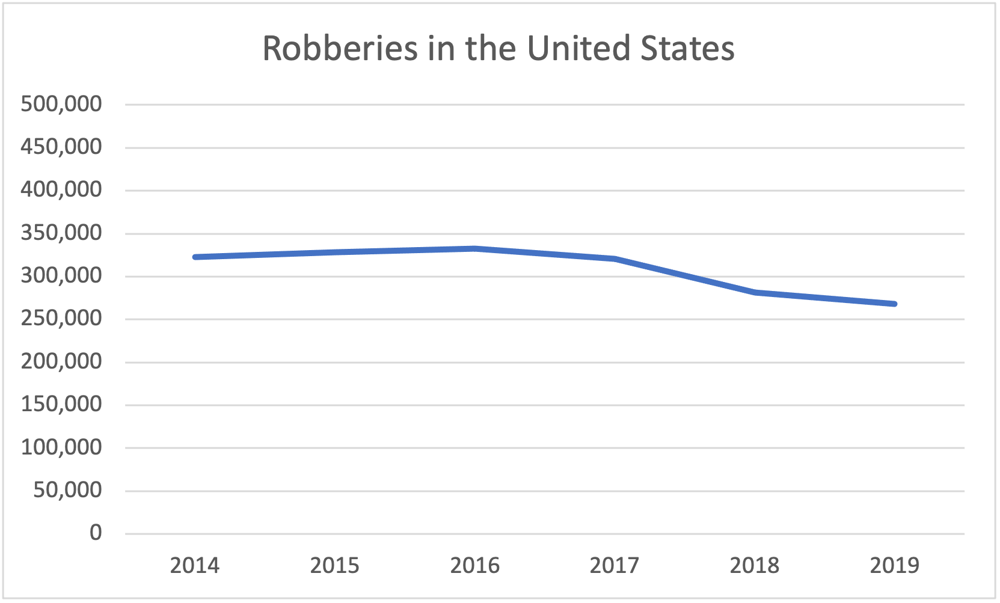

---
layout: center
---

# It's very easy to interpret charts in a way that supports your narrative

Always ask the question, 

> "*what did the person making the chart want to show?*"

---

## Incorrect charts

"**Correct**" charts, which accurately represent the data can be *misleading*

So you need to worry about the *axes*, x and y, the *labels* and *titles*, the *data points* and their relationships to each other, and the *context* in which the chart is being used.

But **incorrect** charts, which *do not* accurately represent the data, can be *even more* misleading.

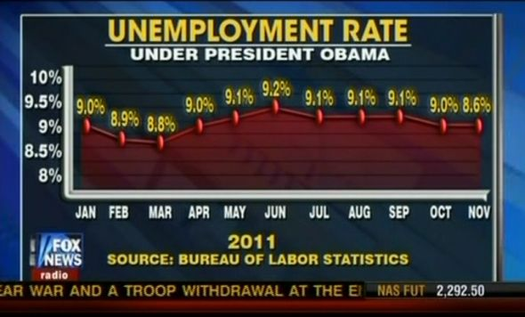

---

## Bad Graphs

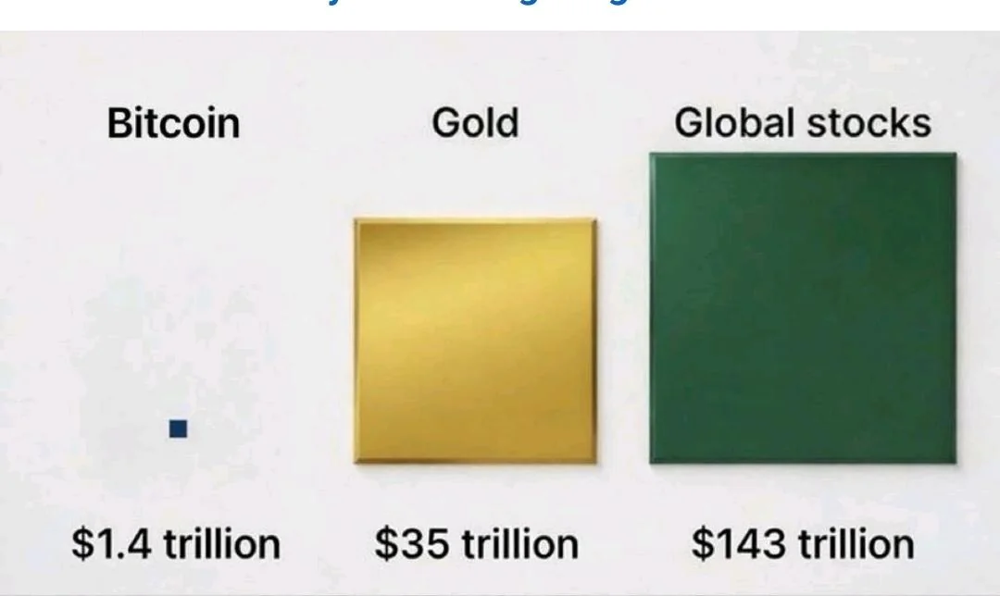

---

## Bad Graphs

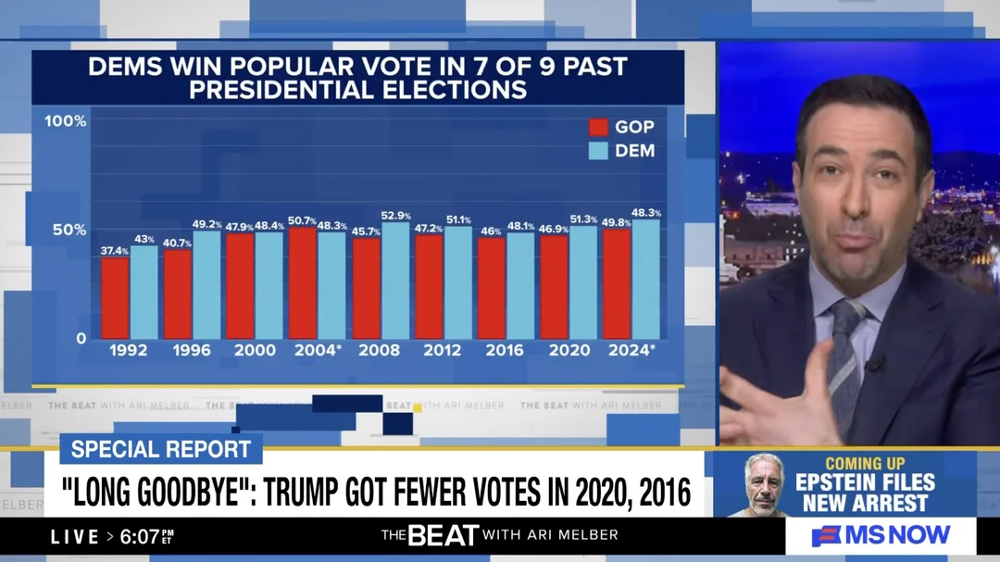

---

## Bad Graphs

---

## Bad Graphs

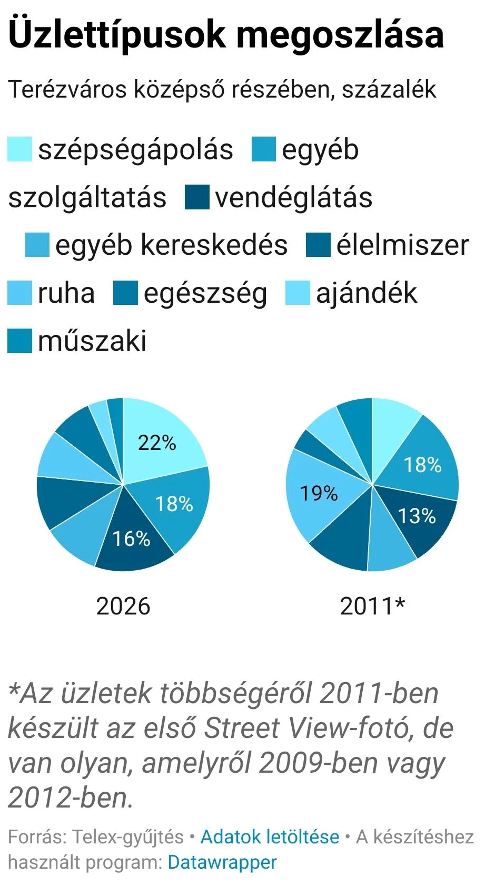

---

## Bad Graphs

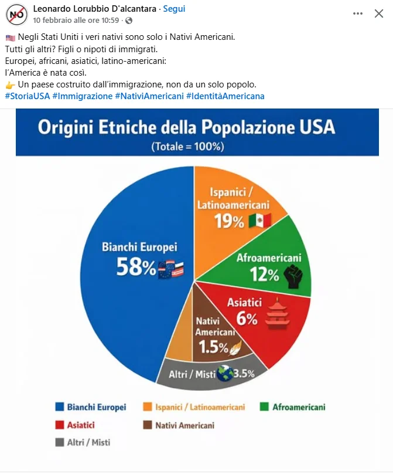

---

## Bad Graphs

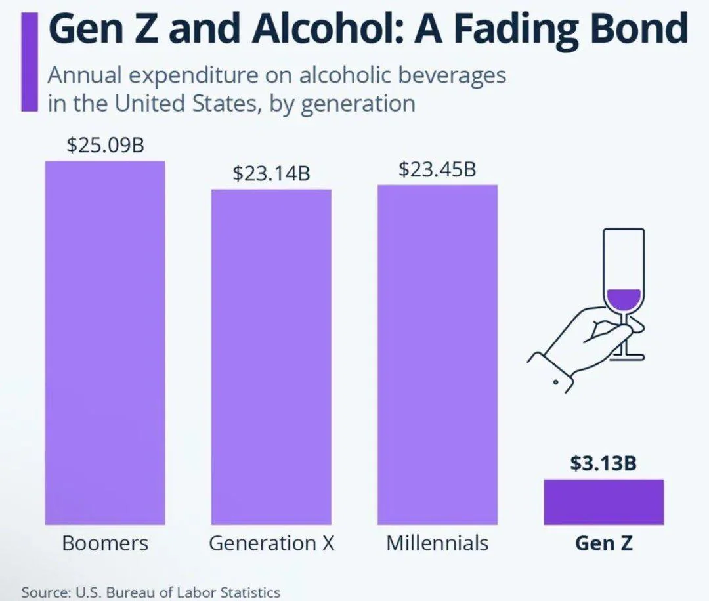

---

## Bad Graphs

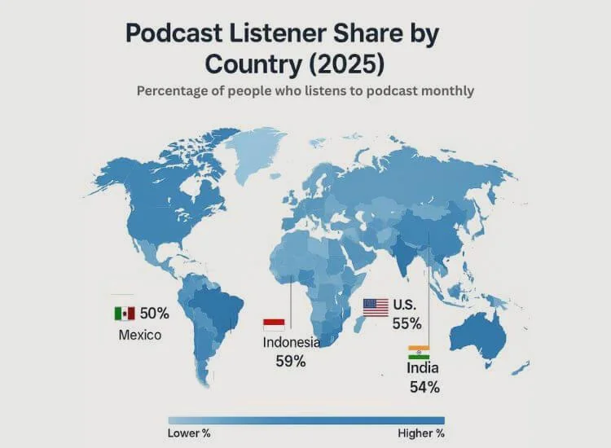

---
layout: center
---

# In excel

---

## How to create a chart in Excel

Each *chart type* has its own specific steps to create, but the general steps are as follows:
1. Select the data you want to use for the chart
2. Go to the "Insert" tab in the ribbon
3. Choose the type of chart you want to create
4. Customize the chart as needed (e.g. add titles, labels, etc.)

---

## Instructions

1. Download the `chart_census.xlsx` file found in the same location as these slides
2. Open the file in Excel
3. Using the data, create the following charts:
- A *pie chart* that shows the distribution of people who earn more than $50k and those who earn less than $50k
- A *statistical histogram* chart that shows the amount of hours per week that people work
- A *scatter plot* that shows the relationship between age and education level

---

## Example

Using the same `chart_census.xlsx` file, we will create a bar chart that shows *how many male and female respondents* there are in the data set.

In excel, a bar chart expects the data to be in a *specific format*, 

For extra guidance, you can go here [w3schools.com/excel/excel_charts.php](https://www.w3schools.com/excel/excel_charts.php) to see the different types of charts and their expected data formats.

To get the data in the correct format, we can use the `COUNTIF` function to count how

---

## Example

To make the chart: 

1. in a separate sheet or column, write the categories on one column, and the values on another column

| Gender | Count |
| --- | --- |
| Male | =COUNTIF(J:J, "Male") |
| Female | =COUNTIF(J:J, "Female") |

2. Select that table
3. Go to the "Insert" tab in the ribbon
4. Choose the "Bar Chart" option

When you click on the chart, notice the "Chart Design" and "Format" tabs that appear in the ribbon, which allow you to customize the chart as needed (e.g. add titles, labels, etc.)

5. Edit the chart title to "Distribution of Gender"

---

## Example

Make a histogram on the amount of education people have

1. Select the column that contains the data on education
2. Go to the "Insert" tab in the ribbon
3. Choose the "Statistical Chart" option, and then choose "Histogram"
4. In the Chart Tab of the ribbon, click on "Select Data"
5. On the right side, click "Format"
6. Under Series "education.num", change the "Bins" to Bin width
7. Bin width" to 1
8. Set the underflow bin to 6
