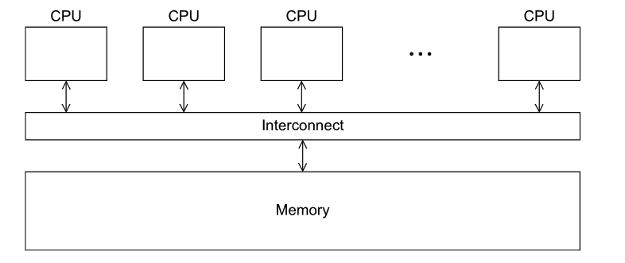
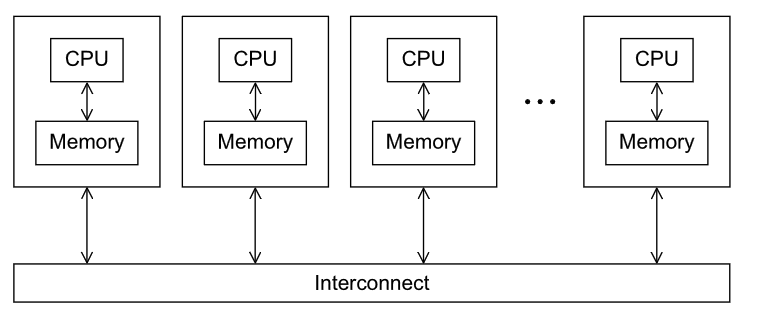
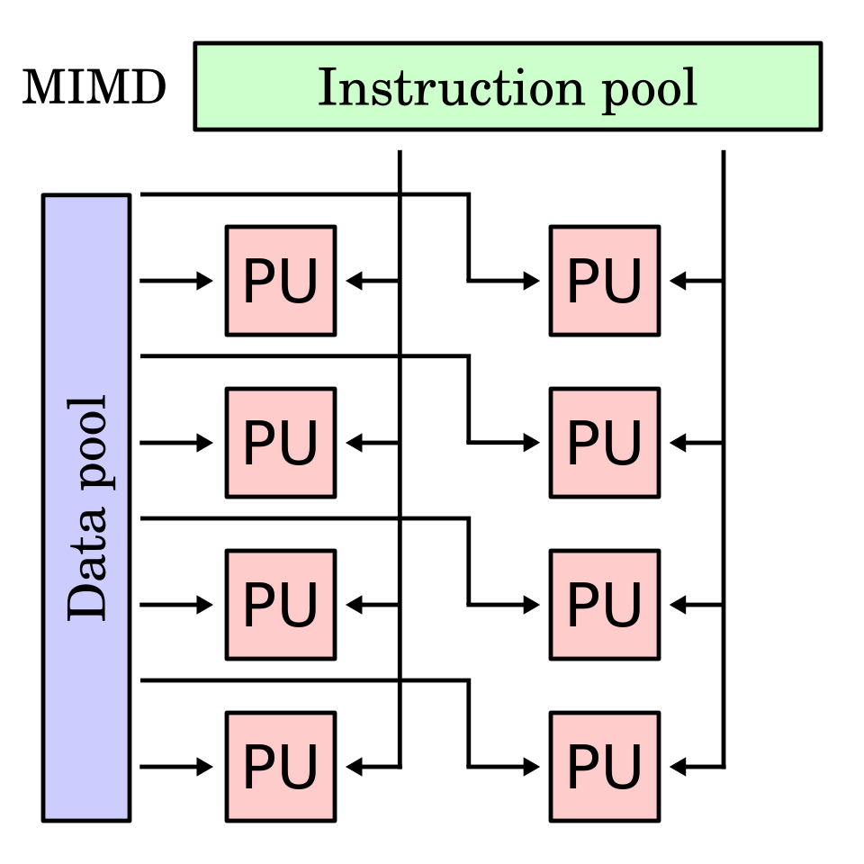
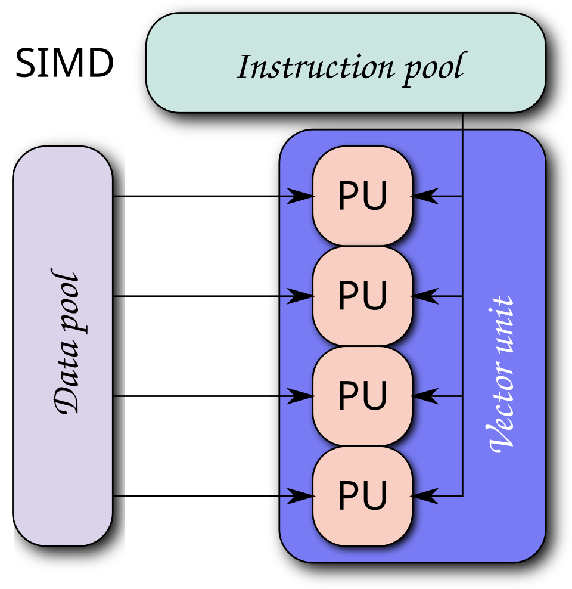

# Classifications of Parallel Computers

---

## Introduction

In this course we'll be using **MPI** which falls under a specific type of parallel computing

But there are also other APIs that use other architectures to achieve parallelism

Including, but not limited to:
- pthreads
- OpenMP
- CUDA

The two ways of classifying these APIs is through 
1. each core's **access** to memory (classification through memory)
2. if each core can operate **independently** (classification through instructions)

---
layout: center
---

# Memory Classifications

---

## Shared memory systems

Where each core can **share** access to the computer's memory

- each core can read and write each memory location



Each core is coordinated by reading and updating to memory locations

---

## Distributed memory systems

Where each core has its own **private** memory

- each core can only read and write to its **own** memory
- but has explicit methods to communicate with other cores



Each core is coordinated by *sending messages* to each other

---
layout: center
---

# Instruction Classifications

---
layout: two-cols
---

## Multiple instruction multiple data

Where each core is considered a normal processor, 
- with their own control units, 
- ALUs,
- and can operate **independently**

This is called a *Multiple-Instruction Multiple-Data* (**MIMD**) system

You can do addition **and** multiplication on different sets of data at the same time

::right::



---
layout: two-cols
---

## Single instruction multiple data



::right::
Where each core is **does not** have its own control unit
- Each core share a single control unit
- but they can access their own memory

This is called a Single-Instruction Multiple-Data (SIMD) system

you must do addition **or** multiplication on different sets of data

---

## MIMD vs SIMD Example

MIMDs are more natural to think about and program, but some problems can be solved much easier with SIMD

For example
- Assume have three arrays with `n` elements
- we want to add the first two arrays
- then store it in the third array

```c
int x[n], y[n], z[n];

for (i = 0; i < n; i++) {
    z[i] = x[i] + y[i];
}
```

---

## With SIMD

If we have `n` SIMD cores, and each core is assigned one element from each of the arrays

- core `i` is assigned elements `x[i], y[i], z[i]`

Then we can simply

```c
i = what_is_my_subscript();
z[i] = x[i] + y[i];
```

---

## Concurrent, parallel, and distributed

These terms are usually used informally and interchangeably

But for our purposes, and agreeing to overall consensus
- Concurrent means multiple tasks can be *in progress* at the same time
- Parallel means a program has multiple tasks **executing** at the same time
- Distributed means a program needs to cooperate with **other programs** to accomplish a task

Parallel and distributed programs **are concurrent**

But an operating system, is **also concurrent** even if it's only running one core

Note that terms are made up and will change depending on context
