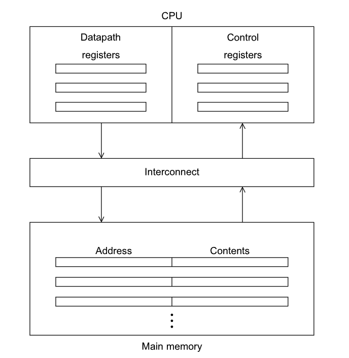
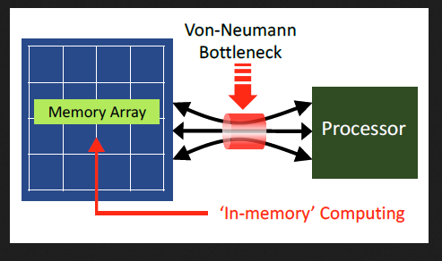
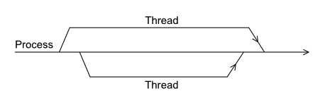
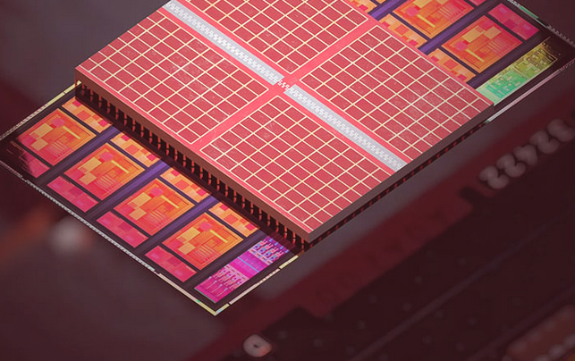
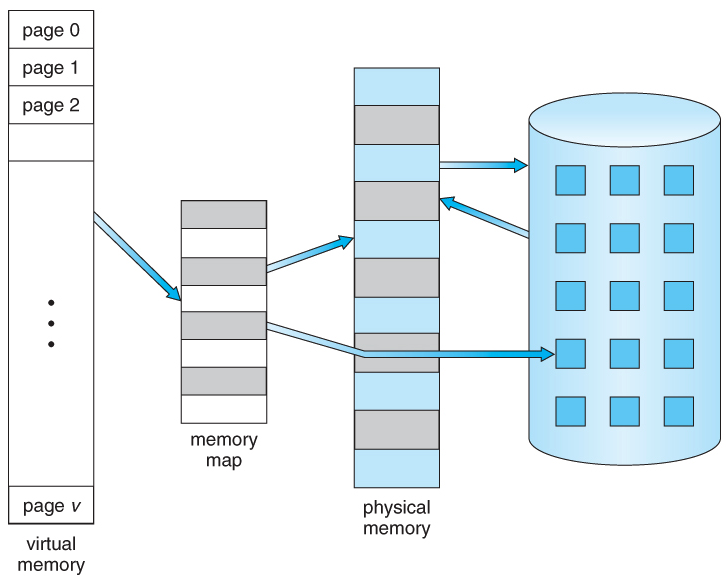
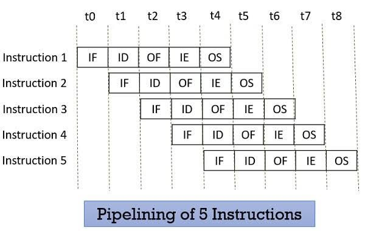
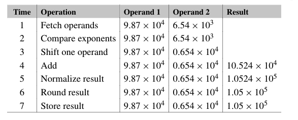
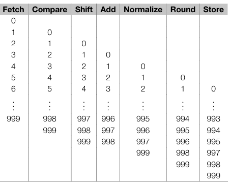

# Introduction

---
layout: two-cols
---

## The von Neumann Architecture

consisting of
1. main memory
2. cpu
3. interconnect

It's the basis of **all*** modern computers

::right::



---
layout: two-cols
---

## The von Neumann Architecture

Inside the CPU
- control unit: what instruction to do
- data path: executing the instructions

::right::


<!--
cpu is empty
cpu wants to run progrma
control gets from memory, stores in registers
control sends to datapath
data path sends back to memory or stores in registers
-->

---

## The von Neumann Bottleneck

- CPU's are incredibly **fast**, millions of instructions per second fast

- Memory, and memory transfers, are **slow**, thousands of bits per second slow

- And in a loop system, the slowest part determines the speed of the whole system



---
layout: center
---

# Factory and warehouse

---

## Software inside the von Neumann Architecture

The operating system is a piece of software

1. When a user runs a program, it creates a process

This includes things like
- machine language
- a block of memory (stack and heap)
- descriptors of resources (files, network connections, etc)
- etc

Most operating systems, and all modern ones, are **multitasking**. Even in single core von Neumann architecture systems

---

## Multitasking

The operating system provides the ability to run multiple programs and processes at the same time

> Even in single core von Neumann architecture systems

They operate on something called **time slices**

When processes need to wait for resources, a **block**, it gives the opportunity for other processes to run

Usually done with **threads**



---

## Modifications to the von Neumann model

The von neumman architecture **works**, but it's flaws have existed since the beginning

And so people have done modifications to it to make it faster

Mainly in three ways
1. to not pull in as much data
2. to pull more data at once
3. to run multiple instructions at once

---
layout: center
---

# Caching
to not pull in as much data

---
layout: two-cols
---

## Caching

The most widely used modification

> Back to the example

There are two ways to make factory faster

1. Widen the road (pull more data)
2. Move the factory or warehouse (store data closer)

::right::



---
layout: two-cols
---

## Caching

A **cache** is a collection of memory locations that are **faster** to access than main memory

> So which data should we store in cache?

There is a tendency for most programs to access the same data and instructions that are **close** to each other. This is called **locality**

A running program is likely to access data that is nearby (**spatial** locality) in the near future (**temporal** locality)

::right::

To exploit this, a cache system stores data and instructions that are likely to be used again soon in the cache

So a **block** of data is pulled from main memory to the cache, usually called a **cache block** or a **cache line**


---

## Caching

In code

```c
float z[1000];

sum = 0.0;
for(i = 0; i < 1000; i++) {
    sum += z[i];
}
```

Arrays are blocks of contiguous memory

So it's very likely that when we access `z[0]`, we'll also access `z[1], z[2], ...` after

So it pulls in a **cache block** or a **cache line**

---
layout: two-cols
---

## Cache hits and misses


::right::
When the CPU needs to access an instruction, it first checks the cache

If it's not in there, it's a **cache miss**

Then it has to go to main memory to get it, which is slow

If it is in there, it's a **cache hit**

Then it can get it quickly from the cache

---
layout: two-cols
---

## Cache mapping

> When we pull a cache line from main memory to the cache, where do we put it?

There are three main ways to do this
1. Fully associative - place it **anywhere**
2. Direct mapped - place it in **one specific** location
3. n-way set associative - place it in **one of n** locations (i.e. 2-way means 2 possible locations)

And whenever we need to evict a cache line, we need a **replacement policy**, usually **LRU** (least recently used)

::right::


---

## Fuller Example

Note that the CPU cache is **not controlled** by the programmer, but knowledge of it allows us to have some indirect control of it

For example, in C, we store 2d arrays in row-major order
```c
double a[max][max], x[max], y[max];

for (i = 0; i < max; i++)
    for (j = 0; j < max; j++)
        y[i] += a[i][j] * x[j];

for (j = 0; j < max; j++)
    for (i = 0; i < max; i++)
        y[i] += a[i][j] * x[j];
```

Assume `max = 3`

Which of these results in less cache misses?

---
layout: center
---

# Virtual Memory
to pull more data at once

---

## Virtual Memory

Assume you need to open *another program*, but you **don't have enough RAM**. Or you're running a program with a dataset **too large** to fit in RAM

Virtual memory allows the operating system to use disk space as "*extra RAM*"

When a program tries to access memory that is not in RAM, it's a **page fault**



---
layout: center
---

# Instruction level parallelism
to run multiple instructions at once

---

## Instruction level parallelism

Using multiple functional units to **simultaneously** execute instructions

There are two main ways to speed up instruction execution
1. Pipelining
2. Multiple issue



---
layout: center
---

## Factory assembly line example

<!--
car engine to chassis
transmission to engine
body to chassis
-->

---
layout: two-cols
---

## In computers

Assume we want to add 

$$
9.87 * 10^4
$$

and 

$$
6.54 * 10^3
$$

Our steps there will be
1. fetch
2. compare exponents
3. shift one operand
4. add
5. add
6. round
7. store

::right::



So for code like the one below

```c
float x[1000], y[1000], z[1000];

for (i = 0; i < 1000; i++) {
    z[i] = x[i] + y[i];
}
```

Assuming each addition takes 7 nanoseconds, this loop will take how long?

---

## Pipelined



Assuming the computer pipelines this addition
- every single addition still takes 7 nanoseconds
- but a new addition can start every nanosecond

The loop will take how long now?

<!--1006-->

---

## Multiple issue

Some processors (most modern ones) can issue multiple instructions at once

In our previous example
```c
float x[1000], y[1000], z[1000];

for (i = 0; i < 1000; i++) {
    z[i] = x[i] + y[i];
}
```

If we assume that we have 2 instead of 1 adder unit, we can effectively double the throughput of our additions

---

# Break
before quiz
