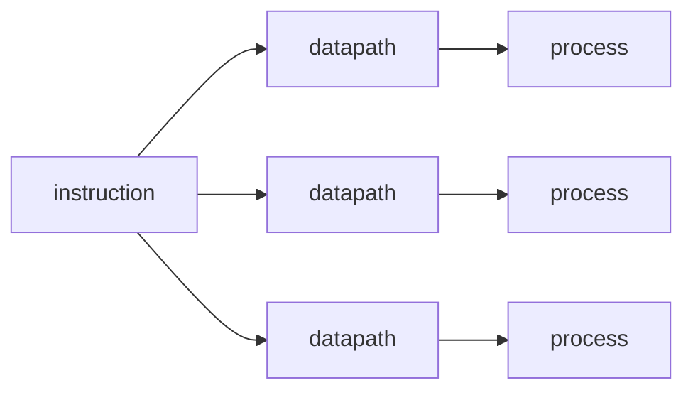
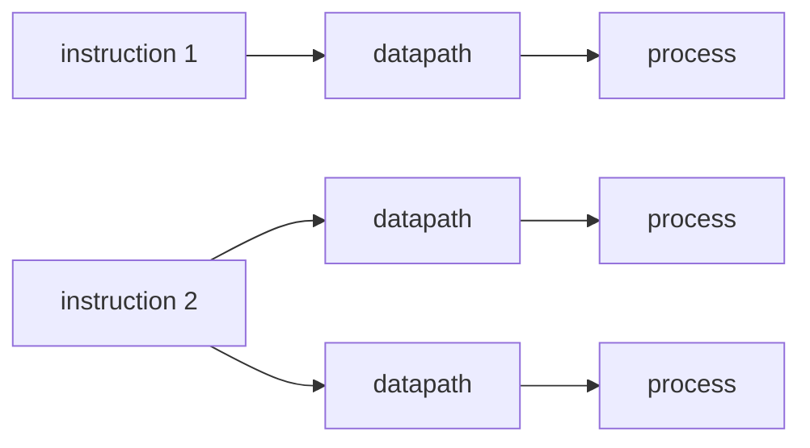

# Parallel hardware

---

## Flynn's Taxonomy

In 1966, Michael J. Flynn proposed a classification system for computer architectures based on the number of concurrent instruction and data streams they support.

image

The four categories are:
1. **SISD** (Single Instruction, Single Data)
2. **SIMD** (Single Instruction, Multiple Data)
3. **MISD** (Multiple Instruction, Single Data)
4. **MIMD** (Multiple Instruction, Multiple Data)

Which one of these is the von Neumann architecture?

Almost every single parallel system is *multiple data*, and the main difference is if they support **one** input stream, or **multiple** input streams.

---

## SIMD

Applies the **same** instruction to **multiple** data points.



Say we want to add the contents of two arrays, assuming we have an **SIMD** system with *n* datapaths,

we could load x[i] and y[i] into the `i`th datapath, then store it at x[i]

---

## SIMD

problem

```
for (i = 0; i < n; i++) {
    if (y[i] > 0.0) {
        x[i] = x[i] + y[i];
    }
}
```
If y[i] isn't positive, the datapath holding y[i] is idle for that instruction.

Parallelism that’s obtained by dividing data among the processors and having the processors all apply the same instructions to their subsets of the data is called **data-parallelism**

SIMD parallelism can be very efficient on large data parallel problems, but not on other types of problems

---

## MIMD

Applies **different** instructions to **different** data points.



Unlike SIMD systems, MIMD systems are usually **asynchronous** and requires **synchronization** between processors.

There are 2 main types of MIMD systems based on how their memory is arranged

---

## Shared Memory

image

---

## Distributed Memory

image

---

# Interconnection networks

---

## in shared memory systems

---

## in distributed memory systems
