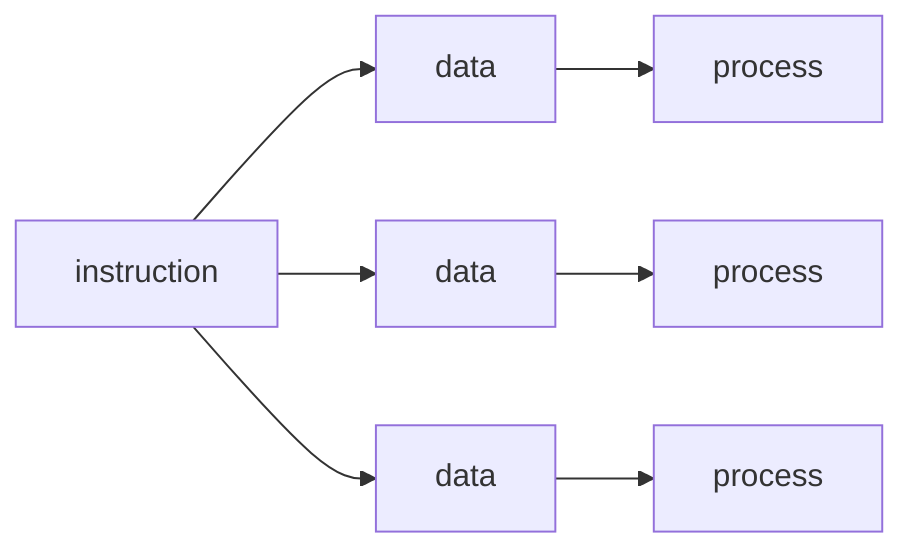
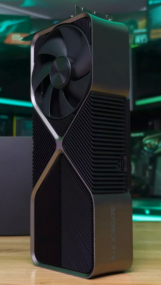
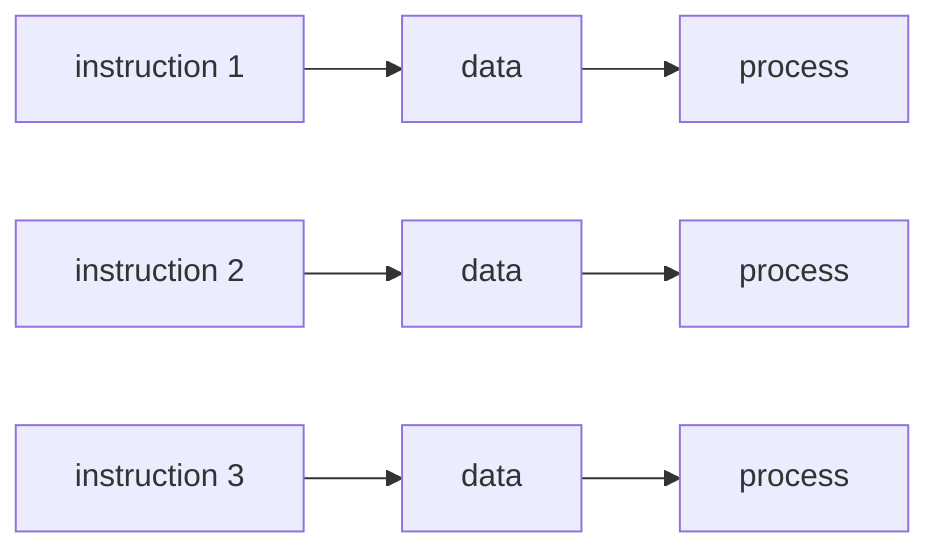
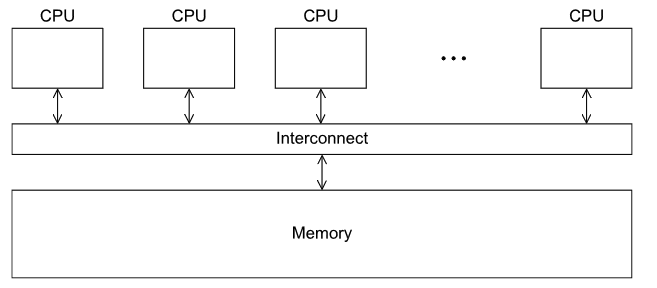
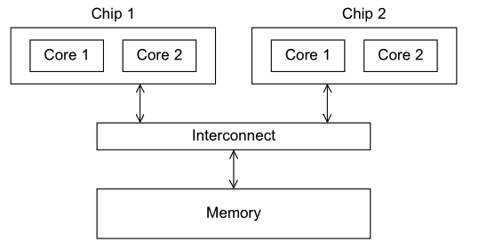
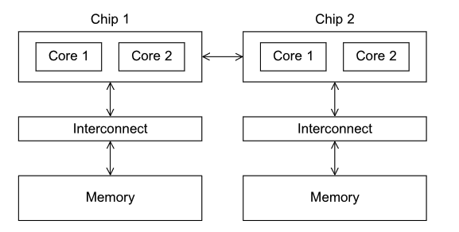
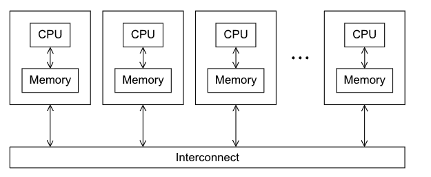
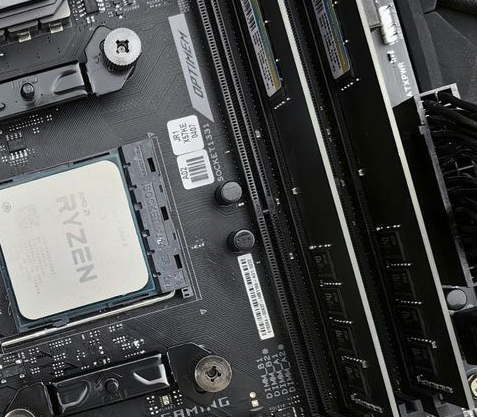
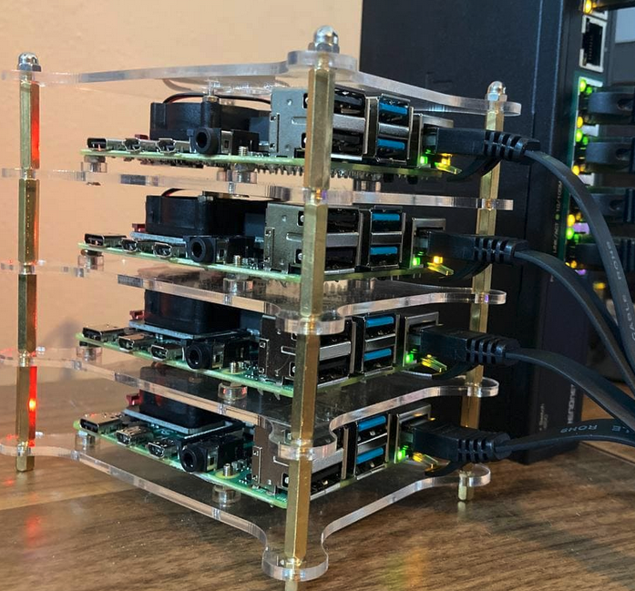

# Parallel hardware

---

## Flynn's Taxonomy

In 1966, *Michael J. Flynn* proposed a classification system for computer architectures based on

> Number of concurrent instruction and data streams they support.

The four categories are:
1. **SISD** (Single Instruction, Single Data)
2. **SIMD** (Single Instruction, Multiple Data)
3. **MISD** (Multiple Instruction, Single Data)
4. **MIMD** (Multiple Instruction, Multiple Data)

> Which one of these is the classic von Neumann architecture?

Almost every single parallel system is *multiple data*, and the main difference is if they support **one** instruction stream, or **multiple** instruction streams.

---

## SIMD

Applies the **same** instruction to **multiple** data points.



Say we want to add the contents of two arrays, assuming we have an **SIMD** system with `n` datapaths,

we could load `one[i]` and `two[i]` into the `i`th datapath (core), then store it at `one[i]`

---

## SIMD

What if we only want to add `two[i]` to `one[i]` if `two[i]` is positive?

```c
for (i = 0; i < n; i++) {
    if (y[i] > 0.0) {
        x[i] = x[i] + y[i];
    }
}
```

If `y[i]` isn't positive, the datapath holding `y[i]` is idle for that instruction.

**Dividing data** and having the processors all apply **the same instructions** to their subsets of the data is called what kind of parallelism?

SIMD parallelism can be very efficient on large data parallel problems, but higher control flow can lead to inefficiencies.

---

## GPUs

The graphics pipeline is uniquely suited to an SIMD architecture

In a typical shader function, the **same** operations are applied to **many pixels** or vertices

```glsl
uniform vec2 player_position;
uniform vec4 color : hint_color = vec4(0.305, 0.298, 0.341,1);

uniform float MULTIPLIER = 0.56;
uniform float SCALE = 0.5;
uniform float SOFTNESS = 0.45;

void fragment(){
	float val = distance(vec2(UV.x , UV.y * MULTIPLIER), 
                      vec2(player_position.x , player_position.y * MULTIPLIER));
	val = val / SCALE;
	float vignette = smoothstep(0.2, SOFTNESS, val);
	COLOR = vec4(color.rgb, vignette);
}
```

> How many pixels are there in a 1080 by 1920 display?

<style>
.slidev-code {
    font-size: 14px !important;
}
</style>

---
layout: two-cols
---

## GPUs and SIMD

Processing a single image can require very large amounts of data, hundreds of megabytes of data is *normal*

Because SIMD systems **don't** need a full control unit for each datapath, they can have **thousands** of datapaths

The rtx 4090 has **16,384** CUDA cores*

The AMD threadripper has **64**

<small>
    *Note that these are not equivalent
</small>

::right::



---

## MIMD

Applies **different** instructions to **different** data points.



Unlike SIMD systems, MIMD systems are usually **asynchronous** and requires **synchronization** between processors.

There are 2 main types of MIMD systems based on how their **memory is arranged**

---

## Shared Memory



Where each core can **share** access to the computer's memory. This style is the most common in **multi-core** processors

Access to the main memory is either **direct**, where all cores can access the main memory.

Or each core can access a **block** of local memory, with access to other core's memory

---
layout: two-cols
---

## Shared Memory

That first type, where all cores can access the main memory directly, is called **Uniform Memory Access** (UMA)



These types are usually easier to program, since all cores access the memory at the same latency

::right::

The second type, where each core has a block of memory, is called **Non-Uniform Memory Access** (NUMA)



But in a NUMA system, access time is **non-uniform**, which means that some memory accesses are faster than others

---

## Distributed Memory



Where each core has its own **private** memory. This style is the most common in **computer clusters**

Usually used in multi-PC systems connected over a **network**, like Ethernet.


One example of distributed memory systems are **botnets**, where many computers are connected over the internet to perform tasks

---
layout: center
---

# Interconnection networks
All parallel systems need a path to communicate

---

## in shared memory systems

In shared memory systems, the main interconnect is the **memory bus**

They are low cost and flexible, but might become slower as traffic increases.



With their main downside being the limit to **distance**, since all cores need to be close enough to the memory bus

---

## in distributed memory systems

In distributed memory systems, the interconnect is usually a **network**



But they're usually divided into two categories:
1. Direct interconnects, where each node is **directly** connected to other nodes (ring, mesh)
2. Indirect interconnects, where nodes are connected through **switches** (star, fat-tree)

---
layout: two-cols-header
---

## Shared vs Distributed

Shared memory systems are easier to program, **faster**, and have lower latency, and

Distributed memory systems are often better for problems require **large amounts of memory**

### Directly

::left::
A larger bus in a shared memory system is more **expensive**, 
> quickly becomes a bottleneck for scalability

::right::
A larger bus in a distributed memory system is **cheaper**, 
> but requires more complex routing algorithms


