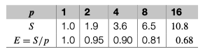
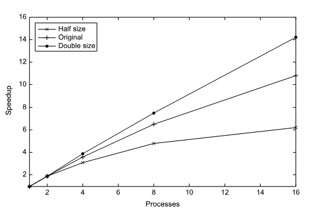
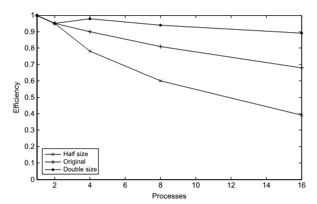

# Performance

---

## Performance

The only reason we use parallel and distributed systems is to **improve performance**.

And to see if we have improved performance, we need to be able to *measure* and *compare* the performance of different systems.

This is usually done by measuring **time**

---

## Performance

Assume that we run a program with $p$ cores

Ideally, that means our program will run $p$ times faster than if we ran it on a *single core*

So if a single core runs a program in 10 seconds, let's call this $T_{serial}$

Then we can expect our parallel program to run in $\frac{T_{serial}}{p}$ seconds, let's call this $T_{parallel}$

This would be called a **linear speedup**, and is the *idealized* case

---

## Overhead

All systems introduce some amount of **overhead** and *inefficiency* that prevents us from achieving linear speedup

For example, the creation and management of threads, the communication between threads, critical sections, any synchronization, etc., all introduce overhead that can slow down our program

So if we define *speedup* as

$$
S = \frac{T_{serial}}{T_{parallel}}
$$

Then a *linear speed* up would be $S = p$ where we get a speedup *equal* to the number of cores

And we can expect $S$ to be *less* than $p$ due to overhead, and that as cores increase, we can *expect* that $S$ will *decrease* due to the increasing overhead

---

## Efficiency

So we can define how *efficient* our parallel program is by looking at the ratio of speedup to the number of cores

$$
\begin{aligned}
E &= \frac{S}{p} = \frac{\frac{T_{serial}}{T_{parallel}}}{p} \\
&= \frac{T_{serial}}{p \cdot T_{parallel}} \\
\end{aligned}
$$

And if we plot the numbers of $E$ with our *assumptions* of overhead, we can see that as the number of cores increases, the *efficiency decreases*

---

## Efficiency

We can describe *efficiency* as

> The fraction of time spent each core is doing useful work, as opposed to overhead, in a parallel program

And with some math, we can determine the specific amount of time spend doing useful work and overhead

$$
\begin{aligned}
T_{work} &= \frac{T_{serial}}{p} \\
T_{overhead} &= T_{parallel} - T_{work} \\
\end{aligned}
$$

Where $T_{work}$ is the time spent doing useful work, and $T_{overhead}$ is the time spent doing overhead

---

## Mini exercise

Given a program
1. runs for 24 seconds on a single core
2. runs for 6 seconds on 8 cores

What is
1. The speedup $S$?
2. The efficiency $E$?
3. The time spent doing useful work $T_{work}$?
4. The time spent doing overhead $T_{overhead}$?

---

## Problem size

Note that while $T_{parallel}$, $S$, and $E$ depend on $p$

All of those and $T_{serial}$ also depend on the **problem size** $n$

For example, if we halve and double the prolbem size of a program that runs like

Then we can expect it to look like

    
    

---
layout: center
---

# Amdahl's Law

---

## Amdahl's Law

In the 1960s, *Gene Amdahl* observed that the speedup of a program is limited by the *serial* portion of the program

> This is called **Amdahl's Law**

It states that the speedup of a program is limited by the fraction of the program that is *serial* and cannot be parallelized

---

## For Example

If a program is *90% parallelizable* and *10% serial*, even with **perfect** parallelization. 

And if we assume that $T_{serial} = 20s$, where the run time is given by $0.9 \cdot T_{serial} / p = 18/p$

The speedup will be given by

$$
\begin{aligned}
S &= \frac{T_{serial}}{T_{parallel}} \\
&= \frac{T_{serial}}{0.9 \cdot T_{serial} / p + 0.1 \cdot T_{serial}} \\ 
&= \frac{20}{18/p + 2}
\end{aligned}
$$

---

## For Example

Now, as $p$ gets larger, $0.9 \cdot T_{serial} / p$ gets closer to 0

Which means the total speedup can never become larger than

$$
\begin{aligned}
S &= \frac{20}{18/p + 2} \\
&= \frac{20}{2} \\
&= 10
\end{aligned}
$$

---

## Scalability in MIMD systems

While "*scalability*" can have different meanings, roughly

> if, by increasing the power of the system it's run on, we can obtain speedups over the program when it's run on less powerful systems, then we can say that the program is *scalable*

In MIMD we can define it using *math*

Assume we have a parallel program with a *fixed* number of processes and a *fixed* input size, and we get an efficiency of $E$

Suppose we increase the number of processes

If we can find a corresponding rate of increase in the problem size so that the program has the same efficiency $E$, then we can say that the program is *scalable*

---
layout: two-cols
---

## Example

Suppose that

1. $T_{serial} = n$ in microseconds, and
2. $n$ is the problem size
3. $T_{parallel} = \frac{n}{p} + 1$ 

Then 

$$
\begin{aligned}
E &= \frac{T_{serial}}{p \cdot T_{parallel}} \\
&= \frac{n}{p(\frac{n}{p}+1)} \\
E &= \frac{n}{n + p}
\end{aligned}
$$

::right::

To see if the program is scalable, we *increase the number of processes* by a factor $k$

And we want to find factor $x$ that we need to increase the problem size by so that $E$ **remains the same**

---

## Example

if the *number of processes* will be $kp$ (where $k$ is the factor by which we increase the number of processes)

and the *problem size* will be $xn$ (where $x$ is the factor by which we increase the problem size)

We want to find $x$  where it still equals $E$

$$
\begin{aligned}
E &= \frac{n}{n + p} = \frac{xn}{xn + kp}
\end{aligned}
$$

---

## Example

$$
\begin{aligned}
E = \frac{n}{n + p} &= \frac{xn}{xn + kp} \\
\frac{1}{n+p} &= \frac{x}{xn + kp} \\
xn + xp &= xn + kp \\
xp &= kp \\
x &= k
\end{aligned}
$$

In other words, the factor that we need to increase $x$ (*the problem size*) and $k$ (*the number of processes*) by *to maintain the same efficiency*, is the **same** factor

To make sure that our program scales and maintains it's current efficiency, anytime we want to increase the number of processors, we also need to increase the problem size by the same factor

---

## Terminology

There are names for two specific outcomes of this process

If we *increase* the processors, and *maintain* the problem size, we call this **strongly scalable**

If we *increase* the processors, and *increase* the problem size by the same factor, we call this **weakly scalable**

So if we set $x=1$ and increase $k$, and it maintains efficiency, our program would be **strongly scalable**

