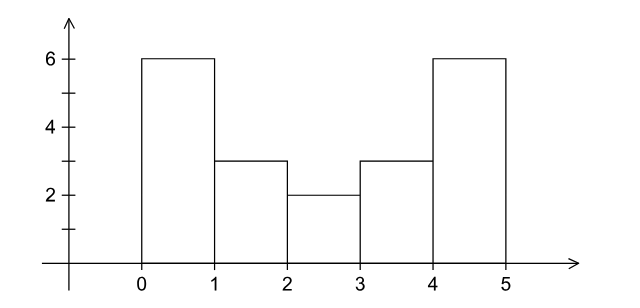
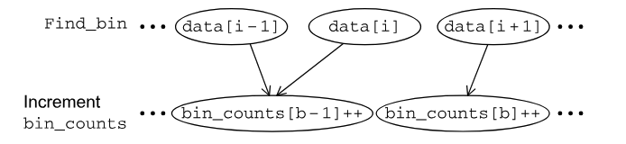
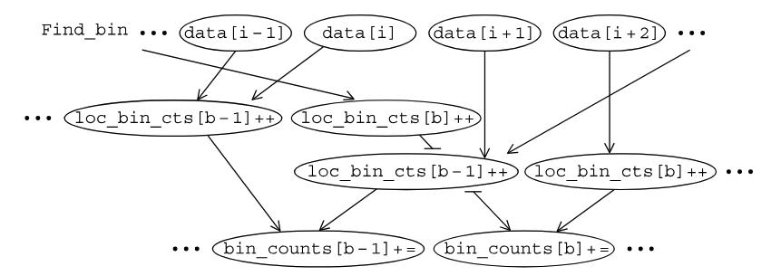

# Designing a parallel system

---

## Designing a parallel system

Assume an example that generates *large quantities of floating point data*

A sample of our data being

```
1.3, 2.9, 0.4, 0.3, 1.3, 4.4, 1.7, 0.4, 3.2, 0.3, 4.9, 2.4, 3.1, 4.4, 3.9, 0.4
```

And our goal is to *generate a histogram* of the data, which is a plot of the number of data points that fall into each of a set of bins



---

## A serial program

A good start to designing a *parallel system* is to *first design a serial program* that can solve the problem

To make a histogram serially, we

1. decide what the bin ranges are
2. determine the number of data points that fall into each bin
3. print the results (we'll ignore this step for now)

---

## A serial program

So the input is

1. the number of measurements, `data_count`
2. an array of `data_count` floats, `data`
3. the minimum value for the bin containing the smallest value, `min_data`
4. the maximum value for the bin containing the largest value, `max_data`
5. the number of bins, `bin_count`

And the outputs are

1. `bin_maxes`, an array of `bin_count` floats
2. `bin_counts`, an array of `bin_count` integers
3. `bin_width = (max_data - min_data) / bin_count`

---

## A serial program

we initialize the `bin_maxes` and `bin_counts` arrays

```c
for (b = 0; b < bin_count; b++) {
    bin_maxes[b] = min_data + (b + 1) * bin_width;
}
```
And we'll say that

$$
\text{bin\_maxes}[b-1] <= \text{data} < \text{bin\_maxes}[b] \\
\text{min\_data} < \text{data} < \text{bin\_maxes}[0]
$$

Note that we need a special case for `bin[0]`

And the code will be

```c
for (i = 0; i < data_count; i++) {
    bin = find_bin(data[i], bin_maxes, bin_count, min_data);
    bin_counts[bin]++;
}
```

---

## Steps to parallelize a program

According to *Ian Foster* in *Designing and Building Parallel Programs*, there are 4 steps to parallelize a program

1. **Partitioning**: divide the computation into smaller pieces
2. **Communication**: determine what data needs to be communicated between the pieces
3. **Agglomeration**: combine pieces to reduce communication
4. **Mapping**: assign pieces to processes

This is called **Foster's Methodology** and is a common way to design parallel programs

---

## Using Foster's Methodology

If we assume that `data_count` is *larger* than `bin_count`, we can assume that the main bottleneck would be the `find_bin` function

For *partitioning*, we have two types of tasks
1. finding the bin for each data point
2. incrementing the bin count

For *communication*, we need those two tasks to communicate



And because the `finding` and `incrementing` tasks are *dependent* on each other, 

we have a lot of *aggregated*

---

## Mapping

At this point in the process, the mapping becomes *dependent on the system and problem*

And there exists one main problem

Assuming that we have *multiple threads* dealing with `data[i]` and `data[i-1]` that fall into the same bin, we get a race condition which has different outcomes depending on the system

---

## MIMD

In an *mimd* system, we would give each thread their own `loc_bin_counts`

Which then gets aggregated at the end of the program


