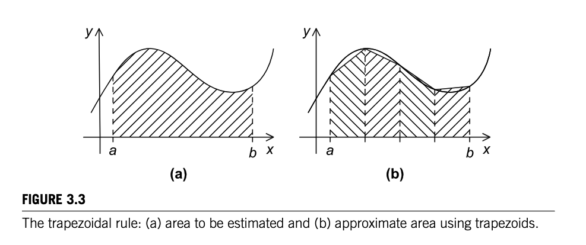
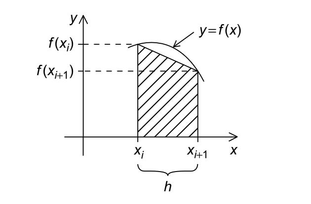
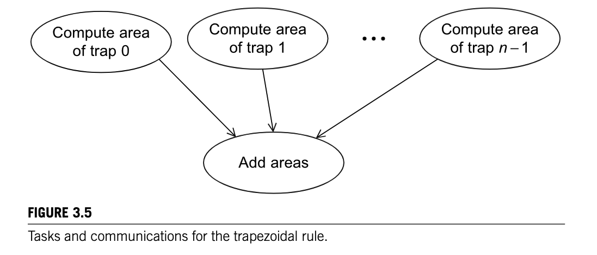

# MPI in Action

---

## The Trapezoidal Rule

A slightly more useful program compared to the simple sums and hello world we've been doing is the trapezoidal rule for numerical integration.

Where we can use the trapezoidal rule to *approximate* the area between the graph of a function

$$
y = f(x)
$$



Where the basic idea is to divide the interval on the x-axis into $n$ equal *subintervals*, approximate the area under the curve, then sum up the areas of the trapezoids.

---
layout: two-cols-header
---

## A single trapezoid

::left::
A single trapezoid, in our case, would be a trapezoid where
- the base is the *subinterval*,
- the sides are *vertical lines*, and
- the top is a *secant line* connecting the two points on the graph of $f(x)$.

And so the formula would be

$$
\text{Area} = \frac{h}{2} \left[f(x_i)+f(x_{i+1})\right]
$$

::right::


---

## A serial program

If we declare that:
1. $n$ is the number of subintervals,
2. $h$ is the width of each subinterval, and

And $h = \frac{b-a}{n}$ where $a$ and $b$ are the left and right endoints

Then declare that $x_0$ is the start and $x_n$ is the end, where

$$
x_0 = a, \quad x_1 = a + h, \quad x_2 = a + 2h, \quad \ldots, \quad x_{n_1} = a + (n -1)h, \quad x_n = b
$$

And so the sum of our trapezoids would be

$$
\text{Sum of Area} \approx h 
\left[ 
\frac{f(x_o)}{2} + f(x_1) + f(x_2) + \ldots + f(x_{n-1}) + \frac{f(x_n)}{2}
\right]
$$

---

## A serial program

In code, that would look like

```c
// input: start, end, n

h = (end - start) / n;
approx = (f(start) + f(end))/2.0;
for (i = 1; i < n; i++) {
    x_i = start + i * h;
    approx += f(x_i);
}
approx = h*approx;
```

---

## Parallelizing it

Recall our 4 basic steps
1. *Partition* the problem into tasks
2. Identify *communication* channels between the tasks
3. *Aggregate* tasks into composite tasks
4. *Map* composite tasks to cores

In **partitioning**, we want to identify *as many tasks as possible*.

In the trapezoidal rule, we might identify two parts

```c{4-5,7}
h = (end - start) / n;
approx = (f(a) + f(end))/2.0;
for (i = 1; i < n; i++) {
    x_i = start + i * h; // finding the area of a single trapezoid
    approx += f(x_i);
}
approx = h*approx; // summing up the areas of the trapezoids
```

---

## Parallelizing it

In **communication**, we can simply take all the *task 1*s, and send them to a single *task 2*.



For **aggregation** and **mapping**, intuitively, we want to have as many *trapezoids as possible*

*More than* the our *number of cores*

---

## Parallelizing it

A natural way of doing this is to *split the interval* `[a, b]` into `comm_sz` subintervals

> this would be aggregation

And assign each core `n / comm_sz` trapezoids to compute

> this would be mapping

---

## Psuedocode

```c
// get end start n comm_sz my_rank
h = (end - start) / n;
local_n = n / comm_sz;
local_start = start + my_rank * local_n * h;
local_end = local_start + local_n * h;
local_integral = Trapezoid(local_a, local_b, local_n, h); // just the serial trapezoid code

if (my_rank != 0) {
    // send local_integral to 0;
} else {
    total_integral = local_integral;
    for (source = 1; source < comm_sz; source++) {
        // receive local_integral from source
        total_integral += local_integral;
    }
}
```

---
layout: two-cols-header
---

## Homework

3 files to submit:
1. `serial_trapezoidal.c` create a serial implementation of the trapezoidal rule
2. `parallel_trapezoidal.c` create a parallel implementation of the trapezoidal rule using MPI
3. `answers.txt`, a text file that shows the output of the 3 `n` sizes

Note, the parallel program only runs when the number of cores is *even*

::left::
Hardcode the inputs: 
- `f(x)` be `f(x) = x*2`
- `start = 0.0`
- `end = 3.0`

::right::
And input
- `n = 10`
- `n = 1000`
- `n = 1000000` (number of trapezoids)
