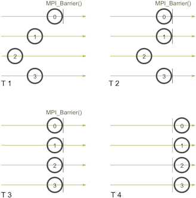
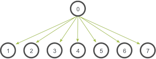
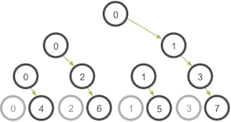

# MPI Broadcast and Collective Communications

---

## Collective Communications

Collective communication is a method of communication which involves participation of **all** processes *in a communicator*

One standard way of doing so is **broadcasting**

---

## Synchronization Points

Collective communication *implies* a synchronization point

This means that all processes must reach the collective communication call before any of them can proceed

---

## MPI_Barrier

MPI has a special function that is dedicated to *synchronization* called `MPI_Barrier`

When you call `MPI_Broadcast`, it is essentially an *implicit* `MPI_Barrier` because all processes must reach the broadcast call before any of them can proceed

It forms a *barrier*, and no processes in the communicator can *pass* until all of them *call the function*

<div class="flex flex-row gap-4 w-1/5">
    
    
    
    
</div>

- Process zero calls `MPI_Barrier` first, then it *hangs*
- Then process `3` and `1` hit the barrier, and they also *hang*
- Finally, process `2` hits the barrier
- Then they all *pass* the barrier and continue

---

## `MPI_Bcast`

A **broadcast** is a standard collective communication technique where one process sends the same data to all processes in a communicator



In this case `0` has the *initial copy* and all other processes receive a **copy** of the data from `0`

---

## `MPI_Bcast`

In code `MPI_Bcast` has the following signature:

```c
MPI_BCast(
    void* data,
    int count,
    MPI_Datatype datatype,
    int root,
    MPI_Comm communicator
)
```

Where **both** the sender and receiver call the **same** function

---

## Broadcasting with Send and Recieve

While `MPI_Bcast` seems like a simple wrapper around `MPI_Send` and `MPI_Recv`, it has some complexities to it

```c
void my_Bcast(void* data, int count, MPI_Datatype datatype, int root, MPI_Comm communicator) {
    int rank, size;
    MPI_Comm_rank(communicator, &rank);
    MPI_Comm_size(communicator, &size);

    if (rank == root) {
        // Root process sends data to all other processes
        for (int i = 0; i < size; i++) {
            if (i != root) {
                MPI_Send(data, count, datatype, i, 0, communicator);
            }
        }
    } else {
        // Non-root processes receive data from the root process
        MPI_Recv(data, count, datatype, root, 0, communicator, MPI_STATUS_IGNORE);
    }
}
```

---

## Broadcasting with Send and Recieve

And the output should look like

```
>>> cd tutorials
>>> ./run.py my_bcast
mpirun -n 4 ./my_bcast
Process 0 broadcasting data 100
Process 2 received data 100 from root process
Process 3 received data 100 from root process
Process 1 received data 100 from root process
```

**But** this function is actually *really* inefficient.

---

## Broadcasting with Send and Recieve

Imagine if each process only has **one** outpoing/incoming network link

Our function is only using *one network link from process zero to send all the data* 

A *smarter* way of doing this is to use a *tree-based* algorithm that can use more network links at once

---

## Broadcasting with Send and Recieve



Instead of `0` sending to all processes, it sends to `1`, then `2`, then `4`, then `5`

And **while** it's sending to `2`
- `1` can send to `3`

*While* `0` is sending to `4`
- `2` can send to `6`
- `1` can send to `5`
- `3` can send to `7`

So multiple network connections can be used at the same time

---

## Comparison

The `MPI_Bcast` implementation utilizes a similar tree broadcast algorithm for good network utilization

```c
for (i = 0; i < num_trials; i++) {
  // Synchronize before starting timing
  MPI_Barrier(MPI_COMM_WORLD);
  total_my_bcast_time -= MPI_Wtime();
  my_bcast(data, num_elements, MPI_INT, 0, MPI_COMM_WORLD);
  // Synchronize again before obtaining final time
  MPI_Barrier(MPI_COMM_WORLD);
  total_my_bcast_time += MPI_Wtime();

  // Time MPI_Bcast
  MPI_Barrier(MPI_COMM_WORLD);
  total_mpi_bcast_time -= MPI_Wtime();
  MPI_Bcast(data, num_elements, MPI_INT, 0, MPI_COMM_WORLD);
  MPI_Barrier(MPI_COMM_WORLD);
  total_mpi_bcast_time += MPI_Wtime();
}
```

We can use `MPI_Wtime()` to get timings

---

## Comparison

Using the code provided [https://github.com/mpitutorial/mpitutorial/blob/gh-pages/tutorials/mpi-broadcast-and-collective-communication/code/compare_bcast.c](here)

Give the output for

| num_elements | num_trials | my_bcast_time (s) | mpi_bcast_time (s) |
|--------------|------------|-------------------|--------------------|
| 100          | 1000       |                   |                    |
| 1000         | 2000       |                   |                    |
| 1000         | 3000       |                   |                    |
| 1000         | 4000       |                   |                    |
| 1 000 000    | 1 000      |                   |                    |

Submit this as a text file with the name `lastname_results.txt` in NEO

