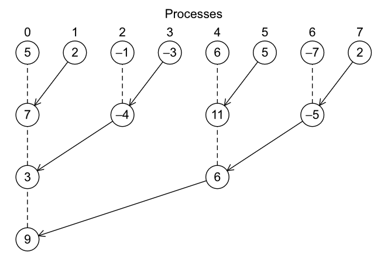
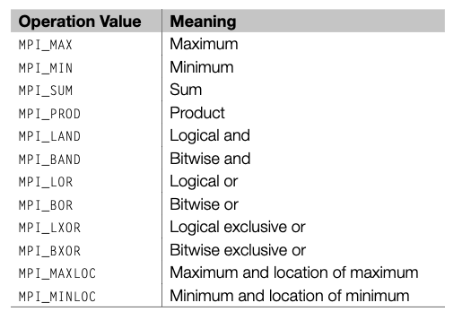

# Collective Communication

---

## Collective Communication

In our Trapezoid program, there are a few points, particularly one, where we can find something to improve upon

In particular, the "*global sum*" step

If we hire *8 people* to build a house, and only *7 people* built that house, while the 8th person is *just giving out orders*, it might not feel *efficient*


---

## Tree structured communication

A better way to do a *global sum* is to use a *tree structured communication* pattern



In our old scheme, we required
- 7 recieves and 7 adds by process 0

While our new scheme requires
- 3 recieves and 3 adds by process 0

There's also the additional benefit of *concurrency*, as work that was originally done *serially* by `process 0` can now be done *concurrently* by specific processes

---

## Tree structured communication

And if had a larger number of processes, like `1024`, the original scheme would require `1023` recieves and `1023` adds by `process 0`, 

While the tree structured communication would require only `10` recieves and `10` adds by `process 0`

And while *manually implementing* a tree structured communication pattern is possible, it's *difficult*

Not simply because of the *complexity* but because of the *possible situations*
- What if you wanted to pair specific processes together??
- What if a method of making a tree only performs well for a small number of processes?
- What if it's the opposite?
- What if it's system dependent?

---

## Global Sum

`MPI` gives out an implementation of a tree structured *global sum* in the form of `MPI_Reduce`

This is implementation is **not** the most *efficient* or the most *optimized*. But it's *good enough* for most developers

A global sum function clearly requires *communication*, however, **unlike** `Send-Recv`, it most likely requires *more than two* processes

In `MPI`, any communication that involves *all* the processes in a communicator is called a **collective communication**

To distinguish between the two, we call `Send-Recv` a **point-to-point communication**

---

## Global Sum

The global sum is, at least in `MPI`, a special case of an entire class of collective operations

For example, we might want to find the *maximum* value, or the *minimum* value, or some other possibility while trying to get the *sum*

This kind of operation is called a **Reduce**

---

## Reduce

Reduce is a fairly common programming pattern, and is used in many different contexts

```js
const array = [1, 2, 3, 4];
const sum = array.reduce(
  (accumulator, currentValue) => accumulator + currentValue,
);
```

Where most implementations are simply ways of calling a *reduce* function on each element of an *array*

In the context of `MPI`, a reduce operation doesn't iterate over a single array, but instead *aggregates* data that is distributed across multiple processes

---
layout: two-cols-header
---

## `MPI_Reduce`

::left::
The format for `MPI_Reduce` is as follows

```c
int MPI_Reduce(
    void* input_data_p, // data to be reduced
    void* output_data_p, // where to stored
    int count, 
    MPI_Datatype datatype, 
    MPI_Op operator, // the reduction operation 
    int destination, // receiver rank
    MPI_Comm comm 
);
```

Note the fifth argument, `operator`, which is the reduction operation to be applied to the data

::right::

There are a number of default operations



However, you can also create your own *custom operations*, which is useful for more complex data structures

---

## `MPI_Reduce`

Using `MPI_SUM` we can use

```c
MPI_Reduce(
    &local_int, // data to be reduced
    &total_int, // where to stored
    1, // only one element to be reduced
    MPI_DOUBLE, 
    MPI_SUM, // the reduction operation 
    0, // receiver rank
    MPI_COMM_WORLD
);
```

---

## Collective vs point to point communication

The main differences between collective and point to point is

1. *All* the processes in the communicator **must** call the same collective function

If one of your processes calls `MPI_Reduce`, and another process *doesn't* have a corresponding `MPI_Recv`, then your program will *hang* and *never finish*

2. While `output_data_p` is only used by the `destination` process, *all* processes must provide a value, even if it's jsut null

