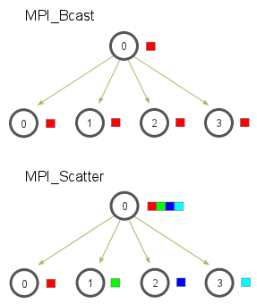
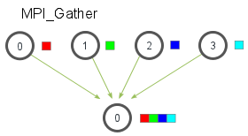
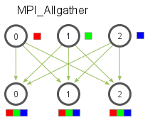

# Collective Communication

---

## Scatter

is a collective routine that is very similar to `Bcast`

It involves a designated root process and, sending data to all processes in a communicator

With the main difference being that scatter sends **chunks of an array** to different processes



Where the array of elements is distributed in order of rank

---

## Scatter

```c
MPC_Scatter(
    void* send_data,
    int send_count,
    MPI_Datatype send_datatype,

    void* recv_data,
    int recv_count,
    MPI_datatype recv_datatype,

    int root,
    MPI_Comm comm
)
```

---

## Scatter, send data

Assuming 4 cores

```c
int recv_data[2];
int send_data[8] = {1, 2, 3, 4, 5, 6, 7, 8};

MPI_Scatter(
    send_data,
    2,
    MPI_INT,

    recv_data,
    2,
    MPI_INT,

    2,
    MPI_COMM_WORLD
);
```

---

## Gather

is the *opposite* of scatter, where each process *sends data* to a designated root process

Where the root process receives the data in order of rank

Mostly used for parallel sorting and searching



---

## Gather

```c
MPI_Gather(
    void* send_data,
    int send_count,
    MPI_Datatype send_datatype,

    void* recv_data,
    int recv_count,
    MPI_datatype recv_datatype,

    int root,
    MPI_Comm comm
)
```

*only the root needs a valid receive buffer

*`recv_count` is the number of elements received from each process, not the total

---

## Gather

Assuming 4 cores

```c
int send_data[2] = {1, 2};
int recv_data[8];

MPI_Gather(
    send_data,
    2,
    MPI_INT,

    recv_data,
    2,
    MPI_INT,

    2,
    MPI_COMM_WORLD
);
```

---
layout: center
---

## Computing the average of numbers

What is average of the list

```c
int items[4] = {3,4,5,6};
```

---

## Defining root

So given random numbers on the root

```c
float *rand_nums;
if (world_rank == 0) {
    rand_num = create_rand_nums(elements_per_proc * proc_count);
}
```

---

## Local variables and sending

Define a local variable to hold the average of each process

```c
float *local_rand_nums = malloc(sizeof(float) * elements_per_proc);

MPI_Scatter(
    rand_nums,
    elements_per_proc,
    MPI_FLOAT,

    local_rand_nums,
    elements_per_proc,
    MPI_FLOAT,

    0,
    MPI_COMM_WORLD
);
```

---

## Compute the average of the local numbers

```c
float compute_avg(float* nums, int count) {
    float sum = 0.0;
    for (int i = 0; i < count; i++) {
        sum += nums[i];
    }
    return sum / count;
}

float local_avg = compute_avg(local_rand_nums, elements_per_proc);
```

---

## Gather the local averages

```c
float *local_avg_array = NULL;
if (world_rank == 0) {
    local_avg_array = malloc(sizeof(float) * proc_count);
}

MPI_Gather(
    &local_avg,
    1,
    MPI_FLOAT,

    local_avg_array,
    1,
    MPI_FLOAT,

    0,
    MPI_COMM_WORLD
);
```

---

## Compute the global average

```c
if (world_rank == 0) {
    float global_avg = compute_avg(local_avg_array, proc_count);
    printf("Global average: %f\n", global_avg);
}
```

---

## Allgather

If scatter is a *one-to-many* operation and gather is a *many-to-one* operation, then allgather is a *many-to-many* operation

Where *each process* **sends** data to *all other processes*, and **receives** data from *all other processes*



In the most basic sense, it's an `MPI_Gather` followed by an `MPI_Bcast`

---

## Allgather

The function declaration is similar to `MPI_Gather` but without the `root` argument

```c
MPI_Allgather(
    void* send_data,
    int send_count,
    MPI_Datatype send_datatype,

    void* recv_data,
    int recv_count,
    MPI_datatype recv_datatype,

    MPI_Comm comm
)
```

---

## Modifying the average example

```c
float *local_avg_array = malloc(sizeof(float) * proc_count);
MPI_Allgather(
    &local_avg,
    1,
    MPI_FLOAT,

    local_avg_array,
    1,
    MPI_FLOAT,

    MPI_COMM_WORLD
);

float global_avg = compute_avg(local_avg_array, proc_count);
```

Where the only difference is that *all processes* receive the local averages, and *all processes* compute the global average


---

## Semi final project 1

**Scenario**:

You are writing a program to process a very small, 16-pixel grayscale image, which is represented by a `1D` array of `16` integers

Where each integer is a brightness value between `0` (black) and `255` (white)

**Goal**:

Apply a *brightness filter* to the image

Where every pixel needs its value increased by `50` but capped at `255` (so if the value is above `255`, it should be set to `255`)

---

## Semi final project 1

**Constraints**:
1. it must run 4 processes
2. Process `0` should hold the image array
3. You must `scatter` the pixels equally among the 4 processes
4. Each process applies the brightness filter to its local chunk of pixels,
5. You must `gather` the processed pixels back to process `0`

Starter template can be found on NEO
