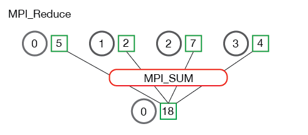
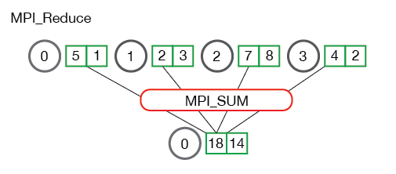

# Reduce

---

## Reduce

One of the most common collective operations is `MPI_Reduce`

*Data Reduction* involves reducing a set of numbers into a smaller set of numbers via a function.

```
[1, 2, 3, 4, 5] -> 15
```

Reductions can be difficult to implement especially in cases where *order* matters

```
[1, 2, 3] -> 9
```

This becomes *more difficult* in a distributed setting

---

## Reduce

In MPI, we can use `MPI_Reduce` to perform reductions across all ranks in a communicator

```c
MPI_Reduce(
    void* send_data,
    void* recv_data,
    int count,
    MPI_Datatype datatype,
    MPI_Op op,
    int root,
    MPI_Comm comm
)
```

This takes an **Array** of input elements on each process, and returns an array of output elements to the root process

---

## Reduce

- `send_data` is the array of elements of type `datatype` that we want to reduce
- `recv_data` is an array of size `sizeof(datatype) * count` present in `root`

And finally

`op`, is the operation you wish to apply

---

## Reduce Operations

MPI provides a number of built in operations, such as:
- `MPI_MAX` - Returns the maximum element.
- `MPI_MIN` - Returns the minimum element.
- `MPI_SUM` - Sums the elements.
- `MPI_PROD` - Multiplies all elements.
- `MPI_LAND` - Performs a logical and across the elements.
- `MPI_LOR` - Performs a logical or across the elements.
- `MPI_BAND` - Performs a bitwise and across the bits of the elements.
- `MPI_BOR` - Performs a bitwise or across the bits of the elements.
- `MPI_MAXLOC` - Returns the maximum value and the rank of the process that owns it.
- `MPI_MINLOC` - Returns the minimum value and the rank of the process that owns it.

---

## Example



Each process has `1` integer

---

## Example



In the case where a process contains multiple elements, the reduction is applied across all elements in the process before being sent to the root 

---

## Larger Example, Computing the average using reduce

```c
float *rand_nums = NULL;
rand_nums = create_rand_nums(num_elements_per_proc);
```

---

## Larger Example, Computing the average using reduce

Sum the numbers locally

```c
float local_sum = 0;
int i;
for (i = 0; i < num_elements_per_proc; i++) {
  local_sum += rand_nums[i];
}
```

---

## Larger Example, Computing the average using reduce

Print the random numbers on each process

```c
printf("Local sum for process %d - %f, avg = %f\n",
       world_rank, local_sum, local_sum / num_elements_per_proc);
```

---

## Larger Example, Computing the average using reduce

Reduce

```c
float global_sum;
MPI_Reduce(&local_sum, &global_sum, 1, MPI_FLOAT, MPI_SUM, 0, MPI_COMM_WORLD);

if (world_rank == 0) {
  printf("Total sum = %f, avg = %f\n", 
         global_sum, global_sum / (world_size * num_elements_per_proc));
}
```

---

layout: center
---

# Pen and Paper Exercises

---

## Scenario

- You are running `3` processes
- Rank 0  has a global array of `6` integers: `1, 2, 3, 4, 5, 6`

## Task (20 points)

Create system on paper that:
1. Scatters the array from rank `0` to all ranks *evenly*
2. Where each core `sums` all of its values and the first value of the next core
    - i.e. rank `0` sums `1 + 2 + 3`, rank `1` sums `3 + 4 + 5`, and rank `2` sums `5 + 6`
3. Then gathers the sums back to rank `0`

You don't have to write *valid* code, just *feasible* code

---

## Function definitions

```c
MPI_Comm_size(MPI_Comm comm, int* size)
MPI_Comm_rank(MPI_Comm comm, int* rank)

MPI_Scatter(void* send_data, int send_count, MPI_Datatype send_datatype,
            void* recv_data, int recv_count, MPI_Datatype recv_datatype,
            int root, MPI_Comm comm)

MPI_Gather(void* send_data, int send_count, MPI_Datatype send_datatype,
              void* recv_data, int recv_count, MPI_Datatype recv_datatype,
              int root, MPI_Comm comm)

MPI_Send(void* data, int count, MPI_Datatype datatype, 
        int dest, int tag, MPI_Comm comm)

MPI_Recv(void* data, int count, MPI_Datatype datatype, 
         int source, int tag, MPI_Comm comm, MPI_Status* status)
```

---

## Questions (5 pts each)

1. Immediately *after* the `MPI_Scatter` finishes, but **before** any point-to-point communication happens, what exactly is sitting in the local array of Rank 1?
2. When Rank 0 calls `MPI_Gather` at the *end* of the program, what is the exact size (in number of elements) of the receive buffer it needs to allocate to catch everyone's sums?
3. Write out the exact final array that `Rank 0` prints out after the `MPI_Gather` is complete
4. `Rank 2` is at the edge of our cluster. How did you ensure Rank 2 didn't try to `MPI_Recv` from a hypothetical "Rank 3" and crash the program?
