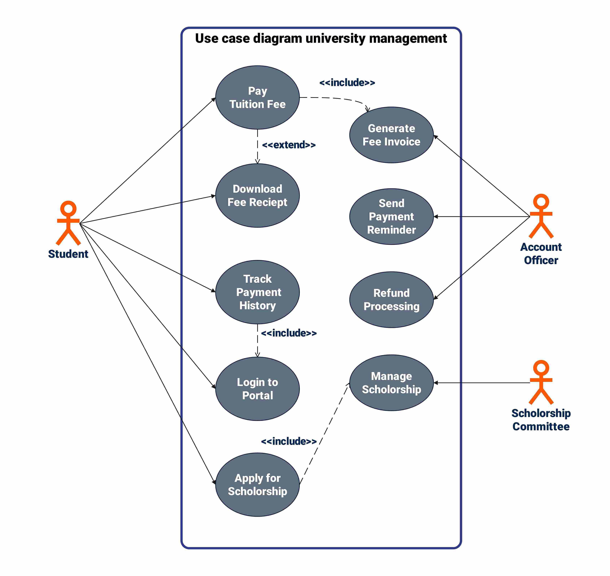

# Use Case Models

---

## Use Case Diagrams

A use case model is a visual representation of the interaction between users (actors) and the system to achieve specific goals (use cases).

It defines **what** the system should do from the user's perspective, not how the system will do it

---

## Example

---

## Terms

- **Actor**: 

An entity that interacts with the system (e.g., user, external system).

- **Use Case**: 

A specific function or action that the system performs in response to an actor's request.

- **System Boundary**: 

A box that defines the scope of the system and separates it from external actors.

---

## Actor

An actor represents a role that interacts with the system. It can be a person, another system, or an organization.

---

## Use Case

A use case represents a specific function or action that the system performs in response to an actor's request. 

It describes a sequence of interactions between the actor and the system to achieve a particular goal.

---

## System Boundary

The system boundary is a box that defines the scope of the system and separates it from external actors.

---

## Benefits

1. **Clarity**: Use case diagrams provide a clear and visual representation of the system's functionality and its interactions with users.
2. **Communication**: They facilitate communication between stakeholders, developers, and designers by providing a common language to discuss system requirements.
3. **Requirement Analysis**: Use case diagrams help in identifying and analyzing the functional requirements of
the system, ensuring that all necessary features are captured and understood.
4. **Design Guidance**: They serve as a guide for system design and development, helping

---

## A note on UML

Use case diagrams are part of the Unified Modeling Language (UML), a standardized modeling language used in software engineering to visualize the design of a system.

One of the primary benefits of UML is that it provides a common language for developers, designers, and stakeholders to communicate and understand the structure and behavior of a system.

---

## Relationships

1. **Association**: A relationship between an actor and a use case, indicating that the actor participates in the use case.
2. **Include**: A relationship where one use case includes the behavior of another use case
3. **Extend**: A relationship where one use case extends the behavior of another use case under certain conditions.
4. **Generalization**: A relationship where one actor or use case is a specialized version

