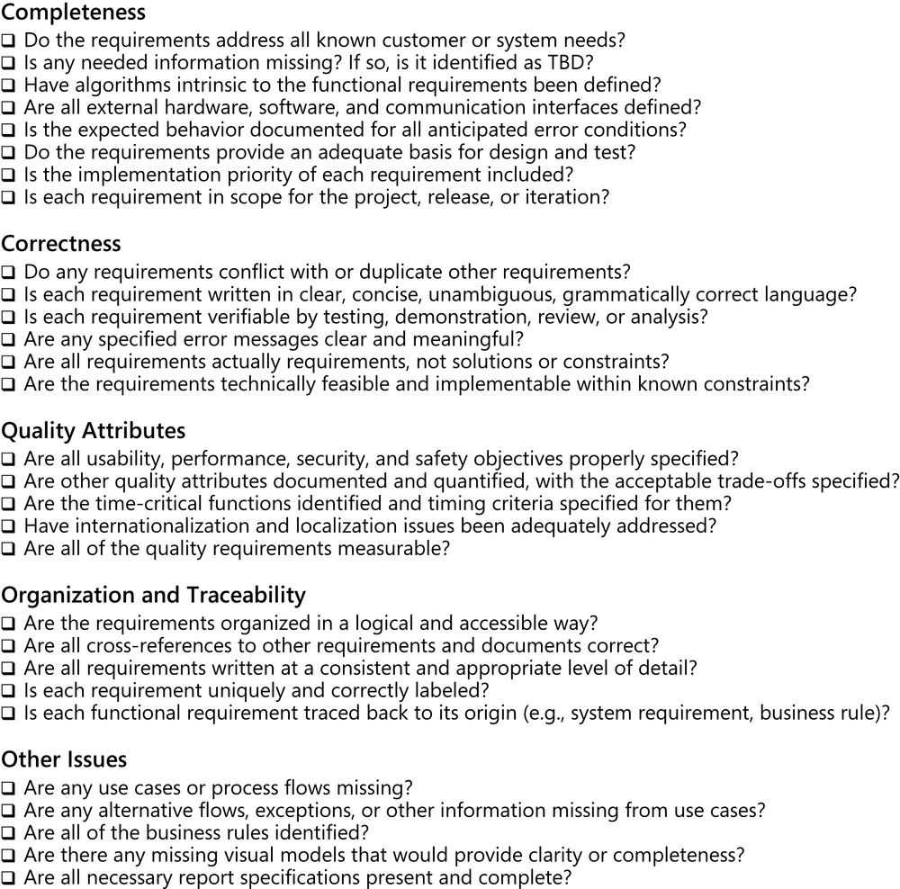
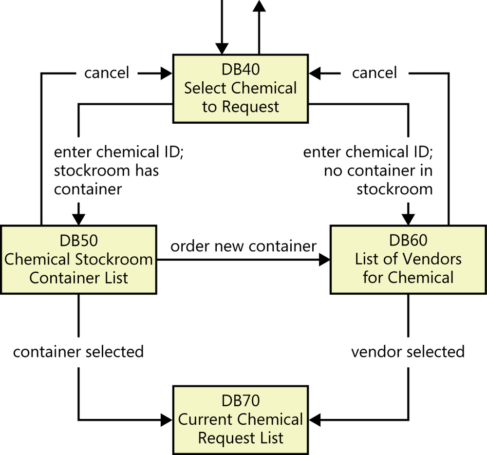
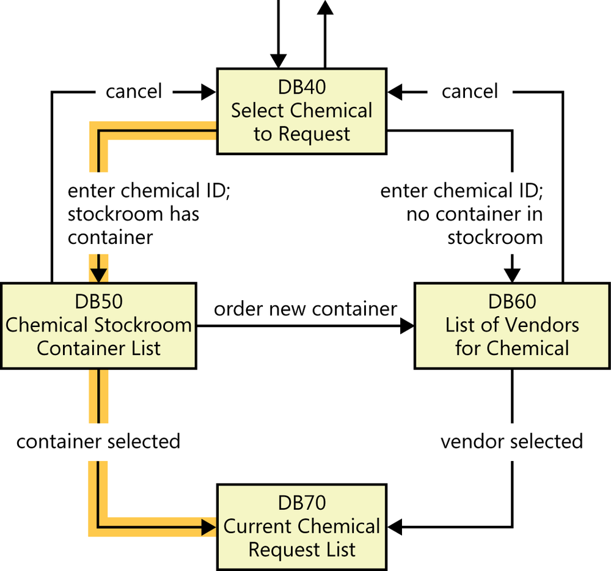

# Testing and validating requirements

---

# Testing

> So you now have a written SRS, that does not mean your SRS is *complete*

As a *living document* your SRS still needs to go through *validation*

Various techniques can help you to evaluate the correctness and quality of your requirements. 

---

## Validation

Validating requirements allows teams to build a solution that meets the business objectives. 

Requirements validation activities attempt to ensure that: 

- The software requirements *accurately* describe the intended system capabilities.
- The software requirements are *correctly derived* from the business requirements, system requirements, business rules, and other sources.

And that

- The requirements are *complete*, *feasible*, and *verifiable*.
- All requirements are *necessary* 

---

## Reviewing requirements

Anytime someone *other than the author* of a work product*, examines it for problems, a **peer review** is taking place. 

<small>*Work product in this case meaning the SRS</small>

> Reviewing requirements is a powerful technique for identifying *ambiguous* or *unverifiable* requirements

---

## Informal Reviews

The act of simply having someone else read the requirements

*Informal reviews* are good for catching glaring errors, inconsistencies, and gaps

But it’s hard for a reviewer to catch **all** of the ambiguous requirements on his own. 

- They might read a requirement and *think they understand it*, moving on to the next without a second thought
- Another reviewer might read the same requirement, *arrive at a different interpretation*, and also not think there is an issue. 

If these two reviewers *never discuss* the requirement, the ambiguity will go unnoticed until later in the project

---

## Formal Reviews

Formal peer reviews follow a well-defined process to help find more errors.

A formal requirements review produces *a report* that identifies the 
- *material examined*, 
- the *reviewers*, and 
- the review team’s judgment as to whether the requirements are *acceptable*. 

The main deliverable is a *summary of the defects* found and the issues raised during the review. 

---

## Inspection

The best-established type of formal peer review is called an *inspection*. 

Inspection of requirements documents is one of the *highest value* software quality techniques available

> But detailed inspection of large requirements sets is *tedious* and *time consuming*

If you don’t have time to inspect everything, *use risk analysis* to differentiate those requirements that *demand inspection* from less critical, less complex, or less novel material for which an informal review will suffice

*Inspections are not cheap*. 

They’re *not fun*. 

But they are cheaper than the alternative of expending lots of effort and customer goodwill fixing problems found much later on

---

## Inspection

Inspection can be organized into different staegs

- planning - which includes selecting the team, scheduling, and distributing the materials to be inspected
- preperation - which includes a *prelimenary review*, and identifying as many potential defects and issues
- inspection - which includes a *meeting* of the team to *discuss* the potential defects and issues identified during preparation
- rework - which includes the author of SRS making changes to address the defects and issues identified during the inspection
- follow up - which includes the inspection team verifying that the rework has been completed and that the materials are now acceptable
- baesline production - which includes the finalization of the materials and their incorporation into the project baseline

---

## Preparation

During preparation, the reviewers read the materials and identify potential defects and issues.

In order to effectively find issues, an organization will likely have a *checklist* of common defects and issues to look for.

---

## Inspection Checklist Example

---

## Challenges with inspection

Inspection has two very clear cut problems

1. large requirements documents

The larger the requirements document, the *more work* it takes to review, and the more likely it is that reviewers will miss defects and issues.

2. large inspection teams

In larger teams, there are more people to *coordinate*, and more potential for miscommunication and misunderstandings.

---

## Prototyping 

After the creation of a *new baseline* requirements document, you can use **prototypes** to validate the requirements.

All kinds of prototypes allow you to find missing requirements before *more expensive* activities like development and testing take place. 

---

## Prototyping

Something as simple as a *paper mock-up* can be used to walk through use cases, processes, or functions to detect any omitted or erroneous requirements. 

Prototypes also help confirm that stakeholders have a *shared understanding* of the requirements. 

> Someone might implement a prototype based on his understanding of the requirements, only to learn that a requirement wasn’t clear when prototype evaluators don’t agree with his interpretation.

*Proof-of-concept* prototypes can demonstrate that the requirements are feasible. 

Additional levels of *sophistication* in prototypes, such as *simulations*, allow more precise validation of the requirements

However, building more sophisticated prototypes will also take more time

---

## Testing

You can begin deriving *conceptual* tests from user requirements early in the development process. 

Use the tests to evaluate functional requirements, analysis models, and prototypes. 

The tests should cover the *normal flow* of each use case, *alternative* flows, and the *exceptions* you identified during elicitation and analysis. 

---

## Testing

Similarly, if you identified business process flows, the tests should cover the business process steps and all possible decision paths.

These conceptual tests are *independent of implementation*. 

For example, consider a use case called “*View a Stored Order*” for a Chemical Tracking System. Some conceptual tests are:

- User enters order number to view, order exists, user had placed the order. Expected result: show order details.
- User enters order number to view, order doesn’t exist. Expected result: Display message “Sorry, I can’t find that order.”
- User enters order number to view, order exists, user hadn’t placed the order. Expected result: Display message “Sorry, that’s not your order.”

---

## Testing

Ideally, a business analyst will write the *functional requirements* and a tester will *write the tests* from a common starting point: the user requirements 

Ambiguities in the user requirements and differences of interpretation will lead to inconsistencies between the views represented by the functional requirements, models, and tests. 

As developers translate requirements into user interface and technical designs, testers can elaborate the conceptual tests into detailed test procedures.

---

## Case Study

Let’s see how the Chemical Tracking System team tied together requirements and visual models with *early test thinking*. 

Following are several pieces of requirements-related information, all of which pertain to the task of requesting a chemical.

Assuming the business objectives for the Chemical Tracking System is to:

> Reduce chemical purchasing expenses by 25% in the first year.

---

## Case Study

A use case that aligns with this business requirement is “*Request a Chemical*.” 

This use case includes *a path* that permits the user to request a chemical container that’s already available in the chemical stockroom. 

> The Requester specifies the desired chemical to request by entering its name or chemical ID number or by importing its structure from a chemical drawing tool. The system either offers the Requester a container of the chemical from the chemical stockroom or lets the Requester order one from a vendor.

---
layout: two-cols
---

## Case Study

Here’s a bit of functionality derived from this use case:

> If the stockroom has containers of the chemical being requested, the system shall display a list of the available containers.

Then

> The user shall either select one of the displayed containers or ask to place an order for a new container from a vendor.

::right::

---

## Case Study

Because this use case has *several possible execution paths*, you can envision multiple tests to address the normal flow, alternative flows, and exceptions. 

The following is just one test, based on the flow that shows the user the available containers in the chemical stockroom.

> At dialog box DB40, enter a valid chemical ID; the chemical stockroom has two containers of this chemical. Dialog box DB50 appears, showing the two containers. Select the second container. DB50 closes and container 2 is added to the bottom of the Current Chemical Request List in dialog box DB70.

---

## Case Study

Ramesh, the test lead for the Chemical Tracking System, wrote several tests like this one based on his understanding of the use case. 

Such abstract tests are *independent* of implementation details. 

They don’t discuss entering data into specific fields, clicking buttons, or other specific interaction techniques. 

As development progresses, the tester can refine such conceptual tests into specific test procedures.

---
layout: two-cols
---

## Case Study

Testing the requirements. 

Ramesh first *mapped each test to the functional requirements.* 

He checked to make certain that every test could be “*executed*” by going through a set of existing requirements. 

He also made sure that *at least one test* covered each functional requirement. 

Next, Ramesh *traced* the execution path for every test on the dialog map with a highlighter pen. 

::right::

By tracing the execution path for each test, you can find incorrect or missing requirements, improve the user’s navigation options, and refine the tests. 

---

## Case Study

Suppose that after “*executing*” all the tests in this fashion, 

the dialog map navigation line labeled “order new container” that goes from DB50 to DB60 **hasn’t** been highlighted. 

There are two possible interpretations:

- That navigation is *not a permitted* system behavior. The BA needs to *remove that line from the dialog map*. If the SRS contains a requirement that specifies the transition, that requirement must also be removed.
- The navigation is legitimate, but the *test that demonstrates the behavior is missing*.

---

## Case Study

In another scenario, suppose a tester wrote a test based on his interpretation of the use case that says 

> the user can take some action to move directly from dialog box DB40 to DB70. 

However, the dialog map *doesn’t contain such a navigation line*, so that test can’t be “executed” with the existing requirements set. 

Again, there are *two possible interpretations*. You’ll need to determine which of the following is correct:

- The navigation from DB40 to DB70 is not a permitted system behavior, so the test is wrong.
- The navigation from DB40 to DB70 is legitimate, but the dialog map and perhaps the SRS are missing the requirement that is exercised by the test.

---

## Case Study

In these examples, the BA and the tester combined requirements, analysis models, and tests to detect missing, erroneous, or unnecessary requirements *long before any code was written* 

Conceptual testing of software requirements is a powerful technique for controlling a project’s cost and schedule by finding requirement ambiguities and errors *early* in the game.

Use cases and tests work well together in two ways: 

> If the use cases for a system are complete, accurate, and clear, the process of deriving the tests is straightforward. And if the use cases are not in good shape, the attempt to derive tests will help to debug the use cases.
