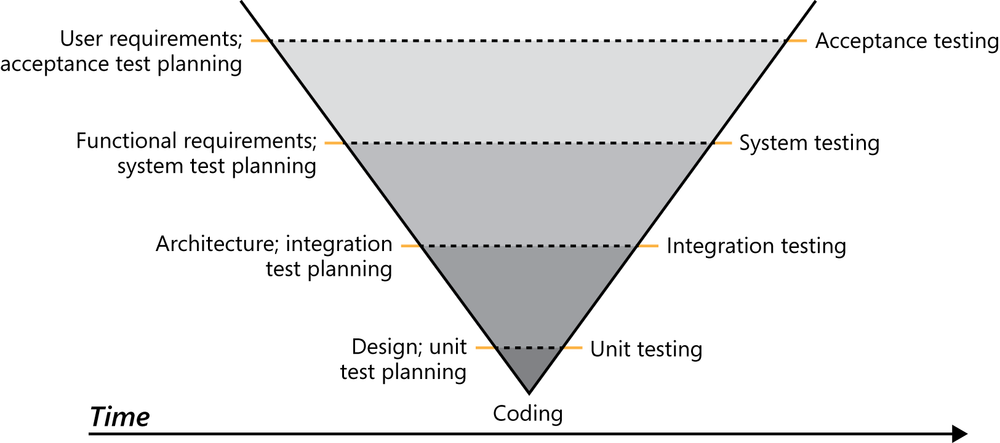

# Lifecycles

---

## Software Development Life Cycles

Describes the typical phases and progression *between* phases most computer-based systems go through.

There are multiple different lifecycles, the two primary ones being:

1. *Waterfall* (Predictive)
2. *Agile* (Adaptive)

These models allow us to understand the *process* of software development, from *initial concept* to *final deployment* and *maintenance*.

---

## Waterfall (predictive)

The most straightforward model, characterized by its *sequential*, step-by-step nature.

It is the simplest but the **least flexible** model.

Historically, the Waterfall model was used as the *earliest* form of *codified* organization for software development phases.

However, its lack of flexibility makes it **less suitable** for modern software development.

---

## V-Model (Verification and Validation)

The *V-Model* is an extension of the Waterfall model where the process steps are bent upwards after the implementation phase to form the typical V shape.

It demonstrates the relationship between each phase of the development life cycle and its **associated phase of testing**.

---

## sidenote: Most software today is web-based

Historically, this was not the case.

Most *older* software were standalone executables that, once given to an organization, **would not change**.

In this context, Waterfall was more useful.

---

## Waterfall

Part of Waterfall's main problems are:

- How testing only happens **at the very end** of the process, and
- Its inability to handle *changes in requirements*,

and the fact that it assumes all requirements can be gathered **upfront**, which is almost never the case.

Most projects do not adhere to a *strict Waterfall model*; rather, most projects use it as a general *guideline* and often incorporate elements of other models to better suit their needs.

---

## Simple modified waterfalls

- *Prototype-based*

One way of adding flexibility to a Waterfall model is simply to make the "*final*" product *smaller*.

By having multiple smaller Waterfalls, where your end goal is a version of your final product, it allows you to mimic the strengths of *Agile* while keeping the simplicity of *Waterfall*.

---

## Arguments for the Waterfall model

The Waterfall model explicitly defines a larger *pre-production* phase compared to development cycles which don't adhere to a specific model (cowboy coding, vibe coding).

It is also **incredibly simple**, with *discrete*, easily understandable and *explainable* phases; thus it is easy to understand.

Compared to more complex models like Scrum, this allows for teams following the Waterfall model to **not require a dedicated project manager**, as the process is simple enough to be self-managed.

---
layout: center
---

# Bad Waterfall is better than nothing

Even if you don't follow Waterfall properly, it is **still better** to work on projects with at least some structure in mind.

---

## Gantt Charts

When working with the Waterfall model, *Gantt charts* are often used to visually represent the project schedule, showing the start and end dates of each phase, as well as the dependencies between tasks.

A Gantt chart, because it is predictive in nature, tends to be **less accurate** as the project progresses, as it does not account for changes in requirements or unforeseen issues.

However, it can still be a **useful tool** for project planning and tracking, especially in projects with well-defined requirements and a clear scope.

---

## Agile (adaptive)

Agile, firstly, is **not** a specific software development lifecycle, but rather a *set of principles* and values that guide the software development process.

However, these principles have led to the development of various agile *methodologies*, such as *Scrum* and *Kanban*, which are specific frameworks that *implement agile principles* in different ways.

> The Agile methodology is an approach that divides work into phases, emphasizing **continuous delivery** and **improvement**. Agile benefits teams by enabling adaptive planning, rapid execution, and ongoing evaluation.

---

## Scrum

Scrum is an Agile framework that structures work into *time-boxed sprints*, with defined roles, artifacts, and ceremonies for *iterative* delivery.

Key roles include *Product Owner*, *Scrum Master*, and *Development Team*, all collaborating to achieve sprint goals.

Scrum emphasizes *transparency*, *inspection*, and *adaptation*, enabling teams to respond to change and deliver value incrementally.

---

## Sprints

The primary strength of Scrum is its **flexibility**; however, it is significantly **more complex** to implement than Waterfall and requires a significant amount of *discipline* and *commitment* from the team.

The primary unit of work in Scrum is the **Sprint**, which is a *fixed-length iteration* during which a specific set of work is completed and made ready for review.

Sprints typically last between **one to four weeks**, with a common duration of two weeks, allowing teams to maintain a steady pace.

During a sprint, the development team focuses on completing the tasks defined in the **Sprint Backlog**, which is derived from the **Product Backlog** and prioritized by the Product Owner.

---

## Kanban

Kanban is an Agile framework that visualizes work, limits **work-in-progress** (WIP), and promotes *continuous improvement* through transparent workflows.

Teams use *Kanban boards* and *cards* to track tasks, identify bottlenecks, and optimize delivery cycles.

It has the possibility for the same complexity as Scrum, but it is **flexible enough** that it can be run with a very simplified system.
