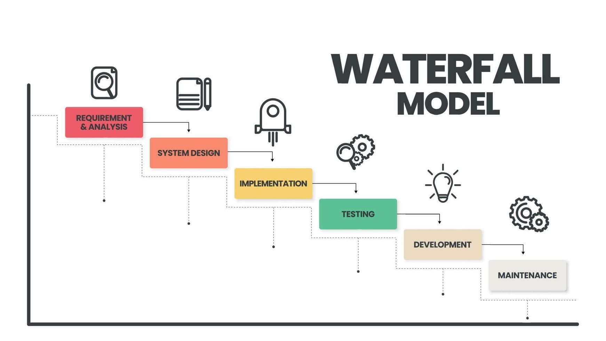
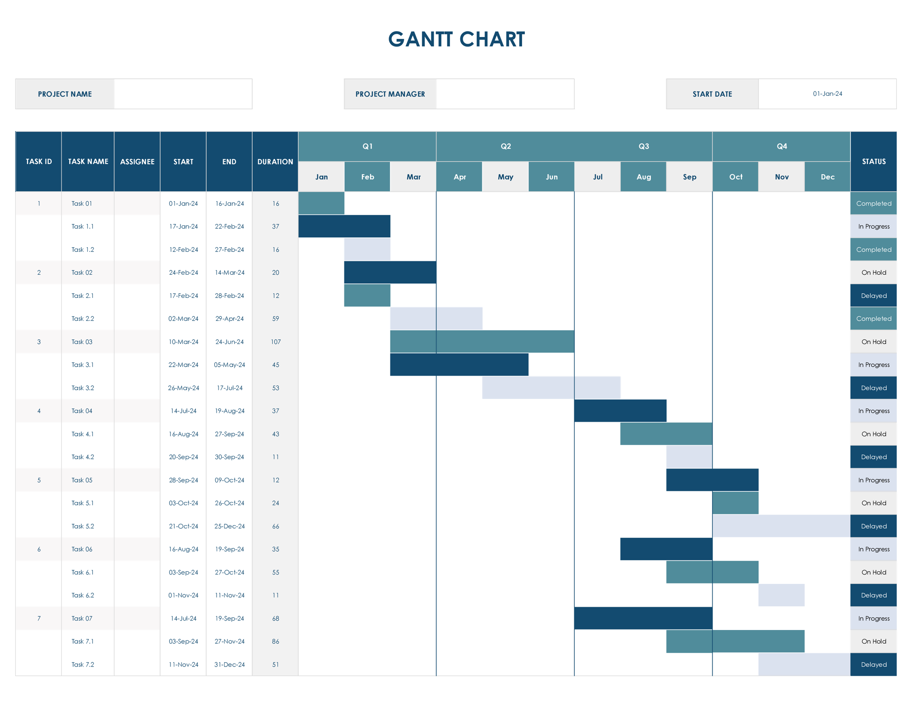
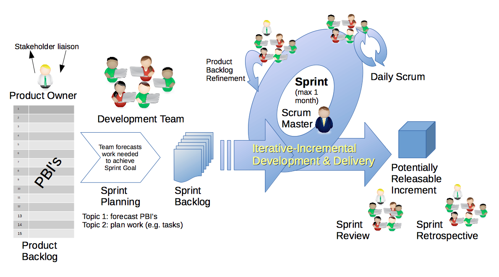
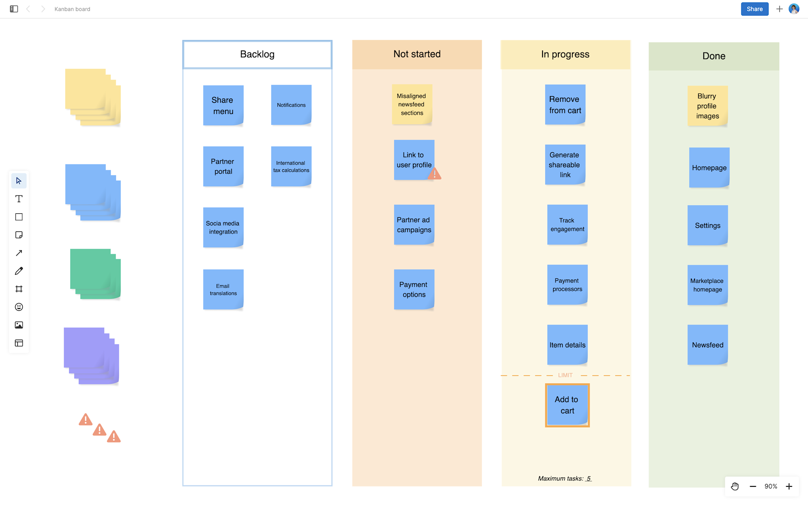

# Lifecycles

---

## Software Development Life Cycles

Describes the typical phases and progression *between* phases most computer-based systems go through

There are multiple different lifecysle, the two primary ones being

1. Waterfall
2. Agile*

These models allow us to understand the *process* of software development, from *initial concept* to *final deployment* and *maintenance*.

---

## Waterfall (predictive)

The most straightfoward model, characterized by *sequential*, step by step, nature

simplest but the *least* flexible

Historically, The waterfall model was used as the *earliest* form of *codified* organization for software development phases.

However, it's lack of flexibility makes it less suitable for softwar development, even back in the time it was created*

---

## sidenote: Most software today is web based

Historically, this was not the case

Most *older* software were standalone executables that, once given to an organization *would not change*

In this context, waterfall was more useful

---

## Waterfall

Part of waterfalls main problem is 

- How testing only happens *at the very end* of the processes, and
- It's inability to handle *changes in requirements*

and the fact that it assumes all requirements can be gathered *upfront*, which is almost never the case.

Most projects do not adhere to a *strict waterfall model*, but rather, most projects use it as a general *guideline*, and often incorporate elements of other models to better suit their needs.

---

## Simple modified waterfalls

- Prototype based

One way of adding flexibility to a waterfall model is simply make the "*final*" product *smaller*

By having multiple smaller waterfalls, where your end goal is a version of your final product, it allows you to mimic the strenghts of agile while keeping the simplicity of waterfall

---

## Arguments for the waterfall model

The waterfall model explicitly defines a larger *pre production* phase compared to development cycles which don't adhere to a specfic model (cowboy coding, vibe coding)

It's also incredibly simple, with *discrete*, easily understandable and *explainable* phases thus it's easy to understand

Compared to more complex models like scrum, this allows for teams following the waterfall model to not require a dedicated project manager, as the process is simple enough to be self managed

---
layout: center
---

# Bad waterfall is better than nothing

Even if you don't follow waterfall properly, it's still better to work on projects with at least some structure in mind

---

## Gantt Charts

When working with the waterfall model, Gantt charts are often used to visually represent the project schedule, showing the start and end dates of each phase, as well as the dependencies between tasks.

A gantt chart, because it's predictive in nature, tends to be *less accurate* as the project progresses, as it does not account for changes in requirements or unforeseen issues that may arise during development.

However, it can still be a useful tool for project planning and tracking, especially in projects with well-defined requirements and a clear scope.

---

## Agile (adaptive)

Agile, firstly, is **not** a specific software development lifecycle, but rather a *set of principles* and values that guide the software development process.

However, these principles have led to the development of various agile *methodologies*, such as *Scrum* and *Kanban*, which are specific frameworks that *implement agile principles* in different ways.

> The Agile methodology is an approach that divides work into phases, emphasizing continuous delivery and improvement. Agile benefits teams by enabling adaptive planning, rapid execution, and ongoing evaluation, leading to more responsive and successful outcomes.

---

## Scrum

Scrum is an Agile framework that structures work into *time-boxed sprints*, with defined roles, artifacts, and ceremonies for *iterative* delivery.

Key roles include product owner, Scrum master, and development team, all collaborating to achieve sprint goals.

Scrum emphasizes *transparency*, *inspection*, and *adaptation*, enabling teams to respond to change and deliver value incrementally.

---

## Sprints

The primary strenght of scrum is its flexibility however, it's significantly more complex to implement than waterfall, and requires a significant amount of *discipline* and *commitment* from the team to follow the framework properly.

The primary unit of work in Scrum is the sprint, which is a fixed-length iteration during which a specific set of work is completed and made ready for review.

Sprints are a fundamental component of the Scrum framework, representing fixed-length iterations during which a specific set of work is completed and made ready for review.

Sprints typically last between one to four weeks, with a common duration of two weeks, allowing teams to maintain a steady pace and adapt to changing requirements.

During a sprint, the development team focuses on completing the tasks defined in the sprint backlog, which is derived from the product backlog and prioritized by the product owner.

---

## Kanban

Kanban is an Agile framework that visualizes work, limits work-in-progress, and promotes continuous improvement through transparent workflows.

Teams use Kanban boards and cards to track tasks, identify bottlenecks, and optimize delivery cycles.

It has the possibility for the same complexity as Scrum, but it's flexible enough that it can be ran with a very simplified system
